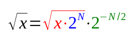
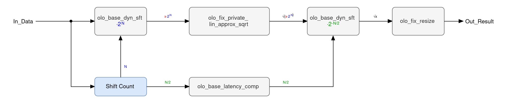
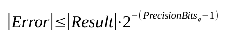

# olo_fix_sqrt

[Back to **Entity List**](../EntityList.md)

## Status Information


VHDL Source: [olo_fix_sqrt](../../src/fix/vhdl/olo_fix_sqrt.vhd)<br />
Bit-true Model: [olo_fix_sqrt](../../src/fix/python/olo_fix/olo_fix_sqrt.py)

## Description

This entity calculates the square root of the input:

```text
Out_Result = sqrt(In_Data)
```

The input is normalized (blue) into the range `[0.25, 1)`, the square root is taken through a table based piecewise
linear approximation (red) and the normalization is reverted on the result (green):



Because the square root halves the exponent, the normalization shift _N_ must be **even** - which is why the
approximation covers the two octaves `[0.25, 1)` and not just one.

The implementation requires less LUT logic than a CORDIC, at the cost of a ROM and a multiplier. Because the
normalization covers the full input range, a relatively small table delivers accurate results over the full range
of any input format. The precision of the approximation is selected through _PrecisionBits_g_, see
[Precision](#precision).

_InFmt_g_ must be **unsigned** - the square root is not defined for negative numbers.

**Latency** of this entity depends on the input format, see [Latency](#latency). The entity is fully pipelined,
hence it accepts one input sample per clock cycle. As a result, back-pressure is not supported.

For details about the fixed-point number format used in _Open Logic_, refer to the
[fixed point principles](./olo_fix_principles.md).

### Corner Cases

An input of **zero** delivers **exactly zero**. The approximation returns zero below its lower bound of `0.25` and
a zero input is the only input that reaches this part of the table, hence no extra logic is required for this.

**Powers of four** are _not_ inverted exactly - contrary to [olo_fix_inv](./olo_fix_inv.md), the square root of a
normalized value is not an exact value the table can return. The relative error stays within the bounds given
under [Precision](#precision) for all inputs.

### Latency

Latency is not guaranteed to be constant across different versions. It's therefore best to design user logic to be
independent of the latency of this block (e.g. through [olo_base_latency_comp](../base/olo_base_latency_comp.md)).

In the current version the latency can be calculated as follows:

```text
Latency = 13 + InShiftLatency + OutShiftLatency
```

_InShiftLatency_ and _OutShiftLatency_ are the latencies of the two barrel shifters (normalization and its
compensation). Each of them has an input register plus one pipeline stage per four shift-select bits. The
normalization shifts by up to _W_ (the width of _InFmt_g_), its compensation by up to _W/2_.

This results in the following overall latencies:

| Width of _InFmt_g_ | Latency        |
| ------------------ | -------------- |
| 2 ... 15           | 17 clock cycles |
| 16 ... 32          | 18 clock cycles |
| 33 ... 255         | 19 clock cycles |
| 256                | 20 clock cycles |

Note: For widths at the boundaries of this table the latency can differ by one clock cycle, depending on the
number of integer bits of _InFmt_g_ (which decides whether the normalization shift is even or odd).

## Generics

| Name            | Type     | Default       | Description                                                  |
| :-------------- | :------- | :------------ | :----------------------------------------------------------- |
| OutFmt_g        | string   | -             | Output format                                                |
| InFmt_g         | string   | -             | Input format. Must be unsigned and at least two and at most 256 bits wide. |
| PrecisionBits_g | positive | 18            | Number of fractional bits of the square root approximation. Must be 10, 14, 18 or 20. |
| MemStyle_g      | string   | "auto"        | Resource control for the table (_auto_, _block_ or _distributed_) |
| Round_g         | string   | "NonSymPos_s" | Rounding mode of the output stage                            |
| Saturate_g      | string   | "Sat_s"       | Saturation mode of the output stage                          |

## Interfaces

### Control

| Name | In/Out | Length | Default | Description                                     |
| :--- | :----- | :----- | ------- | :---------------------------------------------- |
| Clk  | in     | 1      | -       | Clock                                           |
| Rst  | in     | 1      | -       | Reset input (high-active, synchronous to _Clk_) |

### Input Data

| Name     | In/Out | Length           | Default | Description                                  |
| :------- | :----- | :--------------- | ------- | :------------------------------------------- |
| In_Valid | in     | 1                | '1'     | AXI4-Stream handshaking signal for _In_Data_ |
| In_Data  | in     | _width(InFmt_g)_ | -       | Input data<br />Format: _InFmt_g_            |

### Output Data

| Name       | In/Out | Length            | Default | Description                                       |
| :--------- | :----- | :---------------- | ------- | :------------------------------------------------ |
| Out_Valid  | out    | 1                 | N/A     | AXI4-Stream handshaking signal for _Out_Result_   |
| Out_Result | out    | _width(OutFmt_g)_ | N/A     | Square root of _In_Data_<br />Format: _OutFmt_g_  |

## Details

### Architecture

The figure below shows the architecture of the entity. The colors of the signal labels match the formula given in
the [Description](#description).



The normalization shift _N_ is derived from the number of leading zeros of the input. Contrary to
[olo_fix_inv](./olo_fix_inv.md) the shift cannot be the number of leading zeros directly - the exponent left after
the normalization must be even, because the square root halves it. Hence _N_ is the number of leading zeros
rounded up to the required parity, which normalizes the input into `[0.25, 1)` instead of one single octave.

Normalization and its reversal are both implemented by [olo_base_dyn_sft](../base/olo_base_dyn_sft.md), which
spreads the barrel shifter over several pipeline stages to achieve good timing. The output shift is _N/2_, because
the square root halves the exponent. It is delayed to the point where it is needed by
[olo_base_latency_comp](../base/olo_base_latency_comp.md).

The approximation is implemented by the internal entity _olo_fix_private_lin_approx_sqrt_. It contains the square
root tables (one per supported _PrecisionBits_g_ value) and instantiates
[olo_fix_lin_approx_calc](./olo_fix_lin_approx_calc.md) for the piecewise linear interpolation. Below `0.25` the
tables contain zeros, which makes the square root of a zero input exactly zero without any extra logic.

Reverting the normalization shifts the result right by _N/2_. The remaining constant factor (which depends only on
the number of integer bits of the input format) is applied by reinterpreting the number format of the shifted
result, hence it is pure wiring and does not cost any logic. Finally the result is rounded/saturated to _OutFmt_g_
by [olo_fix_resize](./olo_fix_resize.md).

### Precision

_PrecisionBits_g_ selects the number of fractional bits the square root approximation delivers. One table exists
per supported value, hence only the values listed below are allowed - any other value leads to an error:

| _PrecisionBits_g_ | Table size    |
| ----------------- | ------------- |
| 10                | 32 x 16 bit   |
| 14                | 128 x 23 bit  |
| 18                | 512 x 29 bit  |
| 20                | 1024 x 33 bit |

Because the normalization makes the accuracy independent of the magnitude of the input, the error is defined
**relative** to the result:


