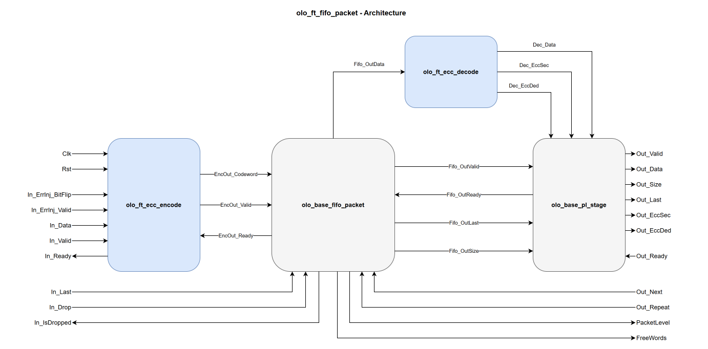

# olo_ft_fifo_packet

[Back to **Entity List**](../EntityList.md)

## Status Information

VHDL Source: [olo_ft_fifo_packet](../../src/ft/vhdl/olo_ft_fifo_packet.vhd)

## Description

This component implements an **ECC-protected synchronous packet FIFO** using SECDED (Single Error Correction,
Double Error Detection) Hamming code. The interface and behavior (store and forward, packet drop on the write
side, packet skip/repeat on the read side) match [olo_base_fifo_packet](../base/olo_base_fifo_packet.md).

The ECC is transparent to the user: data is automatically encoded on write and decoded/corrected on read.
Error status flags indicate whether a single-bit error was corrected or a double-bit error was detected.

In contrast to the base entity, `FeatureSet_g = "DROP_ONLY"` is **not supported** and rejected at
elaboration: in that mode the packet-framing _In_Last_ flag would be stored inside the main RAM where it is
not covered by the ECC parity (see
[Fault-Tolerant Storage of Packet Boundaries](#fault-tolerant-storage-of-packet-boundaries)).

## Generics

| Name               | Type     | Default | Description                                                  |
| :----------------- | :------- | ------- | :----------------------------------------------------------- |
| Width_g            | positive | -       | Number of data bits per FIFO entry. The internal FIFO is wider to accommodate ECC parity bits. |
| Depth_g            | positive | -       | Number of entries (must be a power of two)                   |
| FeatureSet_g       | string   | "FULL"  | "FULL" or "DROP_SKIP_ONLY". "DROP_ONLY" is **not supported** and rejected at elaboration (see [Fault-Tolerant Storage of Packet Boundaries](#fault-tolerant-storage-of-packet-boundaries)). |
| RamStyle_g         | string   | "auto"  | Controls the RAM implementation resource                     |
| RamBehavior_g      | string   | "RBW"   | Controls the RAM behavior. "RBW" or "WBR"                    |
| SmallRamStyle_g    | string   | "registers" | RAM style for the internal packet-boundary FIFO. The default "registers" keeps the packet boundaries in flip-flops so they can be covered by vendor TMR (see [Fault-Tolerant Storage of Packet Boundaries](#fault-tolerant-storage-of-packet-boundaries)). Overriding this to a RAM primitive re-introduces non-ECC-protected RAM state and is discouraged for fault-tolerant designs. |
| SmallRamBehavior_g | string   | "same"  | RAM behavior for the internal packet-boundary FIFO           |
| MaxPackets_g       | positive | 17      | Maximum number of packets in the FIFO (min 2)                |
| EccPipeline_g      | natural  | 0       | Number of pipeline stages between ECC decode and the output (range 0..2, implemented with [olo_base_pl_stage](../base/olo_base_pl_stage.md)). 0 = combinational output. |

## Interfaces

### Clock and Reset

| Name | In/Out | Length | Default | Description                                                  |
| :--- | :----- | :----- | ------- | :----------------------------------------------------------- |
| Clk  | in     | 1      | -       | Clock                                                        |
| Rst  | in     | 1      | -       | Reset (high-active, synchronous to _Clk_). Empties the FIFO and clears the internal error-injection latch and the output pipeline. |

### Input Data

| Name         | In/Out | Length    | Default | Description                               |
| :----------- | :----- | :-------- | ------- | :---------------------------------------- |
| In_Valid     | in     | 1         | '1'     | Input valid (AXI-S handshaking)           |
| In_Ready     | out    | 1         | N/A     | Input ready (AXI-S handshaking)           |
| In_Data      | in     | _Width_g_ | -       | Input data                                |
| In_Last      | in     | 1         | '1'     | End of packet                             |
| In_Drop      | in     | 1         | '0'     | Drop the packet currently being written   |
| In_IsDropped | out    | 1         | N/A     | Indicates the current input packet is being dropped |

### Output Data

| Name       | In/Out | Length                  | Default | Description                                                  |
| :--------- | :----- | :---------------------- | ------- | :----------------------------------------------------------- |
| Out_Valid  | out    | 1                       | N/A     | Output valid (AXI-S handshaking)                             |
| Out_Ready  | in     | 1                       | '1'     | Output ready (AXI-S handshaking)                             |
| Out_Data   | out    | _Width_g_               | N/A     | Output data (corrected if a single-bit error was detected)   |
| Out_Size   | out    | _ceil(log2(Depth_g+1))_ | N/A     | Packet size in words                                         |
| Out_Last   | out    | 1                       | N/A     | End of packet                                                |
| Out_Next   | in     | 1                       | '0'     | Skip to the next packet. See Constraints regarding _EccPipeline_g_. |
| Out_Repeat | in     | 1                       | '0'     | Repeat the current packet (FULL feature set only). See Constraints regarding _EccPipeline_g_. |
| Out_EccSec | out    | 1                       | N/A     | Single error corrected flag. Time-aligned with _Out_Data_.   |
| Out_EccDed | out    | 1                       | N/A     | Double error detected flag. Read data is unreliable. Time-aligned with _Out_Data_. |

### Status

| Name        | In/Out | Length                       | Default | Description                        |
| :---------- | :----- | :--------------------------- | ------- | :---------------------------------- |
| PacketLevel | out    | _ceil(log2(MaxPackets_g+1))_ | N/A     | Number of complete packets in FIFO |
| FreeWords   | out    | _ceil(log2(Depth_g+1))_      | N/A     | Number of free word slots          |

### Error Injection (optional)

These ports drive the internal [olo_ft_ecc_encode](./olo_ft_ecc_encode.md) instance. Leave them unconnected
for normal operation; see
[Open Logic Fault-Tolerance Principles - Error Injection](./olo_ft_principles.md#error-injection) for the
latched-strobe semantics shared across the _ft_ area.

| Name              | In/Out | Length                                                               | Default | Description                                                  |
| :---------------- | :----- | :------------------------------------------------------------------- | ------- | :----------------------------------------------------------- |
| In_ErrInj_BitFlip | in     | _[eccCodewordWidth](./olo_ft_pkg_ecc.md#ecccodewordwidth)(Width_g)_  | all 0   | Codeword-wide flip pattern. Each '1' bit XORs (flips) the corresponding bit of the stored codeword. Popcount 1 = SEC-correctable, popcount 2 = DED-detectable. |
| In_ErrInj_Valid   | in     | 1                                                                    | '0'     | Strobe that latches _In_ErrInj\_BitFlip_ into the encoder's pending-injection register. The latched pattern is applied to the next accepted input beat. |

## Detailed Description

### Architecture

The FIFO is a pipeline of four Open Logic entities:

1. [olo_ft_ecc_encode](./olo_ft_ecc_encode.md) encodes each accepted input beat into a SECDED codeword
   (combinational, the AXI-S handshake passes through).
2. [olo_base_fifo_packet](../base/olo_base_fifo_packet.md) stores the codeword (entity configured with a
   codeword-wide word). _In_Last_ / _In_Drop_ / _Out_Next_ / _Out_Repeat_ and the status outputs connect
   directly to the base FIFO. The packet boundaries live in the base FIFO's internal packet-boundary FIFO,
   implemented in flip-flops by default (_SmallRamStyle_g_ = "registers").
3. [olo_ft_ecc_decode](./olo_ft_ecc_decode.md) decodes and corrects each beat combinationally on the read
   side.
4. [olo_base_pl_stage](../base/olo_base_pl_stage.md) (with `EccPipeline_g` stages) registers the decoded
   data **bundled with its sideband** (_Out_EccSec_, _Out_EccDed_, _Out_Last_, _Out_Size_), so all output
   signals stay time-aligned regardless of the pipeline depth.

Because encoding happens before, and decoding after, all storage elements, the codeword is protected
end-to-end through the FIFO.

See [olo_base_fifo_packet](../base/olo_base_fifo_packet.md) for detailed FIFO behavior.

### Fault-Tolerant Storage of Packet Boundaries

The design goal for the _ft_ area is that **no RAM-resident state is outside the ECC protection**: RAM
cells hold their content for arbitrarily long and cannot be covered by vendor TMR, so anything stored in
RAM must be part of an ECC codeword. For the packet FIFO this drives two decisions:

- **`FeatureSet_g = "DROP_ONLY"` is rejected at elaboration.** In that mode the base FIFO widens the main
  RAM by one bit and stores the _In_Last_ flag of every word alongside the data, because it keeps no
  per-packet boundary records elsewhere. That bit would sit inside the RAM but outside the ECC codeword: a
  single upset would silently split or merge packets (no _Out_EccDed_ indication) and could desynchronize
  the FIFO's packet accounting. In the supported feature sets ("FULL", "DROP_SKIP_ONLY") the main RAM
  holds pure ECC codewords only.
- **The packet-boundary FIFO defaults to `SmallRamStyle_g = "registers"`.** In the supported feature sets
  the packet-end addresses (which drive _Out_Last_, _Out_Size_ and the _Out_Next_ jump target) are stored
  in a small internal FIFO. With the "registers" style this storage is implemented in flip-flops, which
  vendor TMR (`syn_radhardlevel = "tmr"`) covers like all other control logic. Verify in the synthesis
  report that no RAM primitive is inferred for it on your target tool (on tools where "registers" is not a
  recognized RAM-style value, e.g. Intel Quartus which uses "logic", override the generic accordingly).
  Overriding _SmallRamStyle_g_ to a block/distributed RAM saves a few hundred flip-flops but re-introduces
  non-ECC-protected RAM state and is therefore discouraged for fault-tolerant designs.

### ECC Overhead, Error Injection and Status Flags

See the corresponding sections in
[Open Logic Fault-Tolerance Principles](./olo_ft_principles.md):

- [ECC Overhead](./olo_ft_principles.md#ecc-overhead) - internal storage width vs. data width
- [Error Injection](./olo_ft_principles.md#error-injection) - semantics of _In_ErrInj\_BitFlip_ / _In_ErrInj\_Valid_
- [Error Status Flags](./olo_ft_principles.md#error-status-flags) - meaning of _Out_EccSec_ / _Out_EccDed_

### Constraints

- The packet-boundary records (packet-end addresses, from which _Out_Last_ and _Out_Size_ are derived) are
  not part of the ECC codeword. They are kept in flip-flops by default (see
  [Fault-Tolerant Storage of Packet Boundaries](#fault-tolerant-storage-of-packet-boundaries)) and must be
  covered by vendor TMR as part of the surrounding radiation-hardened design, like all other control logic.
- _Out_Next_ and _Out_Repeat_ are sampled on the **internal** FIFO read handshake. With
  `EccPipeline_g > 0` the internal handshake runs ahead of the beats observed on the output ports
  (bounded by the output pipeline's buffer capacity), so users driving _Out_Next_ / _Out_Repeat_ based on
  observed output data cannot align them to specific beats or packets. Use `EccPipeline_g = 0` when
  beat-accurate _Out_Next_ / _Out_Repeat_ control is required.
- See
  [Open Logic Fault-Tolerance Principles - Constraints That Apply Across the Area](./olo_ft_principles.md#constraints-that-apply-across-the-area)
  for the constraints that apply across the _ft_ area.
