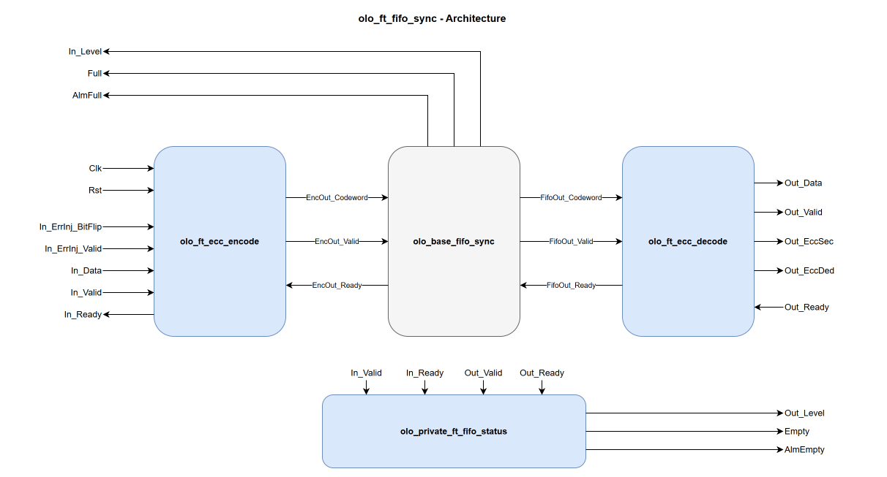

# olo_ft_fifo_sync

[Back to **Entity List**](../EntityList.md)

## Status Information

VHDL Source: [olo_ft_fifo_sync](../../src/ft/vhdl/olo_ft_fifo_sync.vhd)

## Description

This component implements an **ECC-protected synchronous FIFO** using SECDED (Single Error Correction, Double Error
Detection) Hamming code. The interface and behavior match [olo_base_fifo_sync](../base/olo_base_fifo_sync.md).

The ECC is transparent to the user: data is automatically encoded on write and decoded/corrected on read. Error status
flags indicate whether a single-bit error was corrected or a double-bit error was detected.

## Generics

| Name            | Type      | Default | Description                                                  |
| :-------------- | :-------- | ------- | :----------------------------------------------------------- |
| Width_g         | positive  | -       | Number of data bits per FIFO entry. The internal FIFO is wider to accommodate ECC parity bits. |
| Depth_g         | positive  | -       | Number of entries the FIFO has                               |
| AlmFullOn_g     | boolean   | false   | Enable almost-full flag                                      |
| AlmFullLevel_g  | natural   | 0       | Almost-full threshold level                                  |
| AlmEmptyOn_g    | boolean   | false   | Enable almost-empty flag                                     |
| AlmEmptyLevel_g | natural   | 0       | Almost-empty threshold level                                 |
| RamStyle_g      | string    | "auto"  | Controls the RAM implementation resource                     |
| RamBehavior_g   | string    | "RBW"   | Controls the RAM behavior. "RBW" or "WBR"                    |
| ReadyRstState_g | std_logic | '1'     | Value of _In_Ready_ during reset. Behaves exactly as in [olo_base_fifo_sync](../base/olo_base_fifo_sync.md), see [Status and Levels](#status-and-levels). |
| EccPipeline_g   | natural   | 0       | Number of pipeline stages on the ECC decode datapath (range 0..2), forwarded to the internal [olo_ft_ecc_decode](./olo_ft_ecc_decode.md) instance. 0 = combinational output. |

## Interfaces

### Clock and Reset

| Name | In/Out | Length | Default | Description                                                  |
| :--- | :----- | :----- | ------- | :----------------------------------------------------------- |
| Clk  | in     | 1      | -       | Clock                                                        |
| Rst  | in     | 1      | -       | Reset (high-active, synchronous to _Clk_). Empties the FIFO and clears the internal error-injection latch and the codec pipeline. |

### Input Data

| Name     | In/Out | Length                  | Default | Description                     |
| :------- | :----- | :---------------------- | ------- | :------------------------------ |
| In_Data  | in     | _Width_g_               | -       | Input data                      |
| In_Valid | in     | 1                       | '1'     | Input valid (AXI-S handshaking) |
| In_Ready | out    | 1                       | N/A     | Input ready (AXI-S handshaking) |
| In_Level | out    | _ceil(log2(Depth_g+1))_ | N/A     | Input-side fill level. Reports the internal FIFO content and is exact, see [Status and Levels](#status-and-levels). |

### Output Data

| Name       | In/Out | Length                  | Default | Description                                                  |
| :--------- | :----- | :---------------------- | ------- | :----------------------------------------------------------- |
| Out_Data   | out    | _Width_g_               | N/A     | Output data (corrected if a single-bit error was detected)   |
| Out_Valid  | out    | 1                       | N/A     | Output valid (AXI-S handshaking)                             |
| Out_Ready  | in     | 1                       | '1'     | Output ready (AXI-S handshaking)                             |
| Out_Level  | out    | _ceil(log2(Depth_g+2\*EccPipeline_g+1))_ | N/A     | Output-side fill level. Counts every beat still to be delivered, including those buffered in the ECC decoder, and is therefore wider than in the base FIFO. See [Status and Levels](#status-and-levels). |
| Out_EccSec | out    | 1                       | N/A     | Single error corrected flag. Time-aligned with _Out_Data_.   |
| Out_EccDed | out    | 1                       | N/A     | Double error detected flag. Read data is unreliable. Time-aligned with _Out_Data_. |

### Status

| Name     | In/Out | Length | Default | Description                                                  |
| :------- | :----- | :----- | ------- | :----------------------------------------------------------- |
| Full     | out    | 1      | N/A     | Internal FIFO is full, no further beat is accepted. Always the inverse of _In_Ready_, as in the base FIFO. |
| AlmFull  | out    | 1      | N/A     | Internal FIFO holds at least _AlmFullLevel_g_ beats           |
| Empty    | out    | 1      | N/A     | The entity holds no data at all, including the ECC decoder. Safe to use as a drain condition, see [Status and Levels](#status-and-levels). |
| AlmEmpty | out    | 1      | N/A     | At most _AlmEmptyLevel_g_ beats are still to be delivered     |

### Error Injection (optional)

These ports drive the internal [olo_ft_ecc_encode](./olo_ft_ecc_encode.md) instance. Leave them unconnected
for normal operation; see
[Open Logic Fault-Tolerance Principles - Error Injection](./olo_ft_principles.md#error-injection) for the
latched-strobe semantics shared across the _ft_ area.

| Name              | In/Out | Length                                                               | Default | Description                                                  |
| :---------------- | :----- | :------------------------------------------------------------------- | ------- | :----------------------------------------------------------- |
| In_ErrInj_BitFlip | in     | _[eccCodewordWidth](./olo_ft_pkg_ecc.md#ecccodewordwidth)(Width_g)_  | all 0   | Codeword-wide flip pattern. Each '1' bit XORs (flips) the corresponding bit of the stored codeword. Popcount 1 = SEC-correctable, popcount 2 = DED-detectable. |
| In_ErrInj_Valid   | in     | 1                                                                    | '0'     | Strobe that latches _In_ErrInj\_BitFlip_ into the encoder's pending-injection register. The latched pattern is applied to the next accepted input beat. |

## Detailed Description

### Architecture

The datapath is a straight pipeline of three Open Logic entities:

1. [olo_ft_ecc_encode](./olo_ft_ecc_encode.md) encodes each accepted input beat into a SECDED codeword.
   The encoder is instantiated with `Pipeline_g=0` and is therefore **always combinational, zero clock
   cycles of delay**: a beat accepted at _In_Valid_ / _In_Ready_ enters the FIFO in the same clock cycle
   and the AXI-S handshake passes straight through.
2. [olo_base_fifo_sync](../base/olo_base_fifo_sync.md) stores the codeword (entity configured with a
   codeword-wide word). The write-side status (_In_Level_, _Full_, _AlmFull_) comes directly from it.
3. [olo_ft_ecc_decode](./olo_ft_ecc_decode.md) decodes and corrects each beat on the read side and drives
   _Out_EccSec_ / _Out_EccDed_ time-aligned with _Out_Data_. `EccPipeline_g` inserts register stages on the
   decode datapath (see the [codec documentation](./olo_ft_ecc_decode.md) for the stage placement).

The codeword is protected end-to-end while it is inside the FIFO: encoding happens before, and decoding after,
all storage elements.

Alongside the datapath, a small private entity produces the read-side status (_Out_Level_, _Empty_,
_AlmEmpty_) by counting the beats the FIFO and the decoder still have to deliver, see
[Status and Levels](#status-and-levels).

See [olo_base_fifo_sync](../base/olo_base_fifo_sync.md) for detailed FIFO behavior.

Note that the ECC FIFOs deliberately come **without a scrubber**, unlike the ECC RAMs
([olo_ft_ram_sp_scrub](./olo_ft_ram_sp_scrub.md), [olo_ft_ram_sdp_scrub](./olo_ft_ram_sdp_scrub.md)).
A FIFO does not store data permanently, so as long as it is drained regularly, errors do not accumulate
in a word over time and there is nothing for a background scrubber to repair.

### Status and Levels

The ECC decoder buffers up to `2 * EccPipeline_g` beats. The entity holds a maximum of
`Depth_g + 2 * EccPipeline_g` beats.

| Signal    | Reports                   | Remark                                                       |
| :-------- | :------------------------ | :----------------------------------------------------------- |
| In_Level  | internal FIFO             | Same value as [olo_base_fifo_sync](../base/olo_base_fifo_sync.md) |
| Full      | internal FIFO             | Always the inverse of _In_Ready_                             |
| AlmFull   | internal FIFO             | Set when the level is at or above _AlmFullLevel_g_           |
| Out_Level | internal FIFO and decoder | Width is `ceil(log2(Depth_g + 2*EccPipeline_g + 1))`         |
| Empty     | internal FIFO and decoder | Set when the entity holds no beat. Use it as drain condition |
| AlmEmpty  | internal FIFO and decoder | Set when the level is at or below _AlmEmptyLevel_g_          |

The write-side signals are exact. The ECC encoder is combinational. A beat enters the FIFO in the same
clock cycle in which it is accepted.

The read-side signals use a beat count. The count increments when the entity accepts a beat. It
decrements when the entity delivers a beat.

_Empty_ can be '0' while _Out_Valid_ is '0'. This occurs while the decode pipeline refills.

### ECC Overhead, Error Injection and Status Flags

See the corresponding sections in
[Open Logic Fault-Tolerance Principles](./olo_ft_principles.md):

- [ECC Overhead](./olo_ft_principles.md#ecc-overhead) - internal storage width vs. data width
- [Error Injection](./olo_ft_principles.md#error-injection) - semantics of _In_ErrInj\_BitFlip_ / _In_ErrInj\_Valid_
- [Error Status Flags](./olo_ft_principles.md#error-status-flags) - meaning of _Out_EccSec_ / _Out_EccDed_

### Constraints

See
[Open Logic Fault-Tolerance Principles - Constraints That Apply Across the Area](./olo_ft_principles.md#constraints-that-apply-across-the-area)
for the constraints that apply across the _ft_ area. No additional `olo_ft_fifo_sync`-specific constraints
apply.
