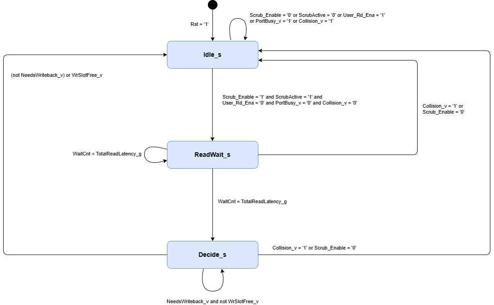
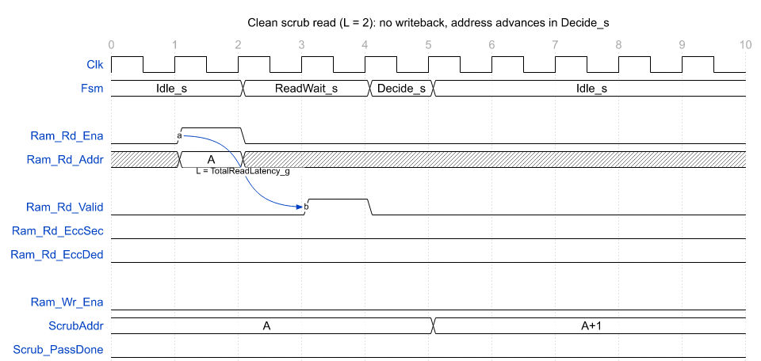
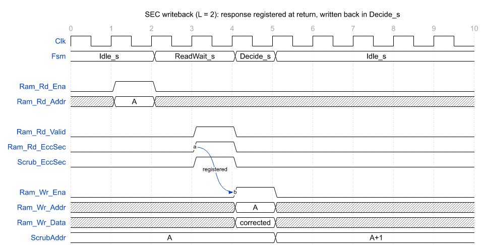
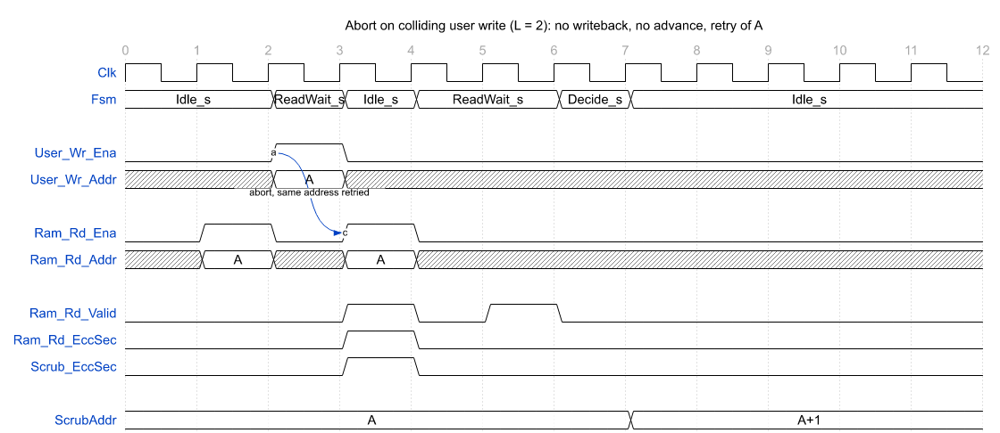
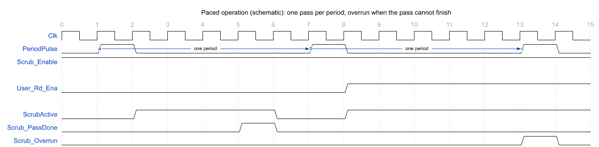

# olo_ft_private_scrubber

[Back to **Entity List**](../EntityList.md)

## Status Information

VHDL Source: [olo_ft_private_scrubber](../../src/ft/vhdl/olo_ft_private_scrubber.vhd)

**Internal building block.** This entity is the private opportunistic-scrubber core instantiated by the scrubbing RAM
wrappers [olo_ft_ram_sp_scrub](./olo_ft_ram_sp_scrub.md) and [olo_ft_ram_sdp_scrub](./olo_ft_ram_sdp_scrub.md). It is
**not intended for direct end-user instantiation** and is documented here so the scrub wrappers can reference its
behavior in one place. It carries no ECC logic of its own; it only schedules and arbitrates reads and writebacks
against an already-ECC-protected RAM.

## Description

The scrubber walks the RAM address space autonomously and rewrites a word whenever the wrapped RAM reports a
correctable single-bit error (SEC) on it, refreshing the stored codeword before a second upset can turn a correctable
error into an uncorrectable one. It is **opportunistic**: scrub reads fill idle read-port cycles, writebacks wait for
a free write slot, and only a user write to the address currently being scrubbed aborts the operation in flight. The
user always wins the port muxes, so the scrubber never stalls a user access; conversely, the scrubber keeps making
progress under partial user traffic (for example a read every second cycle) and is only fully starved while the user
occupies the required port on literally every cycle.

This core owns **both** the scrub FSM **and** the user/scrubber arbitration. To stay reusable across the single- and
dual-port wrappers it presents a generic **write-channel + read-channel** interface: the user side
(`User_Wr_*` / `User_Rd_*`) carries the wrapper's user requests, and the RAM side (`Ram_Wr_*` / `Ram_Rd_*`) carries
the muxed requests to the wrapped RAM. The user always wins. A single-port wrapper ties both user channels to its one
shared port and collapses the two RAM channels back onto it; a dual-port wrapper maps the channels 1:1 onto the RAM's
write and read ports.

By default the scrubber is **free-running**: it advances as fast as user-idle cycles allow. An optional internal
**pacer** (enabled when _ScrubPeriod_g_ > 0.0) instead limits it to one full pass every _ScrubPeriod_g_ seconds and
raises _Scrub_Overrun_ if a pass cannot finish within its period -- see [Scrub Pacing](#scrub-pacing-optional).

For background on the SECDED scheme and the meaning of the ECC flags, see
[Open Logic Fault-Tolerance Principles](./olo_ft_principles.md).

## Generics

| Name               | Type     | Default | Description                                                  |
| :----------------- | :------- | ------- | :----------------------------------------------------------- |
| Depth_g            | positive | -       | Number of addresses to scrub. Matches the wrapped RAM depth. Must be at least 2. |
| Width_g            | positive | -       | Data word-width (decoded data, _not_ the codeword width).    |
| TotalReadLatency_g | positive | -       | End-to-end read latency of the wrapped ECC RAM, i.e. _RamRdLatency_g_ + _EccPipeline_g_. The FSM waits this many cycles between issuing a read and acting on the decoded ECC flags, and the read-valid shift register is this long. |
| SinglePortRam_g    | boolean  | false   | When `true`, the scrubber also drives the collapsed single-port address _Ram_Addr_ for [olo_ft_ram_sp_scrub](./olo_ft_ram_sp_scrub.md). Leave `false` (default) for the dual-port wrapper, which maps _Ram_Wr_Addr_ / _Ram_Rd_Addr_ 1:1 onto the RAM and ignores _Ram_Addr_. |
| ScrubClkHz_g       | real     | 100000000.0 | Frequency of _Clk_ in Hz, used **only** to size the optional pacer. Set it to the actual clock frequency; must be >= 1000.0 when the pacer is enabled (_ScrubPeriod_g_ > 0.0), and is ignored when free-running. |
| ScrubPeriod_g      | real     | 0.0     | Pacer period in seconds: one full scrub pass is started every _ScrubPeriod_g_ seconds (1 ms granularity). `0.0` (default) disables the pacer and leaves the scrubber free-running; any value > 0.0 enables it. |

## Interfaces

### Clock and Reset

| Name | In/Out | Length | Default | Description                                                  |
| :--- | :----- | :----- | ------- | :----------------------------------------------------------- |
| Clk  | in     | 1      | -       | Clock                                                        |
| Rst  | in     | 1      | -       | Reset (high-active, synchronous). Returns the FSM to `Idle_s`, clears the address counter and the read-valid pipeline. |

### Scrubber Enable

| Name         | In/Out | Length | Default | Description                                                  |
| :----------- | :----- | :----- | ------- | :----------------------------------------------------------- |
| Scrub_Enable | in     | 1      | '1'     | External enable. '0' **suspends** scrubbing: no new operation is issued, an operation in flight is aborted (without advancing, so the address is preserved and retried on resume), and the pacer's overrun watchdog is disarmed. The user channels are not disturbed. See [Suspension](#suspension-scrub_enable). |

### User Write Channel (request)

| Name         | In/Out | Length                | Default | Description                                                  |
| :----------- | :----- | :-------------------- | ------- | :----------------------------------------------------------- |
| User_Wr_Addr | in     | _ceil(log2(Depth_g))_ | -       | User write address.                                         |
| User_Wr_Ena  | in     | 1                     | -       | User write enable. While '1' the user owns the write channel; a pending scrub writeback waits for a free write slot. A write to the address currently being scrubbed additionally aborts the scrub operation in flight. |
| User_Wr_Data | in     | _Width_g_             | -       | User write data.                                           |

### User Read Channel (request)

| Name         | In/Out | Length                | Default | Description                                                  |
| :----------- | :----- | :-------------------- | ------- | :----------------------------------------------------------- |
| User_Rd_Addr | in     | _ceil(log2(Depth_g))_ | -       | User read address.                                         |
| User_Rd_Ena  | in     | 1                     | -       | User read enable. While '1' the user owns the read channel and no scrub read is issued; a scrub read already in flight is not disturbed. |

### RAM Write Channel (muxed)

| Name        | In/Out | Length                | Default | Description                                                  |
| :---------- | :----- | :-------------------- | ------- | :----------------------------------------------------------- |
| Ram_Wr_Addr | out    | _ceil(log2(Depth_g))_ | N/A     | Muxed write address (user when _User_Wr_Ena_ = '1', else the scrub address). |
| Ram_Wr_Ena  | out    | 1                     | N/A     | Muxed write enable (`User_Wr_Ena OR` scrubber writeback). |
| Ram_Wr_Data | out    | _Width_g_             | N/A     | Muxed write data (user data, or the registered decoded read data on a scrubber writeback). |

### RAM Read Channel (muxed)

| Name        | In/Out | Length                | Default | Description                                                  |
| :---------- | :----- | :-------------------- | ------- | :----------------------------------------------------------- |
| Ram_Rd_Addr | out    | _ceil(log2(Depth_g))_ | N/A     | Muxed read address (user when _User_Rd_Ena_ = '1', else the scrub address). |
| Ram_Rd_Ena  | out    | 1                     | N/A     | Muxed read enable (`User_Rd_Ena OR` scrubber read). |

### Collapsed Single-Port Address

| Name     | In/Out | Length                | Default | Description                                                  |
| :------- | :----- | :-------------------- | ------- | :----------------------------------------------------------- |
| Ram_Addr | out    | _ceil(log2(Depth_g))_ | N/A     | Single physical RAM address used by single-port wrappers: the write address when a write is active, else the read address. Driven only when _SinglePortRam_g_ = true (tied to 0 otherwise). |

### Decoded RAM Read (response)

| Name          | In/Out | Length    | Default | Description                                                  |
| :------------ | :----- | :-------- | ------- | :----------------------------------------------------------- |
| Ram_Rd_Data   | in     | _Width_g_ | -       | Decoded (corrected) read data from the wrapped RAM. Also forwarded as the writeback payload. |
| Ram_Rd_EccSec | in     | 1         | -       | Single-error-corrected flag from the wrapped RAM's decoder.  |
| Ram_Rd_EccDed | in     | 1         | -       | Double-error-detected flag from the wrapped RAM's decoder.   |
| Ram_Rd_Valid  | in     | 1         | -       | Read-valid from the wrapped RAM. Pulses for every read, user or scrubber.                    |

### User Read Valid (response)

| Name          | In/Out | Length | Default | Description                                                  |
| :------------ | :----- | :----- | ------- | :----------------------------------------------------------- |
| User_Rd_Valid | out    | 1      | N/A     | User-facing read valid: _Ram_Rd_Valid_ with the scrubber-owned read cycles masked out. The wrapper forwards it straight to its user read-valid output. |

### Scrub Status

All status outputs are clean, directly countable one-cycle pulses; no external qualifier is needed.

| Name           | In/Out | Length | Default | Description                                                  |
| :------------- | :----- | :----- | ------- | :----------------------------------------------------------- |
| Scrub_EccSec   | out    | 1      | N/A     | Pulses '1' for one cycle when a scrubber-issued read observed a single-bit error (SEC); gated internally so user reads never appear here. The scrubber writes that address back in the next free write slot, unless a user write to that address (or _Scrub_Enable_ = '0') aborts the operation, in which case the address is retried. |
| Scrub_EccDed   | out    | 1      | N/A     | Pulses '1' for one cycle when a scrubber-issued read observed a double-bit error (DED). The scrubber **does not** write the cell back (the corrected value is unreliable). |
| Scrub_PassDone | out    | 1      | N/A     | Pulses '1' for one cycle when the address counter rolls over from _Depth_g_-1 back to 0, marking a completed pass over the whole memory. |
| Scrub_Overrun  | out    | 1      | N/A     | Pacer watchdog. Pulses '1' (and a simulation warning fires) when a new scrub period begins before the previous pass completed. Disarmed while _Scrub_Enable_ = '0' (suspension is not an overrun) and tied '0' when the pacer is disabled (_ScrubPeriod_g_ = 0.0). |

## Detailed Description

### Arbitration

The request muxes are combinational and give the user priority on each channel independently:

```text
Scrub_Collision = User_Wr_Ena AND (User_Wr_Addr = ScrubAddr)
SinglePortUsed  = (User_Wr_Ena OR User_Rd_Ena) AND SinglePortRam_g

Ram_Wr_Addr = User_Wr_Addr  when User_Wr_Ena='1'  else ScrubAddr
Ram_Wr_Ena  = User_Wr_Ena   OR  <scrub writeback>
Ram_Wr_Data = User_Wr_Data  when User_Wr_Ena='1'  else <registered decoded read data>
Ram_Rd_Addr = User_Rd_Addr  when User_Rd_Ena='1'  else ScrubAddr
Ram_Rd_Ena  = User_Rd_Ena   OR  <scrub read>

-- single-port collapse, only when SinglePortRam_g = true
Ram_Addr    = User_Wr_Addr  when User_Wr_Ena='1'  else  User_Rd_Addr when User_Rd_Ena='1'  else ScrubAddr
```

Only `Scrub_Collision`, a user **write to the address currently being scrubbed**, conflicts with a scrub operation
(read-during-write hazard at issue, stale-writeback hazard in flight) and aborts it. All other user traffic merely
occupies ports: a busy read port defers the next scrub read, a busy write port defers a pending writeback, and neither
disturbs the read already in flight. For a single-port wrapper (`SinglePortRam_g = true`) any user access occupies the
one physical port (`SinglePortUsed`), and the scrubber additionally collapses the write/read addresses onto `Ram_Addr`
(the write address wins when a write is active); because the user always wins, `ScrubAddr` is selected only on cycles
the user is idle.

### Scrubber FSM

The FSM walks one address per scrub operation through three states: `Idle_s` issues the read, `ReadWait_s` waits out
the read latency, and `Decide_s` acts on the (registered) decoded result and advances the address.



Let `L = TotalReadLatency_g` and let `T` be the cycle the read is issued:

- **`Idle_s`** -- issue a scrub read at the current `ScrubAddr` as soon as the read port is free (`User_Rd_Ena = '0'`
  and, single-port, no user access at all), the pass is armed (`Scrub_Enable = '1'` and, paced, `ScrubActive = '1'`)
  and the user is not writing the scrub address in this very cycle. Load `WaitCnt = 1` and go to `ReadWait_s`.
- **`ReadWait_s`** -- count `WaitCnt` up until the decoded response is due (`WaitCnt = L`, i.e. cycle `T+L`), then go to
  `Decide_s`. User reads and user writes to other addresses do not disturb the read in flight; only a colliding user
  write (or `Scrub_Enable = '0'`) aborts.
- **`Decide_s`** (from cycle `T+L+1`) -- act on the **registered** decoder flags captured at `T+L`. A clean or DED word
  needs no writeback: advance `ScrubAddr` immediately (pulsing `Scrub_PassDone` on rollover) and return to `Idle_s`.
  A SEC word is written back in the first cycle the write port is free; while the user occupies the write port the FSM
  **waits here** with the registered corrected word, still guarded by the collision abort.

The decoder response (flags and corrected data) is registered **on the scrub read-return cycle** (`T+L`, qualified by
the internal read-return pulse), and `Decide_s` consumes the registered copy rather than the live decoder output. This
splits the RAM-read -> decode -> re-encode -> RAM-write path across two clock cycles instead of one long combinational
loop, which lets the scrubbing wrapper meet timing on par with the non-scrubbing ECC RAM. Qualifying the capture also
keeps the held writeback payload stable while `Decide_s` waits for a write slot: user read responses flowing through
the shared decode path meanwhile cannot corrupt it.

A clean scrub operation and a SEC writeback look like this (`L = 2`):





**Abort.** If the user writes the address currently being scrubbed (or `Scrub_Enable` goes '0') during `ReadWait_s` or
`Decide_s`, the FSM drops back to `Idle_s` immediately **without advancing `ScrubAddr` and without writing back**, so
the same address is retried on the next opportunity. User data is therefore always authoritative. The read already in
flight still returns and is masked from the user; its gated status pulse may still fire (see below).



### Read-Valid Masking and Status Gating

An internal length-`L` shift register (`ValidPipe`) tracks every scrub read-issue and pulses on the cycle the read
returns from the decoder (`T+L`), decoupled from the FSM state, so it still pulses even when the FSM aborted in the
meantime. It serves two purposes:

- **Masking:** the user-facing read valid is `User_Rd_Valid = Ram_Rd_Valid AND NOT <scrub-return pulse>`, so a
  scrubber-owned read never surfaces as a user read.
- **Status gating:** `Scrub_EccSec` / `Scrub_EccDed` are the decoder flags ANDed with the scrub-return pulse, so they
  are clean one-cycle pulses on scrubber reads only -- directly countable, with no consumer-side qualification.

### Writeback Policy

Only **SEC** errors are written back. A clean read leaves the cell untouched (no unnecessary write traffic), and a
**DED** read is reported via `Scrub_EccDed` but **not** rewritten, because the decoder's data output is unreliable for
a double-bit error. A scrub pass therefore repairs all single-bit upsets and flags (but cannot fix) double-bit upsets.

Because clean and DED words advance without needing the write port, sustained user **write** traffic does not stop the
scrub scan; it only defers the writeback of an encountered SEC word until the first free write slot. Sustained user
**read** traffic on every cycle prevents new scrub reads and is the only way (besides `Scrub_Enable`) to stop the
scan entirely.

### Suspension (Scrub_Enable)

Driving `Scrub_Enable = '0'` suspends the scrubber: no new operation is issued, an operation in flight is aborted
(address preserved, no writeback), and the pacer's overrun watchdog is disarmed so suspension is never reported as an
overrun. On re-enable the scrubber resumes from the preserved address (a paced scrubber resumes with the next period
strobe).

Suspension exists for system-level use cases, not for normal operation (the scrubber never interferes with the user):

- **In-system EDAC self-test:** plant a known error through the wrapper's error-injection port (`ErrInj_BitFlip`) and
  read it back to verify the SEC/DED reporting chain. With the scrubber suspended the planted error deterministically
  survives until the check; a free-running scrubber could repair it first.
- **External pacing or mission phasing:** systems that schedule scrubbing from software or around critical real-time
  windows can gate it externally instead of (or in addition to) the built-in pacer.

### Scrub Pacing (optional)

By default (`ScrubPeriod_g = 0.0`) the scrubber is free-running: `ScrubActive` is tied '1' and the strobe primitives
below are optimized away. Setting `ScrubPeriod_g > 0.0` enables a pacer that limits scrubbing to one pass every
`ScrubPeriod_g` seconds:

- A [olo_base_strobe_gen](../base/olo_base_strobe_gen.md) produces a 1 kHz base tick from `ScrubClkHz_g`, which a
  [olo_base_strobe_div](../base/olo_base_strobe_div.md) divides by `round(ScrubPeriod_g * 1000)` to yield one period
  strobe every `ScrubPeriod_g` seconds (hence the 1 ms granularity). The cascade is required because a single
  [olo_base_strobe_gen](../base/olo_base_strobe_gen.md) limits the clock-to-strobe ratio to 214'748'000, which at
  100 MHz caps the period at about 2.1 s; realistic scrub periods for MTBF budgeting are minutes to hours, and the
  cascade reaches up to 2^31 - 1 ms.
- Each period strobe arms `ScrubActive` (only while `Scrub_Enable = '1'`); `ScrubActive` clears when the pass
  completes, so exactly one pass runs per period and the scrubber sits idle for the rest of it.
- If a period strobe arrives while the previous pass is still in progress, `Scrub_Overrun` pulses and a simulation
  warning fires. This is a watchdog for a `ScrubPeriod_g` set too short for the memory depth and the available idle
  bandwidth. Suspension via `Scrub_Enable` disarms the watchdog: a strobe arriving while suspended neither starts a
  pass nor reports an overrun.



When the pacer is enabled (`ScrubPeriod_g > 0.0`), `ScrubClkHz_g` must be set to the actual `Clk` frequency and be
>= 1000.0, and `ScrubPeriod_g` must be >= 0.001 s; both are checked at elaboration.

### Constraints

The scrubber requires single-clock operation: it observes the wrapped RAM's read on the same clock that drives the
user port, so the scrubbing RAM wrappers are synchronous-only (no async read clock).

There is deliberately no `olo_ft_ram_tdp_scrub`: on a true-dual-port RAM both ports can be user-busy in any cycle
(and may run on independent clocks), so there is no port the scrubber could own opportunistically.
