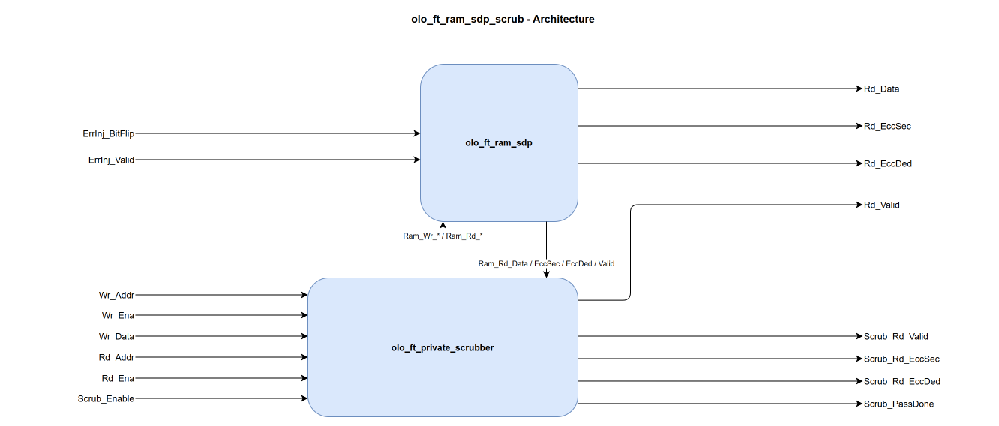

# olo_ft_ram_sdp_scrub

[Back to **Entity List**](../EntityList.md)

## Status Information


VHDL Source: [olo_ft_ram_sdp_scrub](../../src/ft/vhdl/olo_ft_ram_sdp_scrub.vhd)

## Description

This component implements an **ECC-protected simple dual-port RAM with an opportunistic memory scrubber**. It composes
two existing entities:

- [olo_ft_ram_sdp](./olo_ft_ram_sdp.md) - the SECDED-protected simple dual-port RAM (encoder + RAM + decoder).
- [olo_ft_private_scrubber](./olo_ft_private_scrubber.md) - the private opportunistic scrubber FSM.

The user-facing interface mirrors [olo_ft_ram_sdp](./olo_ft_ram_sdp.md) (write port + read port + error injection)
plus a scrubber-enable input and four scrubber-status outputs. ECC encoding/decoding is transparent; the scrubber
additionally walks the address space autonomously and writes corrected codewords back when a single-bit error is
detected, refreshing the memory before a second upset can accumulate into an uncorrectable double-bit error.

This entity is **synchronous-only**: there is no `IsAsync_g` generic and no `Rd_Clk` / `Rd_Rst` port. The scrubber
observes both user ports on a single clock to pick idle cycles. If you need independent read/write clocks, use plain
[olo_ft_ram_sdp](./olo_ft_ram_sdp.md) without scrubbing.

This is useful in **radiation-hardened** designs where single-event upsets (SEUs) can flip bits in memory cells.

For background on the SECDED scheme, the codeword layout, error injection semantics and the constraints that apply
across the _ft_ area, see [Open Logic Fault-Tolerance Principles](./olo_ft_principles.md).

## Generics

| Name           | Type     | Default | Description                                                  |
| :------------- | :------- | ------- | :----------------------------------------------------------- |
| Depth_g        | positive | -       | Number of addresses the RAM has. Must be at least 2.         |
| Width_g        | positive | -       | Number of data bits stored per address (word-width). The internal RAM is wider to accommodate ECC parity bits. |
| RamRdLatency_g | positive | 1       | Read latency of the wrapped RAM, _excluding_ ECC pipeline stages. Higher values can help close timing on the RAM read path. |
| RamStyle_g     | string   | "auto"  | Controls the RAM implementation resource. Passed through to [olo_base_ram_sdp](../base/olo_base_ram_sdp.md). |
| RamBehavior_g  | string   | "RBW"   | Controls the RAM behavior. <br>"RBW": Read-before-write<br>"WBR": Write-before-read |
| EccPipeline_g  | natural  | 0       | Number of pipeline register stages within the ECC decoder (range _0..2_). Total read latency is _RamRdLatency_g_ + _EccPipeline_g_ cycles. See [olo_ft_ram_sdp](./olo_ft_ram_sdp.md#ecc-pipeline) for details. |

## Interfaces

### Clock and Reset

| Name | In/Out | Length | Default | Description                                                  |
| :--- | :----- | :----- | ------- | :----------------------------------------------------------- |
| Clk  | in     | 1      | -       | Clock                                                        |
| Rst  | in     | 1      | -       | Reset (high-active, synchronous to _Clk_). Resets the scrubber FSM and the read-valid pipeline; apply a reset pulse after startup, since the scrubber's address counter does not self-initialize in simulation. The stored RAM contents are unaffected (block RAMs cannot be reset). |

### Write Port

| Name    | In/Out | Length                | Default | Description     |
| :------ | :----- | :-------------------- | ------- | :-------------- |
| Wr_Addr | in     | _ceil(log2(Depth_g))_ | -       | Write address   |
| Wr_Ena  | in     | 1                     | '1'     | Write enable    |
| Wr_Data | in     | _Width_g_             | -       | Write data      |

### Read Port

| Name      | In/Out | Length                | Default | Description                                                  |
| :-------- | :----- | :-------------------- | ------- | :----------------------------------------------------------- |
| Rd_Addr   | in     | _ceil(log2(Depth_g))_ | -       | Read address                                                 |
| Rd_Ena    | in     | 1                     | '1'     | Read enable. _Rd_Valid_ pulses '1' exactly _RamRdLatency_g_+_EccPipeline_g_ cycles after each cycle on which _Rd_Ena_ = '1'. Leave at the default '1' for continuous reads. |
| Rd_Data   | out    | _Width_g_             | N/A     | Read data (corrected if a single-bit error was detected)     |
| Rd_Valid  | out    | 1                     | N/A     | Read-data valid. Pulses '1' only for reads the user issued; cycles consumed by the scrubber's own reads are masked out (see [Architecture](#architecture)). |
| Rd_EccSec | out    | 1                     | N/A     | Single error corrected flag for the current user read.       |
| Rd_EccDed | out    | 1                     | N/A     | Double error detected flag for the current user read. Read data is unreliable in this case. |

### Error Injection (optional)

These ports drive the internal [olo_ft_ecc_encode](./olo_ft_ecc_encode.md) instance (via the wrapped
[olo_ft_ram_sdp](./olo_ft_ram_sdp.md)). Leave them unconnected for normal operation; see
[Open Logic Fault-Tolerance Principles - Error Injection](./olo_ft_principles.md#error-injection) for the shared
latched-strobe semantics.

> **Note on scrubber interaction.** `ErrInj_*` is design-for-test only. The encoder's injection latch is consumed by
> the very next encoder write, which in the scrub variant may be a scrubber writeback rather than the user's intended
> next write. Either drive `ErrInj_Valid = '1'` together with `Wr_Ena = '1'` in the same cycle (immediate injection,
> bypasses the latch), or pause the scrubber with `Scrub_Enable = '0'` while the latch is preloaded - see
> [Pausing the Scrubber](#pausing-the-scrubber). Even in the worst case, a scrubber-corrupted cell is SEC-correctable
> and is repaired by the next scrubber pass over that address.

| Name           | In/Out | Length                                                              | Default | Description                                                  |
| :------------- | :----- | :------------------------------------------------------------------ | ------- | :----------------------------------------------------------- |
| ErrInj_BitFlip | in     | _[eccCodewordWidth](./olo_ft_pkg_ecc.md#ecccodewordwidth)(Width_g)_ | all 0   | Codeword-wide flip pattern. Each '1' bit XORs the corresponding bit of the stored codeword on the next write. Popcount 1 = SEC-correctable, popcount 2 = DED-detectable. |
| ErrInj_Valid   | in     | 1                                                                   | '0'     | Strobe that latches _ErrInj\_BitFlip_ into the encoder's pending-injection register. The latched pattern is applied to the next write. If _ErrInj\_Valid_ = '1' and _Wr\_Ena_ = '1' in the same cycle the pattern is applied directly without going through the latch. |

### Scrubber Control

| Name         | In/Out | Length | Default | Description                                                  |
| :----------- | :----- | :----- | ------- | :----------------------------------------------------------- |
| Scrub_Enable | in     | 1      | '1'     | External enable. '1' = the scrubber runs in idle cycles. '0' suspends it on the same cycle: the FSM is held in `Idle_s`, the scrubber's read and writeback requests are gated low combinationally, and the address counter is **preserved** so coverage resumes from the same address when this is reasserted. Use it to pin the scrubber down during ECC error-injection tests. |

### Scrubber Status

The status outputs report the scrubber's _own_ reads and are valid only on the cycle _Scrub_Rd_Valid_ = '1'.

| Name            | In/Out | Length | Default | Description                                                  |
| :-------------- | :----- | :----- | ------- | :----------------------------------------------------------- |
| Scrub_Rd_Valid  | out    | 1      | N/A     | Pulses '1' on the cycle a scrubber-issued read returns from the decoder (one pulse per scrubber read, regardless of whether an error was detected). Qualifies _Scrub_Rd_EccSec_ / _Scrub_Rd_EccDed_; also used by the scrubber core to mask the user-facing _Rd_Valid_. |
| Scrub_Rd_EccSec | out    | 1      | N/A     | SEC flag of the scrubber's own read. The scrubber writes this address back when it is '1' (and _Scrub_Rd_EccDed_ = '0'). |
| Scrub_Rd_EccDed | out    | 1      | N/A     | DED flag of the scrubber's own read. The scrubber **does not** write the cell back in this case (the corrected value is unreliable). |
| Scrub_PassDone  | out    | 1      | N/A     | Pulses '1' for one cycle when the scrubber's address counter rolls over from _Depth_g_-1 back to 0, marking a completed pass over the memory. |

## Detailed Description

### Architecture



The wrapper places the [olo_ft_private_scrubber](./olo_ft_private_scrubber.md) in front of the wrapped
[olo_ft_ram_sdp](./olo_ft_ram_sdp.md). The scrubber owns the user/scrubber arbitration: the user write port (`Wr_*`)
and read port (`Rd_*`) feed the scrubber's user write and read channels, and the scrubber returns muxed write and read
RAM channels (`Ram_Wr_*` / `Ram_Rd_*`) that map **1:1** onto the RAM's write and read ports, so the wrapper carries no
mux logic of its own. It taps the RAM's decoded read output (`Ram_Rd_Data` / `Ram_Rd_EccSec` / `Ram_Rd_EccDed`) for
its FSM and writeback payload. The user always wins; the scrubber drives the RAM only when **both** user ports are idle
(`Wr_Ena = Rd_Ena = 0`). `ErrInj_*` go directly to the wrapped RAM's encoder, bypassing the scrubber.

The decoder's `Rd_Data` / `Rd_EccSec` / `Rd_EccDed` are forwarded straight to the user. The RAM's read-valid is fed
into the scrubber, which masks the cycles consumed by its own reads and returns the user-facing valid
(`User_Rd_Valid = Ram_Rd_Valid AND NOT Scrub_Rd_Valid`); the wrapper forwards that directly to `Rd_Valid`. The mask
lives in the scrubber core because its read-valid is already aligned to the decoder-return cycle by the internal
length-(`RamRdLatency_g` + `EccPipeline_g`) pipeline (see [olo_ft_private_scrubber](./olo_ft_private_scrubber.md)).

### Opportunistic Scrubbing

- **Idle-only.** Although the underlying RAM has independent write and read ports (so the _user_ can read and write
  in the same cycle), the scrubber acts only on cycles where **neither** user port is active (`Wr_Ena = '0'` and
  `Rd_Ena = '0'`). A continuously active user starves the scrubber but never causes data corruption.
- **Free-running.** There is no rate-limit generic; the scrubber advances as fast as user-idle cycles allow.
- **User always wins.** Any user access (or `Scrub_Enable = '0'`) raises `Scrub_Inhibit`, which aborts an in-flight
  scrub operation back to `Idle_s` without advancing the address counter and without writing back. The address is
  retried on the next idle slot, so user data is always authoritative.
- **SEC-only writeback.** Only correctable single-bit errors are rewritten. Clean cells are left untouched; a DED read
  is reported on `Scrub_Rd_EccDed` but never written back.

See [olo_ft_private_scrubber](./olo_ft_private_scrubber.md) for the scrubber FSM (states, abort behavior and read-valid
alignment).

### Pausing the Scrubber

`Scrub_Enable = '0'` holds the scrubber FSM in `Idle_s` and gates its read/writeback requests low combinationally
on the same cycle. The internal address counter is preserved, so the next `Scrub_Enable = '1'` resumes scrubbing from
the same address. This is the deterministic way to keep the scrubber from interacting with an injection-test sequence:

```vhdl
Scrub_Enable <= '0';
wait until rising_edge(Clk);     -- FSM held in Idle_s
ErrInj_BitFlip <= some_pattern;  -- preload the encoder's injection latch
ErrInj_Valid   <= '1';
wait until rising_edge(Clk);
ErrInj_Valid   <= '0';
... wait / set up / verify ...
Wr_Ena  <= '1';                  -- the latched pattern lands on this write
Wr_Data <= test_value;
Wr_Addr <= test_addr;
wait until rising_edge(Clk);
Wr_Ena  <= '0';
... read back, check Rd_EccSec = '1' ...
Scrub_Enable <= '1';             -- resume background scrubbing
```

### ECC Overhead, Error Injection and Status Flags

The ECC behavior is identical to the wrapped [olo_ft_ram_sdp](./olo_ft_ram_sdp.md), because it is the same instance.
See the corresponding sections in [Open Logic Fault-Tolerance Principles](./olo_ft_principles.md):

- [ECC Overhead](./olo_ft_principles.md#ecc-overhead) - internal storage width vs. data width
- [Error Injection](./olo_ft_principles.md#error-injection) - semantics of _ErrInj\_BitFlip_ / _ErrInj\_Valid_
- [Error Status Flags](./olo_ft_principles.md#error-status-flags) - meaning of _Rd_EccSec_ / _Rd_EccDed_

### Constraints

See
[Open Logic Fault-Tolerance Principles - Constraints That Apply Across the Area](./olo_ft_principles.md#constraints-that-apply-across-the-area)
for the no-byte-enables and no-initialization constraints. In addition, the scrubbing wrapper is **synchronous-only**:
the scrubber observes the user ports on a single clock, so there is no async read clock (no `IsAsync_g`).
