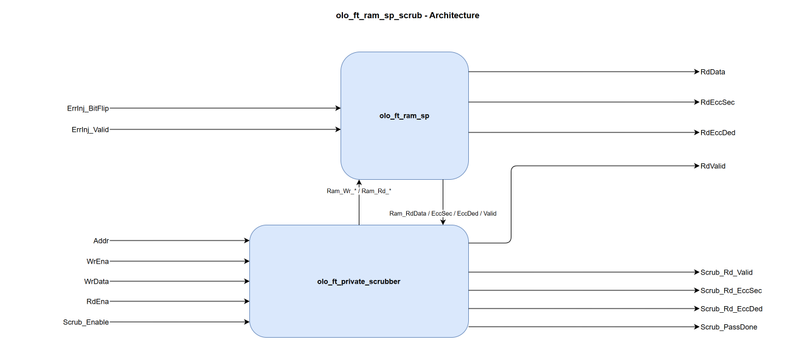

# olo_ft_ram_sp_scrub

[Back to **Entity List**](../EntityList.md)

## Status Information


VHDL Source: [olo_ft_ram_sp_scrub](../../src/ft/vhdl/olo_ft_ram_sp_scrub.vhd)

## Description

This component implements an **ECC-protected single-port RAM with an opportunistic memory scrubber**.

The user-facing interface is identical to [olo_ft_ram_sp](./olo_ft_ram_sp.md) plus a scrubber-enable input and four
scrubber-status outputs. ECC encoding/decoding is transparent; the scrubber additionally walks the address space
autonomously and writes corrected codewords back when a single-bit error is detected, refreshing the memory before a
second upset can accumulate into an uncorrectable double-bit error. Because the underlying RAM is single-port, the
scrubber only issues a read or a writeback on cycles where the user is doing neither (`WrEna = '0'` and `RdEna = '0'`).
User accesses are never stalled.

By default the scrubber is free-running. An optional internal pacer can instead limit it to one pass every
_ScrubPeriod_g_ seconds and flag _Scrub_Overrun_ if a pass overruns its period; see
[olo_ft_private_scrubber - Scrub Pacing](./olo_ft_private_scrubber.md#scrub-pacing-optional).

This is useful in **radiation-hardened** designs where single-event upsets (SEUs) can flip bits in memory cells.

For background on the SECDED scheme, the codeword layout, error injection semantics and the constraints that apply
across the _ft_ area, see [Open Logic Fault-Tolerance Principles](./olo_ft_principles.md).

## Generics

| Name           | Type     | Default | Description                                                  |
| :------------- | :------- | ------- | :----------------------------------------------------------- |
| Depth_g        | positive | -       | Number of addresses the RAM has. Must be at least 2.         |
| Width_g        | positive | -       | Number of data bits stored per address (word-width). The internal RAM is wider to accommodate ECC parity bits. |
| RamRdLatency_g | positive | 1       | Read latency of the wrapped RAM, _excluding_ ECC pipeline stages. Higher values can help close timing on the RAM read path. |
| RamStyle_g     | string   | "auto"  | Controls the RAM implementation resource. Passed through to [olo_base_ram_sp](../base/olo_base_ram_sp.md). |
| RamBehavior_g  | string   | "RBW"   | Controls the RAM behavior. <br>"RBW": Read-before-write<br>"WBR": Write-before-read |
| EccPipeline_g  | natural  | 0       | Number of pipeline register stages within the ECC decoder (range _0..2_). Total read latency is _RamRdLatency_g_ + _EccPipeline_g_ cycles. See [olo_ft_ram_sp](./olo_ft_ram_sp.md#ecc-pipeline) for details. |
| ScrubClkHz_g   | real     | 100000000.0 | Frequency of _Clk_ in Hz, used **only** to size the optional scrub pacer. Set it to the actual clock frequency; must be >= 1000.0 when the pacer is enabled (_ScrubPeriod_g_ > 0.0), ignored when free-running. See [olo_ft_private_scrubber - Scrub Pacing](./olo_ft_private_scrubber.md#scrub-pacing-optional). |
| ScrubPeriod_g  | real     | 0.0     | Pacer period in seconds: one scrub pass is started every _ScrubPeriod_g_ seconds (1 ms granularity). `0.0` (default) keeps the scrubber free-running; any value > 0.0 enables the pacer. |

## Interfaces

### Clock and Reset

| Name | In/Out | Length | Default | Description                                                  |
| :--- | :----- | :----- | ------- | :----------------------------------------------------------- |
| Clk  | in     | 1      | -       | Clock                                                        |
| Rst  | in     | 1      | -       | Reset (high-active, synchronous to _Clk_). Resets the scrubber FSM and the read-valid pipeline; apply a reset pulse after startup, since the scrubber's address counter does not self-initialize in simulation. The stored RAM contents are unaffected (block RAMs cannot be reset). |

### FT RAM Port

| Name     | In/Out | Length                | Default | Description                                                  |
| :------- | :----- | :-------------------- | ------- | :----------------------------------------------------------- |
| Addr     | in     | _ceil(log2(Depth_g))_ | -       | Address                                                      |
| WrEna    | in     | 1                     | -       | Write enable                                                 |
| WrData   | in     | _Width_g_             | -       | Write data                                                   |
| RdEna    | in     | 1                     | -       | Read enable. _RdValid_ pulses '1' exactly _RamRdLatency_g_+_EccPipeline_g_ cycles after each cycle on which _RdEna_ = '1'. Note: holding _RdEna_ = '1' permanently leaves no idle cycles and starves the scrubber entirely (see [Opportunistic Scrubbing](#opportunistic-scrubbing)); deassert it on cycles without an actual read. |
| RdData   | out    | _Width_g_             | N/A     | Read data (corrected if a single-bit error was detected)     |
| RdValid  | out    | 1                     | N/A     | Read-data valid. Pulses '1' only for reads the user issued; cycles consumed by the scrubber's own reads are masked out (see [Architecture](#architecture)). |
| RdEccSec | out    | 1                     | N/A     | Single error corrected flag. Unmasked pass-through of the decoder's SEC flag: qualify it with _RdValid_ = '1'. On a scrubber-owned read return the flag still appears here but _RdValid_ is masked to '0'; scrubber events are reported separately on _Scrub_EccSec_. |
| RdEccDed | out    | 1                     | N/A     | Double error detected flag. Unmasked pass-through of the decoder's DED flag: qualify it with _RdValid_ = '1' (it can also assert on scrubber read returns, where _RdValid_ = '0'). Read data is unreliable when the flag is set. |

### Error Injection (optional)

These ports drive the internal [olo_ft_ecc_encode](./olo_ft_ecc_encode.md) instance (via the wrapped
[olo_ft_ram_sp](./olo_ft_ram_sp.md)). Leave them unconnected for normal operation; see
[Open Logic Fault-Tolerance Principles - Error Injection](./olo_ft_principles.md#error-injection) for the shared
latched-strobe semantics.

> **Note on scrubber interaction.** The encoder's injection latch is consumed by the next encoder write, which in the
> scrub variant may be a scrubber writeback rather than your intended write. Drive `ErrInj_Valid` together with `WrEna`
> (immediate injection, bypasses the latch), or pause the scrubber with `Scrub_Enable = '0'` while preloading (see
> [Pausing the Scrubber](#pausing-the-scrubber)). See [Error Injection](./olo_ft_principles.md#error-injection) for the
> flip-pattern semantics.

| Name           | In/Out | Length                                                              | Default | Description                                                  |
| :------------- | :----- | :------------------------------------------------------------------ | ------- | :----------------------------------------------------------- |
| ErrInj_BitFlip | in     | _[eccCodewordWidth](./olo_ft_pkg_ecc.md#ecccodewordwidth)(Width_g)_ | all 0   | Codeword-wide flip pattern. Each '1' bit XORs the corresponding bit of the stored codeword on the next write. Popcount 1 = SEC-correctable, popcount 2 = DED-detectable. |
| ErrInj_Valid   | in     | 1                                                                   | '0'     | Strobe that latches _ErrInj\_BitFlip_ into the encoder's pending-injection register. The latched pattern is applied to the next write. If _ErrInj\_Valid_ = '1' and _WrEna_ = '1' in the same cycle the pattern is applied directly without going through the latch. |

### Scrubber Control

| Name         | In/Out | Length | Default | Description                                                  |
| :----------- | :----- | :----- | ------- | :----------------------------------------------------------- |
| Scrub_Enable | in     | 1      | '1'     | External enable. '1' = the scrubber runs in idle cycles. '0' suspends it on the same cycle: the FSM is held in `Idle_s`, the scrubber's read and writeback requests are gated low combinationally, and the address counter is **preserved** so coverage resumes from the same address when this is reasserted. Use it to pin the scrubber down during ECC error-injection tests. |

### Scrubber Status

These outputs report the scrubber's _own_ activity as clean, directly countable one-cycle pulses; no external qualifier
is needed.

| Name           | In/Out | Length | Default | Description                                                  |
| :------------- | :----- | :----- | ------- | :----------------------------------------------------------- |
| Scrub_EccSec   | out    | 1      | N/A     | Pulses '1' for one cycle when a scrubber-issued read observed a single-bit error (SEC); gated internally so user reads never appear here. The scrubber writes that address back, unless a user access (or _Scrub_Enable_ = '0') aborts the operation, in which case the address is retried (see [Opportunistic Scrubbing](#opportunistic-scrubbing)). |
| Scrub_EccDed   | out    | 1      | N/A     | Pulses '1' for one cycle when a scrubber-issued read observed a double-bit error (DED). The scrubber **does not** write the cell back (the corrected value is unreliable). |
| Scrub_PassDone | out    | 1      | N/A     | Pulses '1' for one cycle when the scrubber's address counter rolls over from _Depth_g_-1 back to 0, marking a completed pass over the memory. |
| Scrub_Overrun  | out    | 1      | N/A     | Pacer watchdog. Pulses '1' (and a simulation warning fires) when a new scrub period begins before the previous pass completed. Tied '0' when the pacer is disabled (_ScrubClkHz_g_ = 0.0). See [olo_ft_private_scrubber - Scrub Pacing](./olo_ft_private_scrubber.md#scrub-pacing-optional). |

## Detailed Description

### Architecture



This wrapper composes [olo_ft_ram_sp](./olo_ft_ram_sp.md) (the SECDED-protected single-port RAM: encoder + RAM +
decoder) and [olo_ft_private_scrubber](./olo_ft_private_scrubber.md) (the opportunistic scrubber FSM).

The wrapper places the [olo_ft_private_scrubber](./olo_ft_private_scrubber.md) in front of the wrapped
[olo_ft_ram_sp](./olo_ft_ram_sp.md). The scrubber owns the user/scrubber arbitration: the single user port
(`Addr` / `WrEna` / `WrData` / `RdEna`) feeds both of the scrubber's user channels. Because the underlying RAM is
single-port, the scrubber is instantiated with `SinglePortRam_g => true`, so it collapses the muxed write/read
addresses onto the one physical port itself and drives the wrapper's RAM address from its `Ram_Addr` output; this
wrapper therefore carries no address mux of its own. `ErrInj_*` go directly to the wrapped RAM's encoder, bypassing the
scrubber.

The decoder's `RdData` / `RdEccSec` / `RdEccDed` are forwarded straight to the user, while the user-facing `RdValid` is
the scrubber's masked read valid (scrubber-owned read cycles removed). The arbitration, the registered
read/decide/writeback sequence, the read-valid masking and the optional pacer all live in the scrubber core -- see
[olo_ft_private_scrubber](./olo_ft_private_scrubber.md) for the details.

### Opportunistic Scrubbing

Because the underlying RAM is single-port, the scrubber issues a read **or** a writeback only on cycles where the user
is doing neither (`WrEna = '0'` and `RdEna = '0'`). A continuously active user starves the scrubber but never causes
data corruption.

See [olo_ft_private_scrubber](./olo_ft_private_scrubber.md) for everything the scrubber owns: the FSM (states, abort
behavior, read-valid masking), the user-always-wins arbitration, the SEC-only writeback policy, and the optional pacer.

### Pausing the Scrubber

`Scrub_Enable = '0'` holds the scrubber FSM in `Idle_s` and gates its read/writeback requests low combinationally
on the same cycle. The internal address counter is preserved, so the next `Scrub_Enable = '1'` resumes scrubbing from
the same address. This is the deterministic way to keep the scrubber from interacting with an injection-test sequence:

```vhdl
Scrub_Enable <= '0';
wait until rising_edge(Clk);     -- FSM held in Idle_s
ErrInj_BitFlip <= some_pattern;  -- preload the encoder's injection latch
ErrInj_Valid   <= '1';
wait until rising_edge(Clk);
ErrInj_Valid   <= '0';
... wait / set up / verify ...
WrEna  <= '1';                   -- the latched pattern lands on this write
WrData <= test_value;
wait until rising_edge(Clk);
WrEna  <= '0';
... read back, check RdEccSec = '1' ...
Scrub_Enable <= '1';             -- resume background scrubbing
```

### ECC Overhead, Error Injection and Status Flags

The ECC behavior is identical to the wrapped [olo_ft_ram_sp](./olo_ft_ram_sp.md), because it is the same instance. See
the corresponding sections in [Open Logic Fault-Tolerance Principles](./olo_ft_principles.md):

- [ECC Overhead](./olo_ft_principles.md#ecc-overhead) - internal storage width vs. data width
- [Error Injection](./olo_ft_principles.md#error-injection) - semantics of _ErrInj\_BitFlip_ / _ErrInj\_Valid_
- [Error Status Flags](./olo_ft_principles.md#error-status-flags) - meaning of _RdEccSec_ / _RdEccDed_

### Constraints

See
[Open Logic Fault-Tolerance Principles - Constraints That Apply Across the Area](./olo_ft_principles.md#constraints-that-apply-across-the-area)
for the no-byte-enables and no-initialization constraints. In addition, the scrubbing wrapper is **synchronous-only**:
the scrubber observes the user port on a single clock, so there is no async read clock. There is deliberately no scrub
variant of the true-dual-port RAM; see [olo_ft_private_scrubber](./olo_ft_private_scrubber.md#constraints) for the
rationale.
