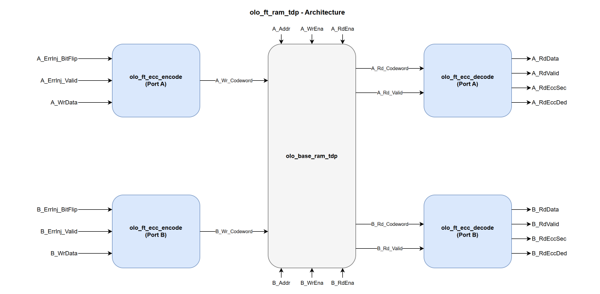

# olo_ft_ram_tdp

[Back to **Entity List**](../EntityList.md)

## Status Information

VHDL Source: [olo_ft_ram_tdp](../../src/ft/vhdl/olo_ft_ram_tdp.vhd)

## Description

This component implements an **ECC-protected true dual-port RAM** using SECDED (Single Error Correction, Double Error
Detection) Hamming code. It wraps [olo_base_ram_tdp](../base/olo_base_ram_tdp.md) internally with a wider word to store
parity bits alongside data.

The ECC is transparent to the user: data is automatically encoded on write and decoded/corrected on read. Error status
flags indicate whether a single-bit error was corrected or a double-bit error was detected.

The true dual-port topology has two fully independent ports (A and B). Each port can read and write, each runs on its
own clock (_A_Clk_ / _B_Clk_), and each has its own ECC encoder and decoder so the two ports are protected
independently.

This is useful in **radiation-hardened** designs where single-event upsets (SEUs) can flip bits in memory cells, e.g. in
space or high-energy physics environments.

For background on the SECDED scheme, the codeword layout, error injection semantics and the constraints that
apply across the _ft_ area, see [Open Logic Fault-Tolerance Principles](./olo_ft_principles.md).

## Generics

| Name           | Type     | Default | Description                                                  |
| :------------- | :------- | ------- | :----------------------------------------------------------- |
| Depth_g        | positive | -       | Number of addresses the RAM has                              |
| Width_g        | positive | -       | Number of data bits stored per address (word-width). The internal RAM is wider to accommodate ECC parity bits. |
| RamRdLatency_g | positive | 1       | Read latency of the wrapped RAM, _excluding_ ECC pipeline stages. Higher values can help close timing on the RAM read path. |
| RamStyle_g     | string   | "auto"  | Controls the RAM implementation resource. Passed through to [olo_base_ram_tdp](../base/olo_base_ram_tdp.md). |
| RamBehavior_g  | string   | "RBW"   | Controls the RAM behavior.  "RBW": Read-before-write "WBR": Write-before-read |
| EccPipeline_g  | natural  | 0       | Number of pipeline register stages within each ECC decoder (range _0..2_).  0 = combinational decode (default).  1 = single register at the decoder output - breaks the path from the RAM read port to the user's logic.  2 = distributed pipeline: register between syndrome compute and correction, plus a register at the output - use this when both halves of the SECDED logic need their own clock cycle to close timing.  See [ECC Pipeline](#ecc-pipeline) for details. Total read latency is _RamRdLatency_g_ + _EccPipeline_g_ cycles. |

## Interfaces

The two ports are symmetric. Port A and Port B carry the same set of signals with the _A\__ / _B\__ prefix
respectively. The descriptions below are written for Port A; Port B behaves identically on its own clock.

### Port A

| Name             | In/Out | Length                                                              | Default | Description                                                  |
| :--------------- | :----- | :----------------------------------------------------------------- | ------- | :----------------------------------------------------------- |
| A_Clk            | in     | 1                                                                  | -       | Port A clock                                                 |
| A_Rst            | in     | 1                                                                  | '0'     | Port A reset (high-active, synchronous to _A_Clk_). Clears the port's error-injection latch and read-valid pipeline. RAM contents are unaffected (block RAMs cannot be reset). |
| A_Addr           | in     | _ceil(log2(Depth_g))_                                             | -       | Port A address                                               |
| A_WrEna          | in     | 1                                                                  | '0'     | Port A write enable                                          |
| A_WrData         | in     | _Width_g_                                                         | 0       | Port A write data                                            |
| A_RdEna          | in     | 1                                                                  | '1'     | Port A read enable. _A_RdValid_ pulses '1' exactly _RamRdLatency_g_+_EccPipeline_g_ cycles after each _A_RdEna_ = '1' cycle. The RAM always reads; _A_RdEna_ only gates the valid flag. Leave at the default '1' for continuous reads. |
| A_RdData         | out    | _Width_g_                                                         | N/A     | Port A read data (corrected if a single-bit error was detected) |
| A_RdValid        | out    | 1                                                                  | N/A     | Port A read-data valid. Pulses '1' when _A_RdData_ / _A_RdEccSec_ / _A_RdEccDed_ correspond to a read (= _A_RdEna_ delayed by _RamRdLatency_g_+_EccPipeline_g_ cycles). |
| A_RdEccSec       | out    | 1                                                                  | N/A     | Port A single error corrected flag. '1' when a single-bit error was detected and corrected. |
| A_RdEccDed       | out    | 1                                                                  | N/A     | Port A double error detected flag. '1' when an uncorrectable double-bit error was detected. Read data is unreliable in this case. |
| A_ErrInj_BitFlip | in     | _[eccCodewordWidth](./olo_ft_pkg_ecc.md#ecccodewordwidth)(Width_g)_ | all 0   | Port A error injection. Codeword-wide flip pattern XORed into the stored codeword. Popcount 1 = SEC-correctable, popcount 2 = DED-detectable. Leave unconnected for normal operation. See [Error Injection](./olo_ft_principles.md#error-injection). |
| A_ErrInj_Valid   | in     | 1                                                                  | '0'     | Port A injection strobe. Latches _A_ErrInj\_BitFlip_ into the encoder's pending-injection register; the pattern is applied to the next write. |

### Port B

| Name             | In/Out | Length                                                              | Default | Description                                  |
| :--------------- | :----- | :----------------------------------------------------------------- | ------- | :------------------------------------------- |
| B_Clk            | in     | 1                                                                  | -       | Port B clock                                 |
| B_Rst            | in     | 1                                                                  | '0'     | Port B reset. Same behavior as _A_Rst_ on _B_Clk_. |
| B_Addr           | in     | _ceil(log2(Depth_g))_                                             | -       | Port B address                               |
| B_WrEna          | in     | 1                                                                  | '0'     | Port B write enable                          |
| B_WrData         | in     | _Width_g_                                                         | 0       | Port B write data                            |
| B_RdEna          | in     | 1                                                                  | '1'     | Port B read enable. Same behavior as _A_RdEna_. |
| B_RdData         | out    | _Width_g_                                                         | N/A     | Port B read data (corrected if a single-bit error was detected) |
| B_RdValid        | out    | 1                                                                  | N/A     | Port B read-data valid. Same behavior as _A_RdValid_. |
| B_RdEccSec       | out    | 1                                                                  | N/A     | Port B single error corrected flag. Same behavior as _A_RdEccSec_. |
| B_RdEccDed       | out    | 1                                                                  | N/A     | Port B double error detected flag. Same behavior as _A_RdEccDed_. |
| B_ErrInj_BitFlip | in     | _[eccCodewordWidth](./olo_ft_pkg_ecc.md#ecccodewordwidth)(Width_g)_ | all 0   | Port B error injection. Same behavior as _A_ErrInj\_BitFlip_. |
| B_ErrInj_Valid   | in     | 1                                                                  | '0'     | Port B injection strobe. Same behavior as _A_ErrInj\_Valid_. |

## Detailed Description

### Architecture

Each port has its own ECC encoder and decoder, so the two ports are protected independently and can run on
independent clocks. The ECC encoding is combinational on each write path. The internal RAM (an instance of
_olo_base_ram_tdp_ with a codeword-wide word) provides the configurable read pipeline (_RamRdLatency_g_) and forwards a
per-port _RdValid_ to the matching decoder. The ECC decoding happens in the per-port
[olo_ft_ecc_decode](./olo_ft_ecc_decode.md) instances and the error flags are time-aligned with the read data
regardless of `EccPipeline_g`.

Unlike the single- and simple-dual-port RAMs, [olo_base_ram_tdp](../base/olo_base_ram_tdp.md) **always reads** on both
ports; the _A_RdEna_ / _B_RdEna_ inputs only gate the corresponding _RdValid_ output, they do not gate the RAM read
itself.

### ECC Pipeline

`EccPipeline_g` is forwarded one-to-one to both internal [olo_ft_ecc_decode](./olo_ft_ecc_decode.md) instances and
inserts register stages on the decode datapath. The range is **0..2**:

| `EccPipeline_g` | Structure |
| :---: | --- |
| 0 | Combinational decode after the RAM read port. _A_RdData_ / _A_RdEccSec_ / _A_RdEccDed_ appear `RamRdLatency_g` cycles after _A_Addr_. |
| 1 | Combinational syndrome + correction + SEC/DED → register near the output. Breaks the path from the RAM read port to the user's logic. |
| 2 | Combinational syndrome → register → combinational correction + SEC/DED → register. Breaks both the syndrome path and the correction path - use this when both halves of the SECDED logic need their own clock cycle to close timing at high clock frequencies. |

Total read latency from address-presented to data-valid is `RamRdLatency_g + EccPipeline_g` clock cycles.

### ECC Overhead, Error Injection and Status Flags

See the corresponding sections in
[Open Logic Fault-Tolerance Principles](./olo_ft_principles.md):

- [ECC Overhead](./olo_ft_principles.md#ecc-overhead) — internal storage width vs. data width
- [Error Injection](./olo_ft_principles.md#error-injection) — semantics of _ErrInj\_BitFlip_ / _ErrInj\_Valid_ (per
  port via the _A\__ / _B\__ prefixes)
- [Error Status Flags](./olo_ft_principles.md#error-status-flags) — meaning of _RdEccSec_ / _RdEccDed_

### Constraints

See
[Open Logic Fault-Tolerance Principles - Constraints That Apply Across the Area](./olo_ft_principles.md#constraints-that-apply-across-the-area)
for the no-byte-enables and no-initialization constraints. In addition, the following `olo_ft_ram_tdp`-specific
constraint applies:

- True dual-port RAM is _NOT_ supported when compiling with Yosys for Cologne Chip FPGAs (inherited from
  [olo_base_ram_tdp](../base/olo_base_ram_tdp.md)).
