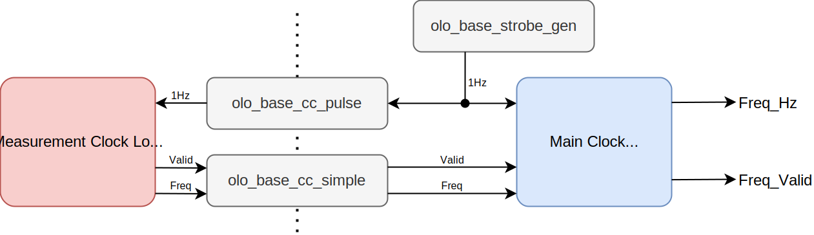

# olo_intf_clk_meas

[Back to **Entity List**](../EntityList.md)

## Status Information

  

VHDL Source: [olo_intf_clk_meas](../../src/intf/vhdl/olo_intf_clk_meas.vhd)

## Description

This entity measures the frequency of a clock under the assumption that the frequency of the main-clock is exactly correct. Generally the system cock comes from PS, the block is useful to verify if other clock are set the correct frequency.

This block contains *Open Logic* clock crossings, refer to [clock crossing principles](../base/clock_crossing_principles.md) regarding timing constraints. 

## Generics

| Name                  | Type | Default | Description                                                  |
| :-------------------- | :--- | ------- | :----------------------------------------------------------- |
| ClkFrequency_g        | real | -       | Frequency of the *Clk* clock (main-clock with a known frequency) in Hz. Must be >= 100 Hz. |
| MaxClkTestFrequency_g | real | 1.0e9   | Maximum frequency of the *ClkTest* clock which can be measured in Hz. Must be >= 100 Hz. |

## Interfaces

| Name       | In/Out | Length | Default | Description                                                  |
| :--------- | :----- | :----- | ------- | :----------------------------------------------------------- |
| Clk        | in     | 1      | -       | Clock                                                        |
| Rst        | in     | 1      | '0'     | Reset input (high-active, synchronous to *Clk*)              |
| ClkTest    | in     | 1      | -       | Clock input of the clock to be measured.                     |
| Freq_Hz    | out    | 32     | -       | Measured clock frequency of *ClkTest* in Hz. Updated once per second and always holds the last measured value (also between *Freq_Valid* pulses). |
| Freq_Valid | out    | 1      | -       | AXI4-Stream handshaking signal for *Freq_Valid*. Pulses high every second when a new *Freq_Hz* value is available. |

## Architecture

Below figure shows the architecture of the entity.

One pulse every second is generated using a *olo_base_strobe_gen* on the main clock. The frequency of the main clock is known and hence the generation of a 1 Hz pulse is trivial.

This pulse is then clock-crossed to the measurement clock domain (using *olo_base_cc_pulse*). On the measurement clock domain the number of clock cycles between two pulses is counted and transferred back to the main clock domain using a *olo_base_cc_simple*.

The logic on the main clock domain does forward the result to the output and additionally detects if no new measurement arrives between to 1 Hz pulses - in this case the measured clock obviously is stopped and the *Freq_Hz* output is set to zero. In case of a stopped clock no new measurement value is sent by the *Measurement Clock Logic* because this logic is synchronous to *ClkTest* and hence does not show any activity if this clock is stopped.

Due to the clock crossings and the internal logic, a certain minimum clock frequency is required for correct measurements. Main clocks (*Clk*) below 100 Hz are not supported and measurement values below that threshold may be imprecise.

