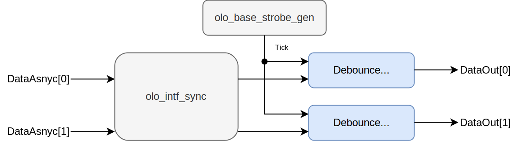

# olo_intf_debounce

[Back to **Entity List**](../EntityList.md)

## Status Information

  

VHDL Source: [olo_intf_debounce](../../src/intf/vhdl/olo_intf_debounce.vhd)

## Description

This component synchronizes external signals and debounces them. The debouncing is implemented efficiently with a prescaler divider shared between all signals in order to keep resource usage as low as possible.

The entity has two modes of operation. 

* In *LOW_LATENCY* mode, an incoming edge is forwarded immediately (less than 5 clock cycles of delay). After the edge is forwarded to the output, the next edge can be detected only after the signal was stable for *DebounceTime_g*.
  * This mode of operation implies that single cycle input pulses are stretched to a pulse-width of *DebounceTime_g*.
* In *GLITCH_FILTER* mode, any signal change is only forwarded to the output after the signal was stable for *DebounceTime_g* on the new level.
  * This mode of operation implies that single cycle input pulses are suppressed.

Below figure provides an example waveform for both modes of operation.

## Generics

| Name           | Type      | Default       | Description                                                  |
| :------------- | :-------- | ------------- | :----------------------------------------------------------- |
| ClkFrequency_g | real      | -             | Frequency of the *Clk* clock in Hz.                          |
| DebounceTime_g | real      | 20.0e-3       | Time during which the signals may bounce in seconds. Must be at least 10 *Clk* periods. |
| Width_g        | positive  | 1             | Number of signals to debounce                                |
| IdleLevel_g    | std_logic | '0'           | Logic level the signal is in idle-state (e.g. button not pressed).  This affects the behavior of *DataOut* immediately after reset (all outputs are set to *IdleLevel_g* upon reset) |
| Mode_g         | string    | "LOW_LATENCY" | Mode of operation. See [Description](#Description) for details.  Valid values are *LOW_LATENCY* and *GLITCH_FILTER*. |

## Interfaces

| Name      | In/Out | Length    | Default | Description                                                  |
| :-------- | :----- | :-------- | ------- | :----------------------------------------------------------- |
| Clk       | in     | 1         | -       | Clock                                                        |
| Rst       | in     | 1         | '0'     | Reset input (high-active, synchronous to *Clk*) For synchronizers the reset is normally not required. |
| DataAsync | in     | *Width_g* | -       | Vector of independent input bits (asynchronous external input). |
| DataSync  | out    | *Width_g* | N/A     | Vector of synchronized and debounced output bits (synchronous to *Clk*) |

## Architecture

Below figure shows the architecture of the entity for a *Width_g=2* setup.

The *olo_base_strobe_gen* serves as prescaler. It produces a *Tick* signal with a target period of 1/31 of *DebounceTime_g*. Due to rounding the actual period may vary (especially for very short *DebounceTime_g* values of only a few clock cycles). The prescaler is shared for all signals to reduce the resource consumption for the normal case where *DebounceTime_g* is very long compared to *ClkFrequency_g*.

The inputs are synchronized using *olo_intf_sync* and one *Debounce Timer* per signal counts how many ticks the signal was stable and does the debouncing based on this counter. The number of *Ticks* the signal must stay stable (equal to *DebounceTime_g*) depends on the exact rounding of the *Tick* frequency - the compensation for the rounding is handled internally by *olo_intf_debounce*.

