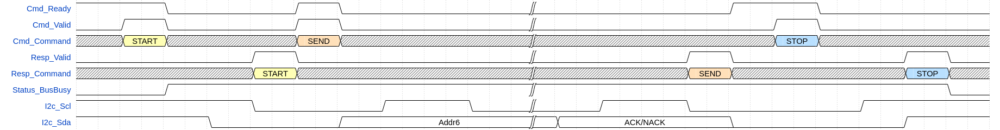

# olo_intf_i2c_master

[Back to **Entity List**](../EntityList.md)

## Status Information

  

VHDL Source: [olo_intf_i2c_master](../../src/intf/vhdl/olo_intf_i2c_master.vhd)

## Description

### Overview

This entity implements an I2C master that is multi-master capable (i.e. supports arbitration). The *olo_intf_i2c_master* allows generating
start, stop and repeated start conditions as well as transferring bytes in both directions. This entity also supports slaves that do clock-stretching.

Addressing is not handled separately. To send the byte containing the address and the R/W bit, the normal byte transfer is used. The user is
responsible for filling the address into bits 7:1 and the R/W flag into bit 0 of the data.

The same applies for 10-bit addressing. The user is responsible to send the 10-bit addressing pattern using two byte transfers.

The bus state (busy or free) is tracked based on start- and stop-conditions. However, if no transactions are ongoing (i.e. SCL = '1' and SDA = '1') for a configurable timeout, the bus is always regarded as free. This helps handling the case where a master starts a transaction and then (e.g. due to reset) aborts the transaction without sending a stop-condition.

The user has three main interfaces:

-   The command interface (*Cmd_...*) allows  to select the next bus action to execute. Commands are:

    -   *START* Send a start condition (only allowed if bus is idle)

    -   *STOP* Send a stop condition (only allowed if bus is not idle)

    -   *REPSTART* Send a repeated start condition (only allowed if the
        bus is not idle)

    -   *SEND* Send a data byte (only allowed if the bus is not idle). 
        The data to send is provided along with the command.

    -   *REC* Receive a data byte (only allowed if the bus is not idle)
        The ACK to send is provided along with the command.

-   On the response interface (*Resp_...*), the user receives one response per command as soon as the command is completed. More information like
    the received ACK bit, whether the command was aborted due to a lost arbitration, the received data or whether the command sequence was
    illegal is sent along with the response.

-   On the status interface (*Status_...*) the user can see if the I2C bus is currently busy or free and if a command timed out (i.e. the user failed to
    provide the next command within time, and hence the bus was released).

For constants containing the command codes, a package *olo_intf_i2c_master_pkg* is defined in the same VHDL file. 

**Note:** The I2C ports must be constrained manually. No solution was found for scoped timing constraints for inferred tristate buffers.

## Generics

| Name               | Type    | Default | Description                                                  |
| :----------------- | :------ | ------- | :----------------------------------------------------------- |
| ClkFrequency_g     | real    | -       | Frequency of the clock *Clk* in Hz. For correct operation, the clock frequency must be at least 16x higher than the I2C bus frequency. |
| I2cFrequency_g     | real    | 100.0e3 | Frequency of the *I2cScl* signal in Hz                       |
| BusBusyTimeout_g   | real    | 1.0e-3  | If *I2cScl* = '1' and *I2cSda* = '1' for this time in sec., the bus is regarded as free. If the user does not provide any command for this time, the *olo_intf_i2c\_master* automatically generates a stop-condition to release the bus. |
| CmdTimeout_g       | real    | 1.0e-3  | When the *olo_intf\_i2c\_master* is ready for the next command but the user does not provide a new command, after this timeout (in sec.) the bus is releases and *Status_CmdTo* is pulsed to inform the user. |
| InternalTriState_g | boolean | true    | **True** = Use internal tri-state buffer (*I2cScl* and *I2cSda*) are used.  **False** = Use external tri-state buffer (*I2cScl\_x* and *I2cSda\_x*) are used. |
| DisableAsserts_g   | boolean | false   | If true, the *olo_intf\_i2c\_master* does not print any messages during simulations.  This generic shall usually be false - it is only used to simulate command sequence errors (which normally produce errors due to assert statements). |

## Interfaces

### Control

| Name | In/Out | Length | Default | Description                                     |
| :--- | :----- | :----- | ------- | :---------------------------------------------- |
| Clk  | in     | 1      | -       | Clock                                           |
| Rst  | in     | 1      | -       | Reset input (high-active, synchronous to *Clk*) |

### Command Interface

| Name        | In/Out | Length | Default | Description                                                  |
| :---------- | :----- | :----- | ------- | :----------------------------------------------------------- |
| Cmd_Ready   | out    | 1      | N/A     | AXI-S handshaking signal for *Cmd_...*                       |
| Cmd_Valid   | in     | 1      | -       | AXI-S handshaking signal for *Cmd_...*                       |
| Cmd_Command | in     | 3      | -       | Command to execute (*olo_intf_i2c_master_pkg*  constant names in brackets) "000" =\> Send startcondition (*CMD\_START*) "001" =\> Send stop condition (*CMD\_STOP*) "010" =\> Send rep. start condition"  (*CMD\_REPSTART)*    "011" =\> Send data  byte (*CMD\_SEND)*  "100" =\> Receive data byte  (*CMD\_REC*) |
| Cmd_Data    | in     | 8      | -       | Data to send (only for *CMD\_SEND*  resp. *Cmd_Command="011"*). |
| Cmd_Ack     | in     | 1      |         | Acknowledge to send (only for *CMD\_REC* resp. *Cmd_Command="100").* **'1'** =\> send ACK , **'0'** =\> send NACK.  **Note that polarity is inverted compared to the acknowledge bit on the I2C bus.** |

### Response Interface

| Name         | In/Out | Length | Default                                                      | Description |
| :----------- | :----- | :----- | ------------------------------------------------------------ | :---------- |
| Resp_Valid   | out    | 1      | AXI-S handshaking signal for *Resp_...* The response interface does not support backpressure. Hence no *Ready* signal is provided. |             |
| Resp_Command | out    | 3      | Type of the command that completed. See *Cmd_Command* for details. |             |
| Resp_Data    | out    | 8      | Received data  Only utilized for *CMD\_REC* resp.  *CmdType="100"* |             |
| Resp_Ack     | out    | 1      | **1** =\> ACK received, **0** =\> NACK received  Note that polarity is inverted compared to the acknowledge bit on the I2C bus. Only utilized for *CMD\_SEND* resp.  *CmdType="011"* |             |
| Resp_ArbLost | out    | 1      | '1' indicates that the command failed because arbitration was lost. |             |
| Resp_SeqErr  | out    | 1      | The command failed because of wrong command sequence (e.g. attempt to do a *CMD\_START* in the middle of an ongoing transfer). |             |

### Status Interface

| Name           | In/Out | Length | Default | Description                                                  |
| :------------- | :----- | :----- | ------- | :----------------------------------------------------------- |
| Status_BusBusy | out    | 1      | N/A     | '1' indicates that the I2C bus is busy (used by this master or another master) |
| Status_CmdTo   | out    | 1      | N/A     | Pulsed high if the bus is released due to a timeout.         |

### I2C Interface

| Name      | In/Out | Length | Default | Description                                                  |
| :-------- | :----- | :----- | ------- | :----------------------------------------------------------- |
| I2c_Scl   | bidir  | 1      | 'Z'     | Used only if **InternalTriState_g = true** SCL signal   |
| I2c_Sda   | bidir  | 1      | 'Z'     | Used only if **InternalTriState_g = true** SDA signal   |
| I2c_Scl_i | in     | 1      | '0'     | Used only if **InternalTriState_g = false** SCL input signal |
| I2c_Scl_o | out    | 1      | N/A     | Used only if **InternalTriState_g = false** SCL output signal |
| I2c_Scl_t | out    | 1      | N/A     | Used only if **InternalTriState_g = false** SCL Tri-State signal ('1' = tristated, '0' drive) |
| I2c_Sda_i | in     | 1      | '0'     | Used only if **InternalTriState_g = false** SDA input signal |
| I2c_Sda_o | out    | 1      | N/A     | Used only if **InternalTriState_g = false** SDA output signal |
| I2c_Sda_t | out    | 1      | N/A     | Used only if **InternalTriState_g = false** SCL Tri-State signal ('1' = tristated, '0' drive) |

## Architecture

 ### Typical Command Sequences

 This section provides a few examples for command/response sequences for typical use cases.

 Note that the response of the last command is always available before the next command must be asserted. So it is possible to apply commands
 based on responses received (e.g. not applying a new command if arbitration was lost).

 #### Two Byte Read

 -   CMD\_START -- send start condition
 -   CMD\_SEND -- send address byte (slave responds with ACK)
 -   CMD\_REC -- receive data and send ACK
 -   CMD\_REC -- receive data and send NACK
 -   CMD\_STOP -- send stop condition

| **Order** | **CmdType** | **CmdData** | **CmdAck** | **RspType** | **RspData** | **RspAck** | **RspArbLost** | **RespSeq** |
| --------- | ----------- | ----------- | ---------- | ----------- | ----------- | ---------- | -------------- | ----------- |
| 1         | CMD\_START  | N/A         | N/A        | CMD\_START  | N/A         | N/A        | 0              | 0           |
| 2         | CMD\_SEND   | Addr + R/W  | N/A        | CMD\_SEND   | N/A         | 1          | 0              | 0           |
| 3         | CMD\_REC    | N/A         | 1          | CMD\_REC    | Data        | N/A        | 0              | 0           |
| 4         | CMD\_REC    | N/A         | 0          | CMD\_REC    | Data        | N/A        | 0              | 0           |
| 5         | CMD\_STOP   | N/A         | N/A        | CMD\_STOP   | N/A         | N/A        | 0              | 0           |

 ### Two Byte Write

 -   CMD\_START -- send start condition
 -   CMD\_SEND -- send address byte (slave responds with ACK)
 -   CMD\_SEND -- send data (slave responds with ACK)
 -   CMD\_SEND -- send data (slave responds with NACK)
 -   CMD\_STOP -- send stop condition

| **Order** | **CmdType** | **CmdData** | **CmdAck** | **RspType** | **RspData** | **RspAck** | **RspArbLost** | **RespSeq** |
| --------- | ----------- | ----------- | ---------- | ----------- | ----------- | ---------- | -------------- | ----------- |
| 1         | CMD\_START  | N/A         | N/A        | CMD\_START  | N/A         | N/A        | 0              | 0           |
| 2         | CMD\_SEND   | Addr + R/W  | N/A        | CMD\_SEND   | N/A         | 1          | 0              | 0           |
| 3         | CMD\_SEND   | Data        | N/A        | CMD\_SEND   | N/A         | 1          | 0              | 0           |
| 4         | CMD\_SEND   | Data        | N/A        | CMD\_SEND   | N/A         | 0          | 0              | 0           |
| 5         | CMD\_STOP   | N/A         | N/A        | CMD\_STOP   | N/A         | N/A        | 0              | 0           |

 ### One Byte Write followed by One Byte Read (with Repeated Start)

 -   CMD\_START -- send start condition
 -   CMD\_SEND -- send address byte (slave responds with ACK)
 -   CMD\_SEND -- send data (slave responds with ACK)
 -   CMD\_REPSTART -- Repeated start
 -   CMD\_REC -- receive data and send NACK
 -   CMD\_STOP -- send stop condition

| Order | CmdType     | CmdData    | CmdAck | RspType       | RspData | RspAck | RspArbLost | RespSeq |
| ----- | ----------- | ---------- | ------ | ------------- | ------- | ------ | ---------- | ------- |
| 1     | CMD\_START  | N/A        | N/A    | CMD\_START    | N/A     | N/A    | 0          | 0       |
| 2     | CMD\_SEND   | Addr + R/W | N/A    | CMD\_SEND     | N/A     | 1      | 0          | 0       |
| 3     | CMD\_SEND   | Data       | N/A    | CMD\_REC      | N/A     | 1      | 0          | 0       |
| 4     | CMD\_REPST. | N/A        | N/A    | CMD\_REPSTART | N/A     | N/A    | 0          | 0       |
| 4     | CMD\_REC    | N/A        | 0      | CMD\_REC      | Data    | N/A    | 0          | 0       |
| 5     | CMD\_STOP   | N/A        | N/A    | CMD\_STOP     | N/A     | N/A    | 0          | 0       |

 #### Arbitration Lost

 -   CMD\_START -- send start condition
 -   CMD\_SEND -- send address byte (slave responds with ACK)
 -   CMD\_SEND -- send data (arbitration is lost during this byte)
 -   CMD\_REPSTART -- Repeated start
     -   This command is ignored (RespSeq='1') because it is illegal when the bus is not owned

| **Order** | **CmdType** | **CmdData** | **CmdAck** | **RspType**   | **RspData** | **RspAck** | **RspArbLost** | **RespSeq** |
| --------- | ----------- | ----------- | ---------- | ------------- | ----------- | ---------- | -------------- | ----------- |
| 1         | CMD\_START  | N/A         | N/A        | CMD\_START    | N/A         | N/A        | 0              | 0           |
| 2         | CMD\_SEND   | Addr + R/W  | N/A        | CMD\_SEND     | N/A         | 1          | 0              | 0           |
| 3         | CMD\_SEND   | Data        | N/A        | CMD\_REC      | N/A         | N/A        | 1              | 0           |
| 4         | CMD\_REPST. | N/A         | N/A        | CMD\_REPSTART | N/A         | N/A        | 0              | 1           |

 ### Example Waveform

The waveform below shows the very simplest transaction possible: Transmitting an address only to probe if the slave is available. This simple transaction was chosen to keep the waveform as short as possible.  The main focus is on the sequence of events, not on the I2C transaction.

 

 
 Address only transaction 

