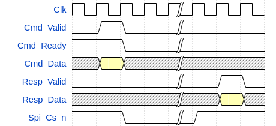

# olo_intf_spi_master

[Back to **Entity List**](../EntityList.md)

## Status Information

VHDL Source: [olo_intf_spi_master](../../src/intf/vhdl/olo_intf_spi_master.vhd)

## Description

### Overview

This entity implements a simple SPI master. All common SPI settings are configurable to ensure the master can be
configured for different applications.

The clock and data phase is configurable according to the SPI standard terminology described in the picture below:

 

 CPOL and CPHA meaning 

For CPHA = 1, the sampling happens on the second edge (blue) and data is applied on the first edge (red). For CPHA = 0
it is the opposite way.

The number of bits to transfer can be chosen per transaction. Alternatively, the related port _Cmd_TransWidth_ can be
left unconnected - in this case, all transactions are _MaxTransWidth_g_ bits. Similarly the slave to communicate with
can be selected through _Cmd_Slave_ for every transaction ot the signal can be left unconnected when only one slave is
used - in this case all transactions implicitly are for communicating with slave 0.

The user interface (FPGA side) is split into a command interface (_Cmd_..._) and a response interface (_Resp_..._).
Below figure summarizes how they behave timing-wise.

## Generics

| Name            | Type      | Default | Description                                                  |
| :-------------- | :-------- | ------- | :----------------------------------------------------------- |
| ClkFreq_g       | real      | -       | Frequency of the clock _Clk_ in Hz. For correct operation, the clock frequency must be at least 4x higher than _SclkFreq_g_. |
| SclkFreq_g      | real      | 1.0e6   | SPI clock (_Sclk_) frequency in Hz.                          |
| MaxTransWidth_g | positive  | 32      | Maximum number of bits to transfer per SPI transaction. The actual number of bits to transfer for every transaction is selected through _Cmd_TransWidth_. If all transactions have the same width, _Cmd_TransWidth_ can be left unconnected - in this case always _MaxTransWidth_g_ bits are transferred. |
| CsHighTime_g    | real      | 20e-9   | Minimum _Cs_n_ high time between two consecutive transactions in seconds. |
| SpiCpol_g       | natural   | 1       | SPI clock polarity, see figure in [Overview](#overview). Range: 0 or 1 |
| SpiCpha_g       | natural   | 1       | SPI clock phase, see figure in [Overview](#overview). Range: 0 or 1 |
| SlaveCnt_g      | positive  | 1       | Number of slaves (number of bits in _SpiCs_n_).              |
| LsbFirst_g      | boolean   | false   | **True**: Transactions are LSB first (data bit 0 is sent first). **False**: Transactions are MSB first (data bit 0 is sent last) |
| MosiIdleState_g | std_logic | '0'     | State of _SpiMosi_ when no transaction is ongoing. In most cases this does not matter. |

## Interfaces

### Control

| Name | In/Out | Length | Default | Description                                     |
| :--- | :----- | :----- | ------- | :---------------------------------------------- |
| Clk  | in     | 1      | -       | Clock                                           |
| Rst  | in     | 1      | -       | Reset input (high-active, synchronous to _Clk_) |

### Command Interface

| Name           | In/Out | Length                          | Default           | Description                                                  |
| :------------- | :----- | :------------------------------ | ----------------- | :----------------------------------------------------------- |
| Cmd_Ready      | out    | 1                               | N/A               | AXI-S handshaking signal for _Cmd_..._                       |
| Cmd_Valid      | in     | 1                               | -                 | AXI-S handshaking signal for _Cmd_..._                       |
| Cmd_Slave      | in     | _ceil(log2(SlaveCnt_g))_        | 0                 | Index of the slave to communicate with. 0 ("0000") -> Spi_Cs_n[0] is operated 3 ("0011") -> Spi_Cs_n[3] is operated The port can be left unconnected if only one slave is used. |
| Cmd_Data       | in     | _MaxTransWidth_g_               | 0                 | Data to send. For _TransWidth_ < _MaxTransWidth_g_ the data is right aligned (MSBs are unused). |
| Cmd_TransWidth | in     | _ceil(log2(MaxTransWidth_g+1))_ | _MaxTransWidth_g_ | Number of bits to transfer in this transaction. The port can be left unconnected if all transactions are _MaxTransWidth_g_ bits wide. |

### Response Interface

| Name       | In/Out | Length            | Default | Description                                                  |
| :--------- | :----- | :---------------- | ------- | :----------------------------------------------------------- |
| Resp_Valid | out    | 1                 | N/A     | AXI-S handshaking signal for _Resp_..._ The response interface does not support backpressure. Hence no _Ready_ signal is provided. |
| Resp_Data  | out    | _MaxTransWidth_g_ | N/A     | Data received For _TransWidth_ < _MaxTransWidth_g_ the data is right aligned (MSBs are unused). |

### SPI Interface

| Name     | In/Out | Length       | Default | Description                                                  |
| :------- | :----- | :----------- | ------- | :----------------------------------------------------------- |
| Spi_Sclk | out    | 1            | N/A     | SPI clock (frequency selected through _SclkFreq_g_)          |
| Spi_Mosi | out    | 1            | N/A     | SPI data from master to slaves                               |
| Spi_Miso | in     | 1            | '0'     | SPI data from slaves to master.  Can be left unconnected if the master only does write data. |
| Spi_Cs_n | out    | _SlaveCnt_g_ | N/A     | SPI chip select (one signal per slave)                       |

## Architecture

### Clock Frequency Calculation

The _Spi_Sclk_ signal is implemented as data-signal (not generated through a PLL) in the FPGA.

The frequency of _Spi_Sclk_ is calculated as follows:

<!-- markdownlint-disable -->
_Fsclk = Fclk / (2 x N)_
<!-- markdownlint-restore -->

_N_ is an integer and chosen automatically according to _ClkFreq_g_ and _SclkFreq_g_. However, the resulting clock
frequency is affected by rounding. The _olo_intf_spi_master_ does assert an error if the SCLK frequency is off by more
than 10% compared to _SclkFreq_g_ requested. To avoid this issue for _SclkFreq_g_ values that are high, chose
_SclkFreq_g_ to be implementable according to the formula below.
