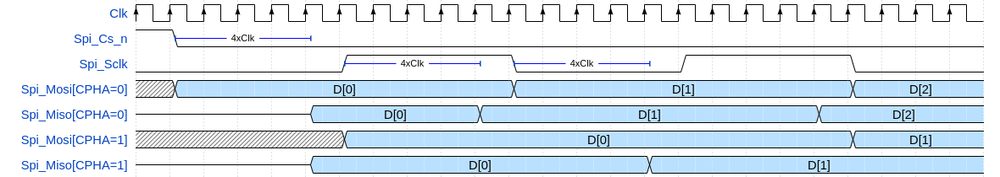
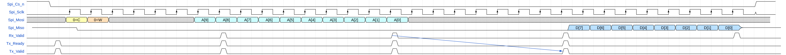

# olo_intf_spi_slave

[Back to **Entity List**](../EntityList.md)

## Status Information

VHDL Source: [olo_intf_spi_slave](../../src/intf/vhdl/olo_intf_spi_slave.vhd)

## Description

### Overview

This entity implements a simple SPI slave. All common SPI settings are configurable to ensure the master can be
configured for different applications.

The clock and data phase is configurable according to the SPI standard terminology (CPHA/CPOL). See
[Details](#details) for more information.

The component allows single transactions (where _CS_n_ goes high after every transaction) and consecutive transactions
(where _CS_n_ does not go high between transactions), which makes it flexible to implement various protocols. See
[Details](#details) for more information.

On the user-side there are 3 AXI4-Stream interfaces:

- TX data (data transmitted from the slave - through MISO)
- RX data (data received from the master - through MOSI)
- Response - informing the user whether TX data was transmitted or if the master aborted the transaction by pulling
  _CS_n_ high.
  - The Response interface is optional and in most cases can be omitted.

The all SPI signals are properly synchronized to _Clk_ using [olo_intf_sync](./olo_intf_sync.md) within
_olo_intf_spi_slave_.

The maximum supported _Spi_Sclk_ frequency is 10x less than the _Clk_ frequency (with some tricks up to 8x less).

## Generics

| Name                      | Type     | Default | Description                                                  |
| :------------------------ | :------- | ------- | :----------------------------------------------------------- |
| TransWidth_g              | positive | 32      | Number of bits in every SPI transaction.                     |
| SpiCpol_g                 | natural  | 0       | SPI clock polarity, see figure in [Overview](#overview). Range: 0 or 1 |
| SpiCpha_g                 | natural  | 0       | SPI clock phase, see figure in [Overview](#overview). Range: 0 or 1 |
| LsbFirst_g                | boolean  | false   | **True**: Transactions are LSB first (data bit 0 is sent first). **False**: Transactions are MSB first (data bit 0 is sent last) |
| ConsecutiveTransactions_g | boolean  | false   | **True**: Multiple transactions without _CS_n_ going high are supported **False**: _CS_n_ must go high between transactions Only enable when required - see [Details](#details) for more information. |
| InternalTriState_g        | boolean  | true    | **True** = Use internal tri-state buffer (_Spi_Miso_ is used).  **False** = Use external tri-state buffer (_Spi_Miso_t_ and _Spi_Miso_o_) are used). |

## Interfaces

### Control

| Name | In/Out | Length | Default | Description                                                  |
| :--- | :----- | :----- | ------- | :----------------------------------------------------------- |
| Clk  | in     | 1      | -       | Clock - Frequency must e at least **10x higher than _Spi_Sclk_ frequecy** For higher SCLK frequencies refer to [Achieving High SCLK Frequencies](#achieving-high-sclk-frequencies) |
| Rst  | in     | 1      | -       | Reset input (high-active, synchronous to _Clk_)              |

### RX Data Interface

Interface for data received from the master through _Spi_Mosi_.

| Name     | In/Out | Length         | Default | Description                            |
| :------- | :----- | :------------- | ------- | :------------------------------------- |
| Rx_Valid | out    | 1              | N/A     | AXI-S handshaking signal for _Rx_Data_ |
| Rx_Data  | out    | _TransWidth_g_ | N/A     | Data received from Master              |

### TX Data Interface

Interface for data sent to the master through *Spi_Miso.

| Name     | In/Out | Length         | Default | Description                            |
| :------- | :----- | :------------- | ------- | :------------------------------------- |
| Tx_Valid | in     | 1              | '1'     | AXI-S handshaking signal for _Rx_Data_ |
| Tx_Ready | out    | 1              | N/A     | AXI-S handshaking signal for _Rx_Data_ |
| Tx_Data  | in     | _TransWidth_g_ | 0       | Data received from Master              |

### Response Interface

In most cases transactions will never be aborted and hence the user can does not need to înterpret output of the
_Response_ interface. In this case, the related ports can be left unconnected.

| Name          | In/Out | Length | Default | Description                                                  |
| :------------ | :----- | :----- | ------- | :----------------------------------------------------------- |
| Resp_Valid    | out    | 1      | N/A     | AXI-S handshaking signal for _Resp_..._                      |
| Resp_Sent     | out    | 1      | N/A     | Indicates that TX data the user applied through the _Tx_..._ interface was successfully transmitted to the master. |
| Resp_Aborted  | out    | 1      | N/A     | Indicates that the transmission of TX data the user applied through the _Tx_..._ interface was aborted by the master pulling _Cs_n_ high before the transfer was completed. |
| Resp_CleanEnd | out    | 1      | N/A     | Indicates that _Cs_n_ was pulled high witout any remaining data to transmit. |

The difference between _Resp_Sent_ and _Resp_CleanEnd_ becomes obvious for continuous transactions without _Cs_n_ going
high. In this case _Resp_Sent_ is pulsed high for every transaction and _Resp_CleanEnd_ is pulsed high only once at the
very end.

All signals in the response interface are single cycle pulses. The user may also just regard _Resp_Sent_, _Resp_Aborted_
and _Resp_CleanEnd_ as single cycle pulses and ignore _Resp_Valid_.

### SPI Interface

| Name       | In/Out | Length | Default | Description                                                  |
| :--------- | :----- | :----- | ------- | :----------------------------------------------------------- |
| Spi_Cs_n   | in     | 1      | N/A     | SPI chip select (low-active).                                |
| Spi_Sclk   | in     | 1      | N/A     | SPI clock. Frequency must be at least **10x lower than _Clk_ frequency**. For higher SCLK frequencies refer to [Achieving High SCLK Frequencies](#achieving-high-sclk-frequencies) |
| Spi_Mosi   | in     | 1      | '0'     | SPI data from master to slave. Can be left unconnected if only the slave does send data. |
| Spi_Miso   | out    | 1      | N/A     | Used only if **InternalTriState_g = true** SPI data from slave to master.  Can be left unconnected if the only the master does send data. |
| Spi_Miso_t | out    | 1      | N/A     | Used only if **InternalTriState_g = false** _Spi_Miso_ Tri-State signal ('1' = tristated, '0' drive) Can be left unconnected if the only the master does send data. |
| Spi_Miso_o | out    | 1      | N/A     | Used only if **InternalTriState_g = false** _Spi_Miso_ output data signal. Can be left unconnected if the only the master does send data. |

## Details

### Detailed Description of Generics

The generics which are not self-explaining are covered in this section in detail.

#### SpiCpol_g and SpiCpha_g

The clock and data phase is configurable according to the SPI standard terminology described in the picture below:

 

 CPOL and CPHA meaning 

For CPHA = 1, the sampling happens on the second edge (blue) and data is applied on the first edge (red). For CPHA = 0
it is the opposite way.

The implementation in _olo_intf_spi_slave_ is slightly different. Data is sampled and applied on the same edge. Reason
for this implementation is that the propagation delay from an incoming _Spi_Sclk_ edge until the _Spi_Miso_ data is
updated is relatively long (4 clock cycles). As a result _Spi_Miso_ hold-time is uncritical - and in contrast _Spi_Miso_
setup time is critical. To maximize the allowed _Spi_Sclk_ frequency, it is optimal to apply _Spi_Miso_ output data as
soon as possible (4 clock cycles after) the _Spi_Sclk_ sampling edge.

 

 Meaning of LsbFirst_g 

#### LsbFirst_g

If this generic is set to _true_, the data is transmitted/received LSB first. Otherwise data is received/transmitted MSB
first.

 

 Meaning of LsbFirst_g 

#### ConsecutiveTransactions_g

If this is generic is set to _false_, _Spi_Cs_n_ must always go high between two transactions. If it is _true_,
transactions can happen consecutively (i.e. with _Spi_Cs_n_) staying low.

 

 Separate transactions (ConsecutiveTransactions_g = false) 

 

 Consecutive transactions (ConsecutiveTransactions_g = true) 

Note that there is always at least one clock cycle of time available from _Rx_Valid_ assertion until the latest point
_Tx_Valid_ must be asserted to inject data for the next transaction.

### User-Side Interfaces

#### TX Data Interface

This interface is used to transfer the TX data (to be transferred to the master through _Spi_Miso_) from the user to
_olo_intf_spi_slave_. The TX data is latched at the very beginning of each transaction.

For the TX data interface (_Tx_..._) the following applies:

- When _Tx_Ready_ goes high and the user does not provide TX data (i.e. set _Tx_Valid_='1') before _Tx_Ready_ goes low
  again, zeros are transmitted. The user _CANNOT_ provide _Tx_Data_ at a later point in time for this specific
  transaction. _Tx_Ready_ goes low when it is too late to send the first bit of data in-time for the first transmitting
  clock edge.
- For the setting _SpiCpha_g_=0, _Spi_Miso_ must become valid after the falling-edge of _Spi_Cs_n_ immediately, as
  visible from the figure in [Overview](#overview). Therefore in this case, the application of _Tx_Data_ must happen
  immediately. Hence _Tx_Ready_ is only pulsed high for one single clock cycle and the user must present _Tx_Data_ and
  apply _Tx_Valid_='1' in this cycle.
- For consecutive transactions, the comment applies only to the very first transaction after _Spi_Cs_n_ going low. For
  the following transactions, the _Tx_Ready_ high phase is longer.

#### RX Data Interface

This interface is used to transfer the RX data (received from the master through _Spi_Mosi_) from _olo_intf_spi_slave_
to the user. The RX data is presented at the very end of each transaction.

- The _Rx_..._ interface does not support backpressure. The user _MUST_ read _Rx_Data_ in the single clock cycle
- _Rx_Valid_ is high.

#### Response Interface

Generally, the response interface _Resp\_..._ informs the user about how a transaction ended. In most cases this
information is not needed and the user can leave all _Resp_..._ ports unconnected.

- _Resp_Sent_='1' indicates that data the user passed through _Tx_..._ was successfully and completely sent to the
  master.
- _Resp_Aborted_='1' indicates that _Spi_Cs_n_ was pulled high _BEFORE_ all data the user passed through _Tx_..._ was
  sent to the master.
- _Resp_CleanEnd_='1' indicates that _Spi_Cs_n_ was pulled high at a moment where no transmit data was pending (because
  the user did not assert _Tx_Valid_ for the next transaction).

For single transactions, there are the following options:

1. One _Resp_Aborted_='1' response if the user passed data through the _Tx_..._ intetrface and _Spi_Cs_n_ is pulled high
   during the transaction.
2. One _Resp_Sent_='1' followed by one _Resp_CleanEnd_='1' response if the user passed data through the _Tx_..._
   intetrface and _Csp_Cs_n_ is pulled high after the transaction completed.
3. One _Resp_CleanEnd_='1' response if the user did not pass data through the _Tx_..._ interface and _Spi_Cs_n_ is
   pulled high. Whether _Spi_Cs_n_ is pulled high after all bits were transferred or during the transfer does not play
   any role in this case.

For continuous transactions, the responses are the same. Just that _Resp_Aborted='1'_ becomes more common at the end of
the transfer because at the time _olo_spi_slave_ asserts _Tx_Ready='1'_ the user cannot know if this was the last
transaction in a burst or not. Hence the user might assert _Tx_Valid_ but the data might not be sent because the master
pulls _Spi_Cs_n_ high - which leads to a _Resp_Aborted_='1' response.

### Timing Considerations

#### Spi_Cs_n to Spi_Miso Propagation Delay

The propagation delay from _Spi_Cs_n_ falling-edge to the application of the first data-bit on _Spi_Miso_ is four clock
cycles:

- Two clock cycles for synchronization for _Spi_Cs_n_ (double stage synchronizer)
- One clock cycle for the edge detection
- One clock cycle for setting *_pi_Miso_

As a result **the master must be configured to ensure a at least 5 _Clk_ periods of time between the falling edge of
_Spi_Cs_n_ and the first sampling edge of _Spi_Sclk_**. For _SpiCPH_g=1_ this normally is the case anyways. For
_SpiCPH_g=0_ it might require special attention.

#### Spi_Sclk to Spi_Miso Propagation Delay

The propagation delay from _Spi_Sclk_ edges to the application of _Spi_Miso_ data four clock cycles:

- Two clock cycles for synchronization for _Spi_Sclk_ (double stage synchronizer)
- One clock cycle for the edge detection
- One clock cycle for setting _Spi_Miso_

#### Achieving High SCLK Frequencies

_Spi_Sclk_ frequencies above 1/10 of the _Clk_ frequencies is possible with some special considerations, which violate
the normal AXI4-Stream handshaking.

For _Spi_Sclk_ frequencies between 1/8 and 1/10 of the _Clk_ frequency, ensure that _Tx_Valid_ goes high not more than
two clock cycles after _Tx_Ready_ is asserted. This limitation applies even if _Tx_Ready_ stays high for longer.

For high _Spi_Sclk_ frequencies, the _Spi_Miso_ line is timing critical regarding routing.

### Protocol Examples

This section provides different possible SPI protocol definitions for an SPI register access with 10-bit register
address and 8-bit register data. The aim is the sowcase the effect of different configuration options.

All options shown use _LsbFirst_g_=false.

#### Non-Consecutive Transactions, 16 bit

In this case the protocol would be defined as follows:

- Bit[15]='1' of MOSI data indicates a command
  - '0' indicates a pure data word (read or write data)
- Bit[14] defines the command: '1'=read, '0'=write
- Bit[9:0] define the address of the access

For write commands, write data is transferred in Bits[7:0] of the next transaction (data word).

 

 Write Command 

For read commands, read data is returned in Bits[7:0] of the next transaction. In general, _Rx_Data_ is presented only
after the first transaction completed and at this point _Tx_Data_ was already transmitted. Hence with none-consecutive
transactions, _Tx_Data_ cannot depend on _Rx_Data_ of the same transfer.

 

 Read Command 

#### Consecutive Transactions 8 bit

Using 8-bit consecutive transactions, it is possible to build a protocol that shows up as a single 24-bit SPI
transaction on the master (but as 3 8-bit transactions on the slave).

- Bit[23] of MOSI data indicates if the transaction is a read or a write
- Bit[17:8] define the address of the access
- Bit[7:0] of MISO (read) or MOSI (write) contain the data.

 

 Write Command 

There is half a clock period between the last sample edge of the second byte (when the address and the command is known)
and the first transmit edge of the third byte (by when TX data must be passed) if the _Spi_Sclk_ frequency is
significantly lowr than the _Clk_ frequency. Hence it is possible to pass read-data through _Tx_..._ between Bit[8] and
Bit[7] of the transaction (between the second and third 8-bit transaction for the slave).

 

 Read Command 

The only drawback of this solution is, that a small FSM is required to handle the different 8-bit transactions (from a
slave perspective) that make up a 24-bit transaction (from master perspective).

#### Consecutive Transactions 8 bit - Fast SCLK

In case of high _Spi_Sclk_ frequencies (see [Achieving High SCLK Frequencies](#achieving-high-sclk-frequencies)), it is
not always possible to provide the next _Tx_Data_ quick enough after _Rx_Valid_. In this case 32-bits (4 x 8 bits) are
required and the additional data-byte is inserted to allow for more time for gnerating _Tx_Data_ after the address was
received through _Rx_Data_.

Because this topic affects read only, only the read transaction is shown.

 

 Write Command 

