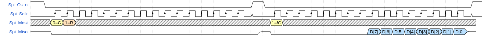
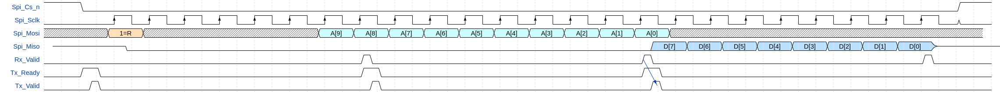

# olo_intf_spi_slave

[Back to **Entity List**](../EntityList.md)

## Status Information

  

VHDL Source: [olo_intf_spi_slave](../../src/intf/vhdl/olo_intf_spi_slave.vhd)

## Description

### Overview

This entity implements a simple SPI slave. All common SPI settings are configurable to ensure the master can be configured for different applications.

The clock and data phase is configurable according to the SPI standard terminology (CPHA/CPOL). See [Details](#Details) for more information.

The component allows single transactions (where *CS_n* goes high after every transaction) and consecutive transactions (where *CS_n* does not go high between transactions), which makes it flexible to implement various protocols. See [Details](#Details) for more information.

On the user-side there are 3 AXI4-Stream interfaces:

* TX data (data transmitted from the slave - through MISO)
* RX data (data received from the master - through MOSI)
* Response - informing the user whether TX data was transmitted or if the master aborted the transaction by pulling *CS_n* high.
  * The Response interface is optional and in most cases can be omitted.

The all SPI signals are properly synchronized to *Clk* using [olo_intf_sync](./olo_intf_sync.md) within *olo_intf_spi_slave*.

The maximum supported *Spi_Sclk* frequency is 10x less than the *Clk* frequency (with some tricks up to 6x less).

## Generics

| Name                      | Type     | Default | Description                                                  |
| :------------------------ | :------- | ------- | :----------------------------------------------------------- |
| TransWidth_g              | positive | 32      | Number of bits in every SPI transaction.                     |
| SpiCpol_g                 | natural  | 0       | SPI clock polarity, see figure in [Overview](#Overview). Range: 0 or 1 |
| SpiCpha_g                 | natural  | 0       | SPI clock phase, see figure in [Overview](#Overview). Range: 0 or 1 |
| LsbFirst_g                | boolean  | false   | **True**: Transactions are LSB first (data bit 0 is sent first). **False**: Transactions are MSB first (data bit 0 is sent last) |
| ConsecutiveTransactions_g | boolean  | false   | **True**: Multiple transactions without *CS_n* going high are supported **False**: *CS_n* must go high between transactions Only enable when required - see [Details](#Details) for more information. |
| InternalTriState_g        | boolean  | true    | **True** = Use internal tri-state buffer (*Spi_Miso* is used).  **False** = Use external tri-state buffer (*Spi_Miso_t* and *Spi_Miso_o*) are used). |

## Interfaces

### Control

| Name | In/Out | Length | Default | Description                                                  |
| :--- | :----- | :----- | ------- | :----------------------------------------------------------- |
| Clk  | in     | 1      | -       | Clock - Frequency must e at least **10x higher than *Spi_Sclk* frequecy** For higher SCLK frequencies refer to [Achieving High SCLK Frequencies](#Achieving-High-SCLK-Frequencies) |
| Rst  | in     | 1      | -       | Reset input (high-active, synchronous to *Clk*)              |

### RX Data Interface

Interface for data received from the master through *Spi_Mosi*.

| Name     | In/Out | Length         | Default | Description                            |
| :------- | :----- | :------------- | ------- | :------------------------------------- |
| Rx_Valid | out    | 1              | N/A     | AXI-S handshaking signal for *Rx_Data* |
| Rx_Data  | out    | *TransWidth_g* | N/A     | Data received from Master              |

### TX Data Interface

Interface for data sent to the master through *Spi_Miso.

| Name     | In/Out | Length         | Default | Description                            |
| :------- | :----- | :------------- | ------- | :------------------------------------- |
| Tx_Valid | in     | 1              | '1'     | AXI-S handshaking signal for *Rx_Data* |
| Tx_Ready | out    | 1              | N/A     | AXI-S handshaking signal for *Rx_Data* |
| Tx_Data  | in     | *TransWidth_g* | 0       | Data received from Master              |

### Response Interface

In most cases transactions will never be aborted and hence the user can does not need to înterpret output of the *Response* interface. In this case, the related ports can be left unconnected.

| Name          | In/Out | Length | Default | Description                                                  |
| :------------ | :----- | :----- | ------- | :----------------------------------------------------------- |
| Resp_Valid    | out    | 1      | N/A     | AXI-S handshaking signal for *Resp_...*                      |
| Resp_Sent     | out    | 1      | N/A     | Indicates that TX data the user applied through the *Tx_...* interface was successfully transmitted to the master. |
| Resp_Aborted  | out    | 1      | N/A     | Indicates that the transmission of TX data the user applied through the *Tx_...* interface was aborted by the master pulling *Cs_n* high before the transfer was completed. |
| Resp_CleanEnd | out    | 1      | N/A     | Indicates that *Cs_n* was pulled high witout any remaining data to transmit. |

The difference between *Resp_Sent* and *Resp_CleanEnd* becomes obvious for continuous transactions without *Cs_n* going high. In this case *Resp_Sent* is pulsed high for every transaction and *Resp_CleanEnd* is pulsed high only once at the very end.

All signals in the response interface are single cycle pulses. The user may also just regard *Resp_Sent*, *Resp_Aborted* and *Resp_CleanEnd* as single cycle pulses and ignore *Resp_Valid*.

### SPI Interface

| Name       | In/Out | Length | Default | Description                                                  |
| :--------- | :----- | :----- | ------- | :----------------------------------------------------------- |
| Spi_Cs_n   | in     | 1      | N/A     | SPI chip select (low-active).                                |
| Spi_Sclk   | in     | 1      | N/A     | SPI clock. Frequency must be at least **10x lower than *Clk* frequency**. For higher SCLK frequencies refer to [Achieving High SCLK Frequencies](#Achieving-High-SCLK-Frequencies) |
| Spi_Mosi   | in     | 1      | '0'     | SPI data from master to slave. Can be left unconnected if only the slave does send data. |
| Spi_Miso   | out    | 1      | N/A     | Used only if **InternalTriState_g = true** SPI data from slave to master.  Can be left unconnected if the only the master does send data. |
| Spi_Miso_t | out    | 1      | N/A     | Used only if **InternalTriState_g = false** *Spi_Miso* Tri-State signal ('1' = tristated, '0' drive) Can be left unconnected if the only the master does send data. |
| Spi_Miso_o | out    | 1      | N/A     | Used only if **InternalTriState_g = false** *Spi_Miso* output data signal. Can be left unconnected if the only the master does send data. |

## Details

### Detailed Description of Generics

The generics which are not self-explaining are covered in this section in detail.

#### SpiCpol_g and SpiCpha_g

The clock and data phase is configurable according to the SPI standard terminology described in the picture below:

 

 CPOL and CPHA meaning 

For CPHA = 1, the sampling happens on the second edge (blue) and data is applied on the first edge (red). For CPHA = 0 it is the opposite way.

The implementation in *olo_intf_spi_slave* is slightly different. Data is sampled and applied on the same edge. Reason for this implementation is that the propagation delay from an incoming *Spi_Sclk* edge until the *Spi_Miso* data is updated is relatively long (4 clock cycles). As a result *Spi_Miso* hold-time is uncritical - and in contrast *Spi_Miso* setup time is critical. To maximize the allowed *Spi_Sclk* frequency, it is optimal to apply *Spi_Miso* output data as soon as possible (4 clock cycles after) the *Spi_Sclk* sampling edge.

 

 Meaning of LsbFirst_g 

#### LsbFirst_g

If this generic is set to *true*, the data is transmitted/received LSB first. Otherwise data is received/transmitted MSB first.

 

 Meaning of LsbFirst_g 

#### ConsecutiveTransactions_g

If this is generic is set to *false*, *Spi_Cs_n* must always go high between two transactions. If it is *true*, transactions can happen consecutively (i.e. with *Spi_Cs_n*) staying low.

 

 Separate transactions (ConsecutiveTransactions_g = false) 

 

 Consecutive transactions (ConsecutiveTransactions_g = true) 

Note that there is always at least one clock cycle of time available from *Rx_Valid* assertion until the latest point *Tx_Valid* must be asserted to inject data for the next transaction.

### User-Side Interfaces

#### TX Data Interface

This interface is used to transfer the TX data (to be transferred to the master through *Spi_Miso*) from the user to *olo_intf_spi_slave*. The TX data is latched at the very beginning of each transaction.

For the TX data interface (*Tx_...*) the following applies:

* When *Tx_Ready* goes high and the user does not provide TX data (i.e. set *Tx_Valid*='1') before *Tx_Ready* goes low again, zeros are transmitted. The user *CANNOT* provide *Tx_Data* at a later point in time for this specific transaction.
  *Tx_Ready* goes low when it is too late to send the first bit of data in-time for the first transmitting clock edge.

* For the setting *SpiCpha_g*=0, *Spi_Miso* must become valid after the falling-edge of *Spi_Cs_n* immediately, as visible from the figure in [Overview](#Overview). Therefore in this case, the application of *Tx_Data* must happen immediately. Hence *Tx_Ready* is only pulsed high for one single clock cycle and the user must present *Tx_Data* and apply *Tx_Valid*='1' in this cycle. 

* For consecutive transactions, the comment applies only to the very first transaction after *Spi_Cs_n* going low. For the following transactions, the *Tx_Ready* high phase is longer.

#### RX Data Interface

This interface is used to transfer the RX data (received from the master through *Spi_Mosi*) from *olo_intf_spi_slave* to the user. The RX data is presented at the very end of each transaction.

* The *Rx_...* interface does not support backpressure. The user *MUST* read *Rx_Data* in the single clock cycle *Rx_Valid* is high.

#### Response Interface

Generally, the response interface *Resp_...* informs the user about how a transaction ended. In most cases this iformation is not needed and the user can leave all *Resp_...* ports unconnected.

* *Resp_Sent*='1' indicates that data the user passed through *Tx_...* was successfully and completely sent to the master.
* *Resp_Aborted*='1' indicates that *Spi_Cs_n* was pulled high *BEFORE* all data the user passed through *Tx_...* was sent to the master.
* *Resp_CleanEnd*='1' indicates that *Spi_Cs_n* was pulled high at a moment where no transmit data was pending (because the user did not assert *Tx_Valid* for the next transaction).

For single transactions, there are the following options:

1. One *Resp_Aborted*='1' response if the user passed data through the *Tx_...* intetrface and *Spi_Cs_n* is pulled high during the transaction. 
2. One *Resp_Sent*='1' followed by one *Resp_CleanEnd*='1' response if the user passed data through the *Tx_...* intetrface and *Csp_Cs_n* is pulled high after the transaction completed.
3. One *Resp_CleanEnd*='1' response if the user did not pass data through the *Tx_...* interface and *Spi_Cs_n* is pulled high. Whether *Spi_Cs_n* is pulled high after all bits were transferred or during the transfer does not play any role in this case.

For continuous transactions, the responses are the same. Just that *Resp_Aborted='1'* becomes more common at the end of the transfer because at the time *olo_spi_slave* asserts *Tx_Ready='1'* the user cannot know if this was the last transaction in a burst or not. Hence the user might assert *Tx_Valid* but the data might not be sent because the master pulls *Spi_Cs_n* high - which leads to a *Resp_Aborted*='1' response.

### Timing Considerations

#### Spi_Cs_n to Spi_Miso Propagation Delay

The propagation delay from *Spi_Cs_n* falling-edge to the application of the first data-bit on *Spi_Miso* is four clock cycles:

* Two clock cycles for synchronization for *Spi_Cs_n* (double stage synchronizer)
* One clock cycle for the edge detection
* One clock cycle for setting *Spi_Miso*

As a result **the master must be configured to ensure a at least 5 _Clk_ periods of time between the falling edge of _Spi_Cs_n_ and the first sampling edge of _Spi_Sclk_**. For *SpiCPH_g=1* this normally is the case anyways. For *SpiCPH_g=0* it might require special attention.

#### Spi_Sclk to Spi_Miso Propagation Delay

The propagation delay from *Spi_Sclk* edges to the application of *Spi_Miso* data four clock cycles:

* Two clock cycles for synchronization for *Spi_Sclk* (double stage synchronizer)
* One clock cycle for the edge detection
* One clock cycle for setting *Spi_Miso*

#### Achieving High SCLK Frequencies

*Spi_Sclk* frequencies above 1/10 of the *Clk* frequencies is possible with some special considerations, which violate the normal AXI4-Stream handshaking.

For *Spi_Sclk* frequencies between 1/8 and 1/10 of the *Clk* frequency, ensure that *Tx_Valid* goes high not more than two clock cycles after *Tx_Ready* is asserted. This limitation applies even if *Tx_Ready* stays high for longer.

For *Spi_Sclk* frequencies between 1/6 and 1/8 of the *Clk* frequency, ensure that *Tx_Valid* goes high not more than one clock cycle after *Tx_Ready* is asserted. This limitation applies even if *Tx_Ready* stays high for longer.

For high *Spi_Sclk* frequencies, the *Spi_Miso* line is timing critical regarding routing.

### Protocol Examples

This section provides different possible SPI protocol definitions for an SPI register access with 10-bit register address and 8-bit register data. The aim is the sowcase the effect of different configuration options.

All options shown use *LsbFirst_g*=false.

#### Non-Consecutive Transactions, 16 bit

In this case the protocol would be defined as follows:

* Bit[15]='1' of MOSI data indicates a command
  * '0' indicates a pure data word (read or write data)
* Bit[14] defines the command: '1'=read, '0'=write
* Bit[9:0] define the address of the access

For write commands, write data is transferred in Bits[7:0] of the next transaction (data word).

 

 Write Command 

For read commands, read data is returned in Bits[7:0] of the next transaction. In general, *Rx_Data* is presented only after the first transaction completed and at this point *Tx_Data* was already transmitted. Hence with none-consecutive transactions, *Tx_Data* cannot depend on *Rx_Data* of the same transfer.

 

 Read Command 

#### Consecutive Transactions 8 bit

Using 8-bit consecutive transactions, it is possible to build a protocol that shows up as a single 24-bit SPI transaction on the master (but as 3 8-bit transactions on the slave).

* Bit[23] of MOSI data indicates if the transaction is a read or a write
* Bit[17:8] define the address of the access
* Bit[7:0] of MISO (read) or MOSI (write) contain the data.

 

 Write Command 
 

There is half a clock period between the last sample edge of the second byte (when the address and the command is known) and the first transmit edge of the third byte (by when TX data must be passed) if the *Spi_Sclk* frequency is significantly lowr than the *Clk* frequency. Hence it is possible to pass read-data through *Tx_...* between Bit[8] and Bit[7] of the transaction (between the second and third 8-bit transaction for the slave).

 

 Read Command 
 

The only drawback of this solution is, that a small FSM is required to handle the different 8-bit transactions (from a slave perspective) that make up a 24-bit transaction (from master perspective).

#### Consecutive Transactions 8 bit - Fast SCLK

In case of high *Spi_Sclk* frequencies (see [Achieving High SCLK Frequencies](#Achieving-High-SCLK-Frequencies)), it is not always possible to provide the next *Tx_Data* quick enough after *Rx_Valid*. In this case 32-bits (4 x 8 bits) are required and the additional data-byte is inserted to allow for more time for gnerating *Tx_Data* after the address was received through *Rx_Data*. 

Because this topic affects read only, only the read transaction is shown. 

 

 Write Command 
 

 
