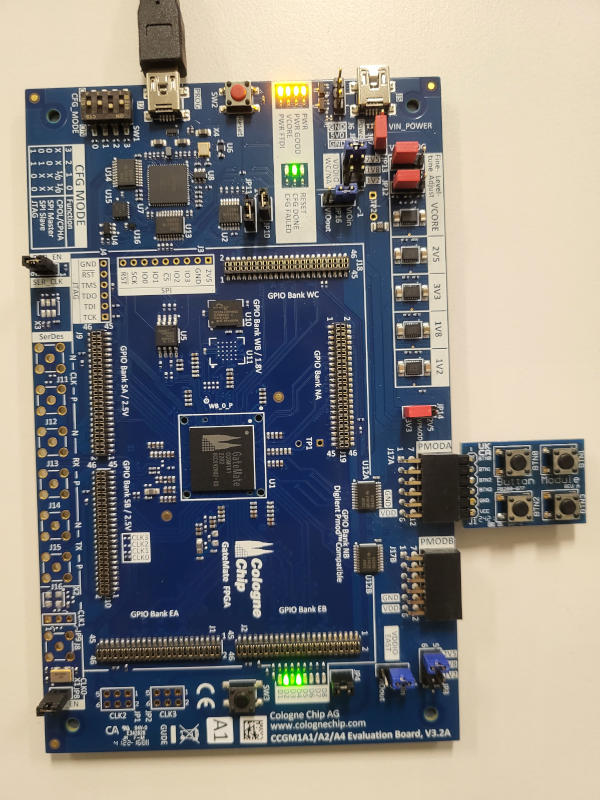
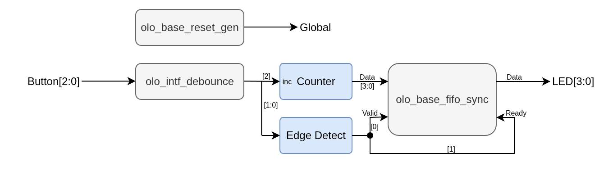

[Back to **Readme**](../../Readme.md)

# Cologne Chip Tutorial

## Introduction

The aim of this tutorial is give users a kick-start on creating Cologne Chip projects using _Open Logic_.

The Cologne Chip toolchain is based on _Yosys_ based _oss-cad-suite_ and hence the same tutorial might apply for
_Yosys_/_oss-cad-suite_ in general.

The tutorial covers project setup and implementation up to the production of a running bitstream for a small design.
The design is rather hardware independent but all examples and pinout constraints are given for a
[GateMate FPGA Starter Kit](https://colognechip.com/programmable-logic/gatemate-evaluation-board/) evaluation board. If
you want to use it on some other hardware, just change pinout and the target device accordingly.

The steps should be very much independent of the _oss-cad-suite_ version but all screenshots are taken with the
_oss-cad-suite_ build from Sep-2025.

> **Note:** Instantiating VHDL entities with generics from Verilog is currently not supported by _Yosys_. Hence this
> tutorial is only available for VHDL.

## Step 1: Setup Hardware

The _GateMate FPGA Starter Kit_ does not contain the buttons required for this tutorial. Therefore a
PMod BTN must be connected to the _upper_ row of the connector _PMODA_ as shown below.



## Step 2: Build Project

### Overview

In this tutorial we will build the following design:



All _Open Logic_ blocks are shown in grey. Custom logic is shown in blue.

The design does de-bounce all three buttons.

Every time the user presses _Button[2]_, the counter is incremented. Every time the user presses _Button[0]_, the state
of the counter is written into a FIFO (4 bits wide, 4096 entries deep). Every time the user presses _Button[1]_, one
FIFO entry is read and applied to the LEDs. Note that clock and reset are not shown in the figure for simplicity
reasons.

The de-bouncing is required to ensure that a button press really only produces one edge (and hence one read/write
transaction to the FIFO resp. a single increment of the counter).

The design is super simple - it is not meant for demonstrating the coolest features of _Open Logic_ but for being the
simplest possible example of a design making use of _Open Logic_.

### Build Design

Because the _oss-cad-suite_ does not come with a GUI, in contrast
to all other tutorials this tutorial does not congain a GUI walkthrough. Instead it mainly consists of the build srcipt.

**Note:** The build script is provided for Linux environments. For Windows, the commands must be adapted accordingly.

To build the project, first navigate to the folder `<open-logic-root>/doc/tutorials/CologneChipTutorial/Files` in a
shell. Then execute the build script [scrtipted_build.sh](./CologneChipTutorial/Files/scripted_build.sh):

```bash
cd <open-logic-root>/doc/tutorials/CologneChipTutorial/Files
source ./scripted_build.sh
```

In the build script, the only line that really is Open Logic specific is the following one:

```bash
python3 ../../../../tools/yosys/compile_olo.py
```

This line does compile Open Logic. All other content is as decribed on the
[Cologne Chip Website](https://colognechip.com/programmable-logic/gatemate)
under the _Getting Started_ section.


### Analyze Resource Utilization

From the resource utilization (see _nexpnr.log_) it is obvious that the FIFO was correctly mapped to Block-RAM
(one _RAM_HALF_ is used).

```text
Info: Device utilisation:
Info:             USR_RSTN:       0/      1     0%
Info:             CPE_COMP:       0/  20480     0%
Info:          CPE_CPLINES:      12/  20480     0%
Info:                IOSEL:       9/    162     5%
Info:                 GPIO:       9/    162     5%
Info:                CLKIN:       1/      1   100%
Info:               GLBOUT:       1/      1   100%
Info:                  PLL:       0/      4     0%
Info:             CFG_CTRL:       0/      1     0%
Info:               SERDES:       0/      1     0%
Info:               CPE_LT:     524/  40960     1%
Info:               CPE_FF:     133/  40960     0%
Info:            CPE_RAMIO:      49/  40960     0%
Info:             RAM_HALF:       1/     64     1%
```

The overall LUT count of the design is 524 CPE_LT. For interpreting this number it must be kept in mind, that a CP_LT
is only half a LUT, hence the design uses 262 full LUTs.

### Analyze Timing

The timing report shows that unsurprisingly the slow clock-speed of the 10 MHz clock is met.

```text
Info: Max frequency for clock 'i_fifo.clk': 94.83 MHz (PASS at 10.00 MHz)
```

## Step 3: Program Hardware

The board can be programmed by executing the command below. Note that on Linux permissions must be set correctly
or alternatively the command might have to be exeuted as root.

```bash
openFPGALoader -b gatemate_evb_spi -m ./cologne_tutorial.bit
```

You can increment the counter (press _BTN2_) and write (_BTN0_) a few counter values into the FIFO. The
values can then be displayed on the the LEDs one by one by pressing _BTN1_.

## Step 5: Discussion of the VHDL Source Code

The source code can be found in the file
[\<open-logic-root\>/doc/tutorials/CologneChipTutorial/Files/cologne_tutorial.vhd](./CologneChipTutorial/Files/cologne_tutorial.vhd).

Not every line of the source code is discussed. It is simple and implements the design described earlier. Only a few
details worth mentioning are discussed.

### Omitting Unused Generics

The FIFO instance only sets two generics:

```vhdl
    i_fifo : entity olo.olo_base_fifo_sync
        generic map ( 
            Width_g         => 4,               
            Depth_g         => 4096                 
        )
        ...
```

The _olo_base_fifo_sync_ entity would have much more generics but due to the concept of providing default values for
optional generics, it is not necessary to obfuscate source-code with many lines of actually unused generics.

```vhdl
entity olo_base_fifo_sync is
    generic ( 
        Width_g         : positive;                   
        Depth_g         : positive;                  
        AlmFullOn_g     : boolean   := false;        
        AlmFullLevel_g  : natural   := 0;                   
        AlmEmptyOn_g    : boolean   := false;        
        AlmEmptyLevel_g : natural   := 0;                   
        RamStyle_g      : string    := "auto";       
        RamBehavior_g   : string    := "RBW";        
        ReadyRstState_g : std_logic := '1'
    );
    ...
```

### Omitting Unused Ports

The same concept applies to unused ports. In this case we do neither require full handshaking nor status signals like
Full/Empty/Level - hence all these signals can be omitted:

```vhdl
    i_fifo : entity olo.olo_base_fifo_sync
        ...
        port map (    
              Clk           => Clk,
              Rst           => Rst,
              In_Data       => Data,
              In_Valid      => RisingEdges(0),
              Out_Data      => Led,
              Out_Ready     => RisingEdges(1)              
        );
```

Again compared to the full list of signals the _olo_base_fifo_sync_ provides many lines of obfuscating code can be
omitted because all optional input ports come with default values.

```vhdl
entity olo_base_fifo_sync is
    ...
    port (    
        -- Control Ports
          Clk           : in  std_logic;
          Rst           : in  std_logic;
          -- Input Data
          In_Data       : in  std_logic_vector(Width_g - 1 downto 0);
          In_Valid      : in  std_logic                                             := '1';
          In_Ready      : out std_logic;
          In_Level      : out std_logic_vector(log2ceil(Depth_g + 1) - 1 downto 0);
          -- Output Data
          Out_Data      : out std_logic_vector(Width_g - 1 downto 0);
          Out_Valid     : out std_logic;
          Out_Ready     : in  std_logic                                             := '1';
          Out_Level     : out std_logic_vector(log2ceil(Depth_g + 1) - 1 downto 0);
          -- Status
          Full          : out std_logic; 
          AlmFull       : out std_logic;
          Empty         : out std_logic; 
          AlmEmpty      : out std_logic
          
    );
```
