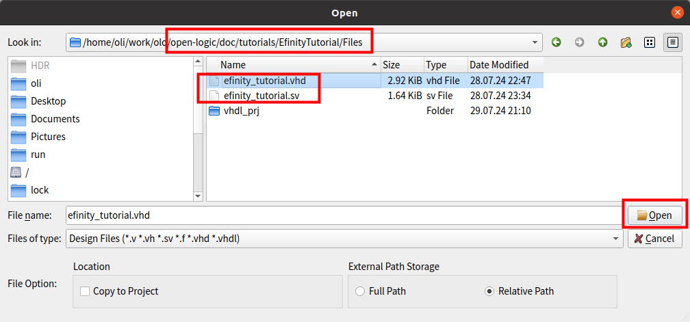
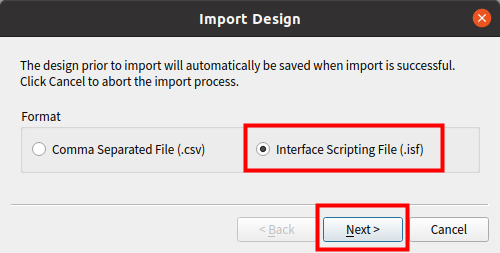

[Back to **Readme**](../../Readme.md)

# Efinity Tutorial

## Introduction

The aim of this tutorial is give users a kick-start on creating Efinix Efinity projects using *Open Logic*.

The tutorial covers project setup and implementation up to the production of a running bitstream for a small design. The design is rather hardware independent but all examples and pinout constraints are given for a [Trion T20 BGA256 Development Kit](https://www.efinixinc.com/products-devkits-triont20.html). If want to use it on some other hardware, just change pinout and the target device accordingly.

The steps should be very much independent of the Efinity version but all screenshots are taken with version 2024.1.

## Step 1: Project setup

First, create a new project.


You may choose any project name and path you like. Select the device present on the target hardware:


No other settings are required, you can immediately close the dialog by pressing **OK**.

## Step 2: Integrate Open Logic

We follow the steps described also in the [HowTo...](../HowTo.md) document. They are repeated here, so you do not have to open the *HowTo* document separately.

Close the Efinity project. This is required because the script to add *Open Logic* does modify the project file.


Open a terminal window and navigate to *<open-logic-root>/tools/efinity*. The execute the import scripts. There are a few notes for this step:

* Python3 must be installed on your PC
* Use forward slashes (/) as path-separator, also if your PC is a windows PC.
* For windows, you have to use the command *python* or *py -3* instead of *python3* by default
* For the VHDL tutorial, use `--library olo` as in the example below. For the verilog tutorial use `--library default`.
* Replace `<path-to-project-xml>`by the full path to the project XML file, including the file-name (e.g. `/some/path/my_project.xml`)

```
python3 ./import_sources.py --project <path-to-project-xml> --library olo
```

Now open the project again in Efinity. You should find it under recent projects:


You should now see all Open Logic files being added to the project.


If you are interested to see into which library the files are compiled, open the project settings:


You can then see which files are compiled into which library. Keep in mind that for the VHDL tutorial, the library should be *olo* and for the verilog tutorial it shall be *default*.


That's it,  *Open Logic* is now ready to be used.

## Step 3: Build FPGA Design

### Overview

In this tutorial we will build the following design:


All *Open Logic* blocks are shown in grey. Custom logic is shown in blue.

The design does de-bounce two buttons and four switches. Every time the user presses button 0, the state of the switches is written into a FIFO (4 bits wide, 4096 entries deep). Every time the user presses button 1, one FIFO entry is read and applied to the LEDs. Note that clock and reset are not shown in the figure for simplicity reasons.

The de-bouncing is required to ensure that a button press really only produces one edge (and hence one read/write transaction to the FIFO). For the switches, de-bouncing is not strictly required but good style.

The design is super simple - it is not meant for demonstrating the coolest features of *Open Logic* but for being the simplest possible example of a design making use of *Open Logic*.

### Add Source Code

The VHDL code is provided in the file [<open-logic-root>/doc/tutorials/EfinityTutorial/Files/efinity_tutorial.vhd](./EfinityTutorial/Files/efinity_tutorial.vhd). 

If you are using Verilog, use the system verilog source file: [<open-logic-root>/doc/tutorials/EfinityTutorial/Files/efinity_tutorial.sv](./EfinityTutorial/Files/efinity_tutorial.sv). 

Open the add file dialog from the right-click menu on *Design*.


Navigate to the file [<open-logic-root>/doc/tutorials/EfinityTutorial/Files/efinity_tutorial.vhd](./EfinityTutorial/Files/efinity_tutorial.vhd) and add it. 

For the verilog variant of the tutorial, add the file [<open-logic-root>/doc/tutorials/EfinityTutorial/Files/efinity_tutorial.sv](./EfinityTutorial/Files/efinity_tutorial.sv) instead.



And finally select *efinity_tutorial* as the top-level module:


### Add Constraints

First timing constraints are added through the right-click menu of the *Constraints* entry:


A basic timing constraint file specifying the clock frequency is provided in the file [<open-logic-root>/doc/tutorials/EfinityTutorial/Files/timing.sdc](./EfiintyTutorial/Files/timing.sdc). The constraint file only defines the clock frequency in this case - not what is state of the art for a real design but sufficient for the tutorial.


### Add Interface

In Efinity tools, the pinout is specified as interface. A file containing the pinout for the [Trion T20 BGA256 Development Kit](https://www.efinixinc.com/products-devkits-triont20.html) is provided - if you target another board, just edit the pins used accordingly.

The interface file provided can be added to the project through the Interface Designer:


Starting the interface designer may take a little time. In the Interface Designer, the *Import Design* option has to be used:


The pinout is provided as *.isf* file.



Open the file selection dialog.


Select the file [<open-logic-root>/doc/tutorials/EfinityTutorial/Files/pinout.isf](./EfiintyTutorial/Files/pinout.isf).


Then close the dialog ...


... and save the interface.


After that, the Interface Designer window can be closed.

### Build Design

Build the design by pressing the synthesis button:


The tool will run all following steps automatically (see green checkmarks on all steps of the flow):


### Analyze Resource Utilization

From the resource utilization it is obvious that the FIFO was correctly mapped to Block-RAM. Because RAM blocks in Trion devices are relatively small (5kb), four RAM blocks are required.

Also note that the *Logic Element* utilization is higher than for the [Vivado Tutorial](./VivadoTutorial.md) and the [Quartus Tutorial](./QuartusTutorial.md). This is causes by the fact that the Trion Device only has 4-input LUTs (while AMD/Altera use 6-input LUTs).

Overall the resource consumption is as expected and Open Logic is proven to be efficient.


### Analyze Timing

Timing is easily met - as one would expect for such a simple design.


## Step 4: Try it on Hardware

Now connect your [Trion T20 BGA256 Development Kit](https://www.efinixinc.com/products-devkits-triont20.html) hardware to your PC using the USB cable.

Open the Programmer:


You should see the target board being detected and you can select the bitstream to program:


Select the *.bit* file:


JTAG is used as programming mode. Then press the programming button.


You can now dial in values using the DIP switches (*SW3*) and write them into the FIFO by pressing *SW5*. After that they can be read from the FIFO and displayed one by one by pressing *SW6*. 

Because there are only three DIP switches, the fourth *Switch* input is mapped to the button *SW4*. This might be a bit unusual but the value of keeping the design the same for all tutorials was prioritized over an intuitive usage. You can easily try out the design without even using *SW4*.

## Step 5: Discussion of the VHDL Source Code

The source code can be found in the file [<open-logic-root>/doc/tutorials/EfinityTutorial/Files/efinity_tutorial.vhd](./EfinityTutorial/Files/efinity_tutorial.vhd). 

Not every line of the source code is discussed. It is simple and implements the design described earlier. Only a few details worth mentioning are discussed.

The source code samples given are VHDL - however, for the verilog example file the code looks very much the same and the comments apply as well.

### Omitting Unused Generics

The FIFO instance only sets two generics:

```
    i_fifo : entity olo.olo_base_fifo_sync
        generic map ( 
            Width_g         => 4,               
            Depth_g         => 4096                 
        )
        ...
```

The *olo_base_fifo_sync* entity would have much more generics but due to the concept of providing default values for optional generics, it is not necessary to obfuscate source-code with many lines of actually unused generics.

```
entity olo_base_fifo_sync is
    generic ( 
        Width_g         : positive;                   
        Depth_g         : positive;                  
        AlmFullOn_g     : boolean   := false;        
        AlmFullLevel_g  : natural   := 0;                   
        AlmEmptyOn_g    : boolean   := false;        
        AlmEmptyLevel_g : natural   := 0;                   
        RamStyle_g      : string    := "auto";       
        RamBehavior_g   : string    := "RBW";        
        ReadyRstState_g : std_logic := '1'
    );
    ...
```

### Omitting Unused Ports

The same concept applies to unused ports. In this case we do neither require full handshaking nor status signals like Full/Empty/Level - hence all these signals can be omitted:

```
    i_fifo : entity olo.olo_base_fifo_sync
        ...
        port map (    
              Clk           => Clk,
              Rst           => Rst,
              In_Data       => Switches_Sync,
              In_Valid      => RisingEdges(0),
              Out_Data      => Led,
              Out_Ready     => RisingEdges(1)              
        );
```

Again compared to the full list of signals the *olo_base_fifo_sync* provides many lines of obfuscating code can be omitted because all optional input ports come with default values.

```
entity olo_base_fifo_sync is
    ...
    port (    
        -- Control Ports
          Clk           : in  std_logic;
          Rst           : in  std_logic;
          -- Input Data
          In_Data       : in  std_logic_vector(Width_g - 1 downto 0);
          In_Valid      : in  std_logic                                             := '1';
          In_Ready      : out std_logic;
          In_Level      : out std_logic_vector(log2ceil(Depth_g + 1) - 1 downto 0);
          -- Output Data
          Out_Data      : out std_logic_vector(Width_g - 1 downto 0);
          Out_Valid     : out std_logic;
          Out_Ready     : in  std_logic                                             := '1';
          Out_Level     : out std_logic_vector(log2ceil(Depth_g + 1) - 1 downto 0);
          -- Status
          Full          : out std_logic; 
          AlmFull       : out std_logic;
          Empty         : out std_logic; 
          AlmEmpty      : out std_logic
          
    );
```

### Inversions

You may notice that the *Buttons* inputs as well as the *Led* outputs are inverted. This is required because some I/Os on the target HW are low-active.

## Notes

Efinity as of today does not allow scripted builds. Therefore in contrast to other tutorials, no scripted build option is provided.
