[Back to **Readme**](../../Readme.md)

# Gowin Tutorial

## Introduction

The aim of this tutorial is give users a kick-start on creating Gowin projects using _Open Logic_.

The tutorial covers project setup and implementation up to the production of a running bitstream for a small design.
The design is rather hardware independent but all examples and pinout constraints are given for a
[DK_START_GW1N-LV4LQ144C615_V1.1](https://www.gowinsemi.com/en/support/devkits_detail/1/) evaluation board.
If want to use it on some other hardware, just change pinout and the target device accordingly.

The steps should be very much independent of the GowinEDA version but all screenshots are taken with version 1.9.11.

## Step 1: Project setup

First, create a new project.

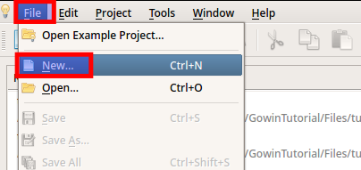

In the select _FPGA Design Project_.

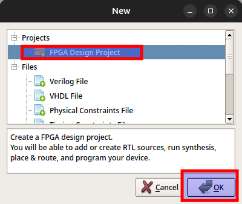

On the next page, any project name and folder can be selected.

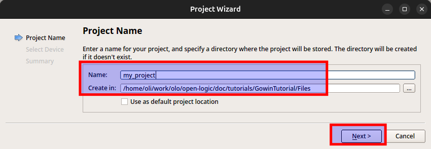

As part, choose the FPGA on the DE0-CV: **GW1N-LV4LQ144C6/15**

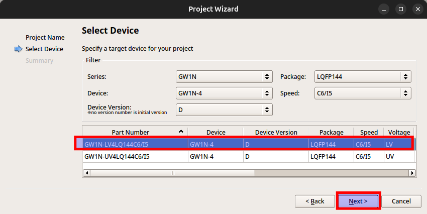

You can now forward through the last pages without changes and simply press the _Finish_ button.

## Step 2: Integrate Open Logic

We follow the steps described also in the [HowTo...](../HowTo.md) document. They are repeated here, so you do not have
to open the _HowTo_ document separately.

In the Gowin TCL console, execute the following command (_\<open-logic-root\>_ must be replaced by the path to
Open Logic on your machine):

```tcl
source <open-logic-root>/tools/gowin/import_sources.tcl
```

In the screenshot below the path on my local PC is shown - the path on your system of course is different.

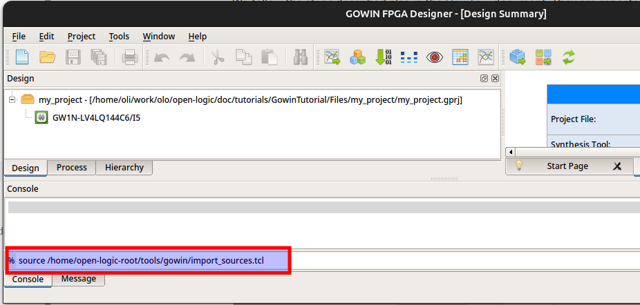

Note that the script does _automatically change the VHDL language standard for your project to **VHDL2008**_ because
this is required with Gowin tools for Open Logic to work correctly.

You should now see a number of source files being added to the project - all of them compiled into the library _olo_.
The exact number of source files may vary as _Open Logic_ still grows.

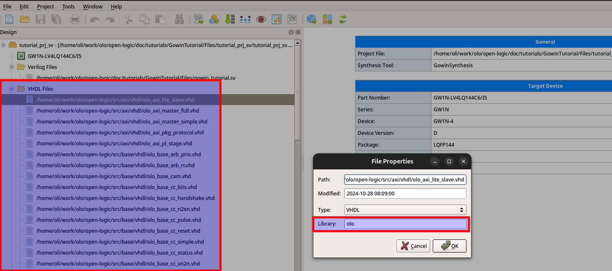

That's it, _Open Logic_ is now ready to be used.

## Step 3: Build FPGA Design

### Overview

In this tutorial we will build the following design:


All _Open Logic_ blocks are shown in grey. Custom logic is shown in blue.

The design does de-bounce two buttons and four switches. Every time the user presses button 0, the state of the switches
is written into a FIFO (4 bits wide, 4096 entries deep). Every time the user presses button 1, one FIFO entry is read
and applied to the LEDs. Note that clock and reset are not shown in the figure for simplicity reasons.

The de-bouncing is required to ensure that a button press really only produces one edge (and hence one read/write
transaction to the FIFO). For the switches, de-bouncing is not strictly required but good style.

The design is super simple - it is not meant for demonstrating the coolest features of _Open Logic_ but for being the
simplest possible example of a design making use of _Open Logic_.

### Add Source Code

The code is provided in the file
[\<open-logic-root\>/doc/tutorials/GowinTutorial/Files/gowin_tutorial.vhd](./GowinTutorial/Files/gowin_tutorial.vhd).

If you are using Verilog, use the system verilog source file:
[\<open-logic-root\>/doc/tutorials/GowinTutorial/Files/gowin_tutorial.sv](./GowinTutorial/Files/gowin_tutorial.sv).

Add this file to the project through the _add file_ dialog available from the right-click menu of the _Design_ pane.

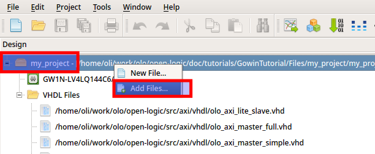

Navigate to the file
[\<open-logic-root\>/doc/tutorials/GowinTutorial/Files/gowin_tutorial.vhd](./GowinTutorial/Files/gowin_tutorial.vhd)
and add it.

If you are using Verilog, use the system verilog source file:
[\<open-logic-root\>/doc/tutorials/GowinTutorial/Files/gowin_tutorial.sv](./GowinTutorial/Files/gowin_tutorial.sv).

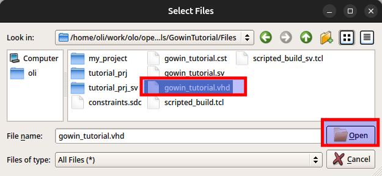

The software asks you if you want to copy the source file into the project. Normally copies shall be avoided and the
source files shall be used from where it is - hence we select _No_ here.

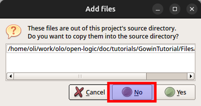

You should now see the source-file being added.


And finally select this file as top-module for the project through the _Project > Configuration_ dialog:

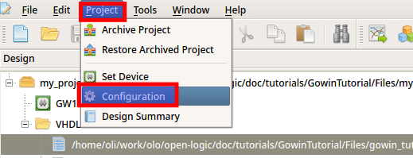

The entity name of the top-level module must be entered in the dialog manually.

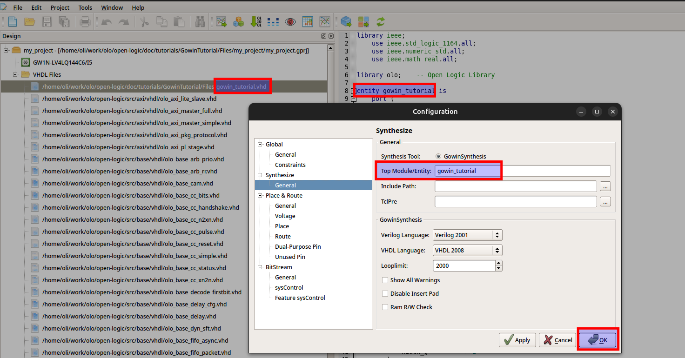

### Add Constraints

The required pinout for the [DK_START_GW1N-LV4LQ144C615_V1.1](https://www.gowinsemi.com/en/support/devkits_detail/1/)
board is provided in the file
[\<open-logic-root\>/doc/tutorials/GowinTutorial/Files/pinout.cst](./GowinTutorial/Files/pinout.cst).You can simply add
the file through the _Add Files_ dialog (see [Add Source Code](#add-source-code)).

To visualize the constraints loaded, first synthesis must be run (otherwise the _Floorplanner_ tool does not start).


Gowin synthesis is blazing fast, this only takes seconds.

The pinout can then be viewed through the _Floorplanner_ tool:


In the _I/O Constraints_ tab the loaded pinout is shown:

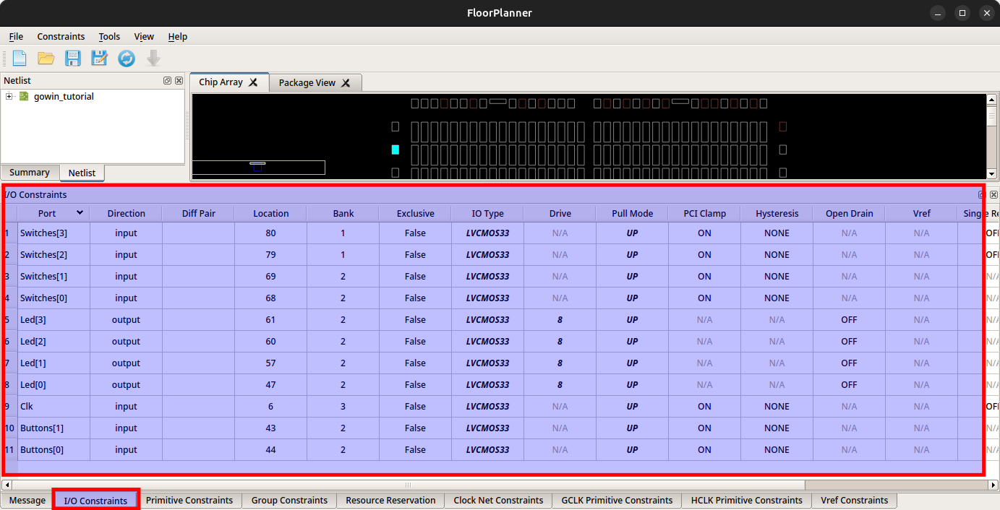

After inspection of the pinout, the _Floorplanner_ can be closed.

Next a minimal set of timing constraints is added. The constraint file only defines the clock frequency in this case -
not what is state of the art for a real design but sufficient for the tutorial.

This is done by adding the file
[\<open-logic-root\>/doc/tutorials/GowinTutorial/Files/timing.sdc](./GowinTutorial/Files/timing.sdc) through the
_Add Files_ dialog (see [Add Source Code](#add-source-code)).

### Build Design

Build the design and generate a bitstream. You can just press the _Run All_ button - Gowin will detect
automatically run all required steps of the flow.


### Analyze Resource Utilization

From the resource utilization it is obvious that the FIFO was correctly mapped to Block-RAM.

The LUT usage also demonstrates the efficiency of _Open Logic_: If the de-bouncing would be implemented in the most
simple form (one counter per signal running on the system clock directly), the de-bouncing alone would use 126 LUTs (6
signals x 25ms @ 50 MHz --> 126 counter bits). The overall LUT count of the design is only 207 - and this includes the
FIFO.

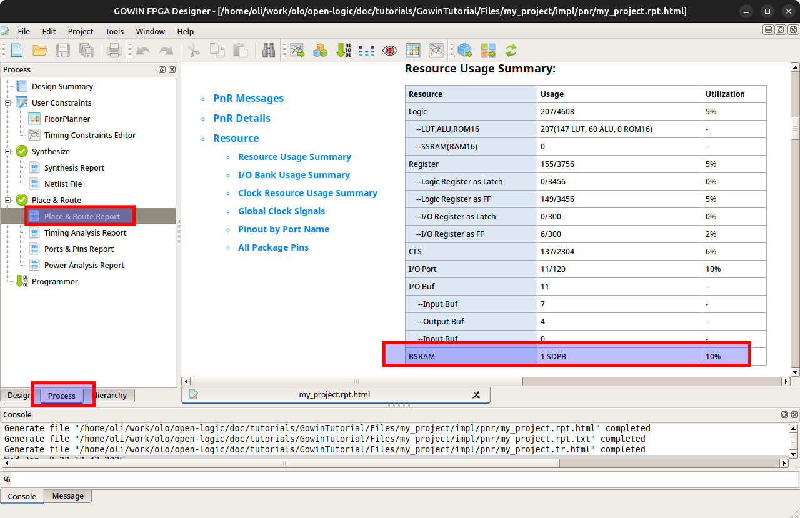

### Analyze Timing

The timing report shows that unsurprisingly the slow clock-speed of the 50 MHz clock is met. It also shows missing
output and input delays - which is acceptable for a tutorial but should be fixed by adding constraints in a real-world
project.

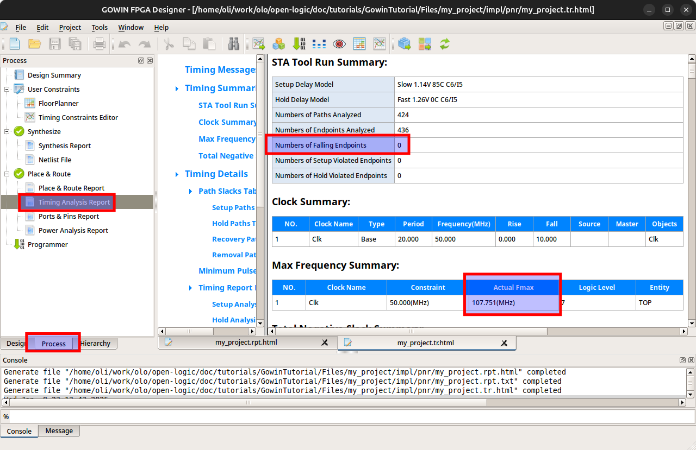

## Step 4: Try it on Hardware

Now connect your [DK_START_GW1N-LV4LQ144C615_V1.1](https://www.gowinsemi.com/en/support/devkits_detail/1/)
hardware to your PC using the USB cable and enable power (if LEDs are on, the board is ready).

Open the Programmer. 

Theoretically the programmer could be launched from within GowinEDA but at least on my test system (Ubuntu), I had to launch the programmer independently and with root privileges. 

**Note:** Cable drivers must be installed before launching the programmer for the tool to work correctly.

First, the programmer can be detected automatically:

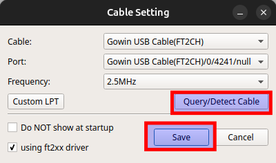

Select the correct series *GW1N* and device _GW1N-4D_. The corresponding fields have drop-down menus that show up when you click inside the field.

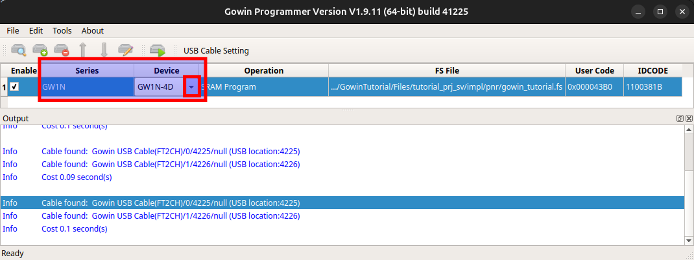

The dialog to select the operation to execute can be opened by double-clicking the _Operation_ field. 

Select:

- Access Mode: **SRAM Mode**
- Operation: **SRAM Program**
- File name: \<your-project-folder\>/impl/pnr/\<your-project-name>.fs

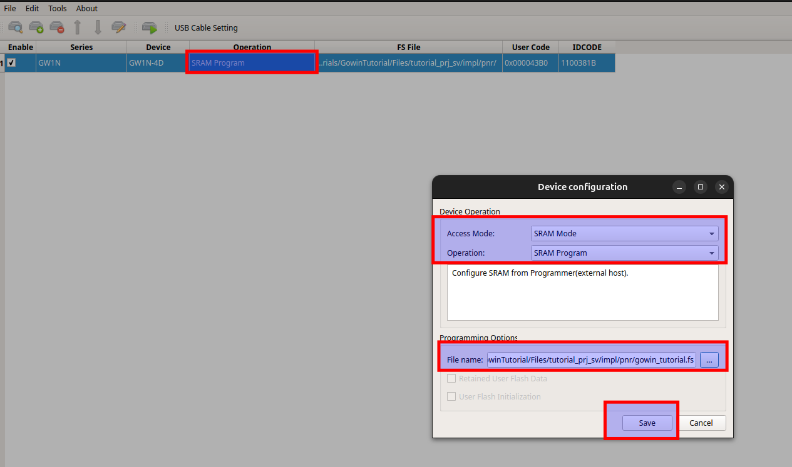

Then program the device using the _Configure/Program_ button:


You can now dial in values using the _Switches_ and write them into the FIFO by pressing _Key 2_ (second from the left).
After that they can be read from the FIFO and displayed one by one by pressing _Key 1_ (on the very left).

## Step 5: Discussion of the VHDL Source Code

The source code can be found in the file
[\<open-logic-root\>/doc/tutorials/GowinTutorial/Files/gowin_tutorial.vhd](./GowinTutorial/Files/gowin_tutorial.vhd).

Not every line of the source code is discussed. It is simple and implements the design described earlier. Only a few
details worth mentioning are discussed.

The source code samples given are VHDL - however, for the verilog example file the code looks very much the same and the
comments apply as well.

### Omitting Unused Generics

The FIFO instance only sets two generics:

```vhdl
    i_fifo : entity olo.olo_base_fifo_sync
        generic map ( 
            Width_g         => 4,               
            Depth_g         => 4096                 
        )
        ...
```

The _olo_base_fifo_sync_ entity would have much more generics but due to the concept of providing default values for
optional generics, it is not necessary to obfuscate source-code with many lines of actually unused generics.

```vhdl
entity olo_base_fifo_sync is
    generic ( 
        Width_g         : positive;                   
        Depth_g         : positive;                  
        AlmFullOn_g     : boolean   := false;        
        AlmFullLevel_g  : natural   := 0;                   
        AlmEmptyOn_g    : boolean   := false;        
        AlmEmptyLevel_g : natural   := 0;                   
        RamStyle_g      : string    := "auto";       
        RamBehavior_g   : string    := "RBW";        
        ReadyRstState_g : std_logic := '1'
    );
    ...
```

### Omitting Unused Ports

The same concept applies to unused ports. In this case we do neither require full handshaking nor status signals like
Full/Empty/Level - hence all these signals can be omitted:

```vhdl
    i_fifo : entity olo.olo_base_fifo_sync
        ...
        port map (    
              Clk           => Clk,
              Rst           => Rst,
              In_Data       => Switches_Sync,
              In_Valid      => RisingEdges(0),
              Out_Data      => Led,
              Out_Ready     => RisingEdges(1)              
        );
```

Again compared to the full list of signals the _olo_base_fifo_sync_ provides many lines of obfuscating code can be
omitted because all optional input ports come with default values.

```vhdl
entity olo_base_fifo_sync is
    ...
    port (    
        -- Control Ports
          Clk           : in  std_logic;
          Rst           : in  std_logic;
          -- Input Data
          In_Data       : in  std_logic_vector(Width_g - 1 downto 0);
          In_Valid      : in  std_logic                                             := '1';
          In_Ready      : out std_logic;
          In_Level      : out std_logic_vector(log2ceil(Depth_g + 1) - 1 downto 0);
          -- Output Data
          Out_Data      : out std_logic_vector(Width_g - 1 downto 0);
          Out_Valid     : out std_logic;
          Out_Ready     : in  std_logic                                             := '1';
          Out_Level     : out std_logic_vector(log2ceil(Depth_g + 1) - 1 downto 0);
          -- Status
          Full          : out std_logic; 
          AlmFull       : out std_logic;
          Empty         : out std_logic; 
          AlmEmpty      : out std_logic
          
    );
```

## Notes

If you should want to build the tutorial project without many manual mouse clicks, you can do so by following the steps
below:

- Open GowinEDA

- In the TCL console, navigate to the directory \<open-logic-root\>/doc/tutorials/GowinTutorial/Files
  
  ```tcl
  cd <open-logic-root>/doc/tutorials/GowinTutorial/Files
  ```

- Run the script [scripted_build.tcl](./GowinTutorial/Files/scripted_build.tcl), which creates and builds the tutorial
  project: <br>
  For VHDL:
  
  ```tcl
  source scripted_build.tcl
  ```
  
  For Verilog:
  
  ```tcl
  source scripted_build_sv.tcl
  ```
  
  The script launches another GowinEDA, which can be closed. This is an unwanted side-effect of the TCL command for creating new projects.

Note: replace \<open-logic-root\> with the root folder of your _Open Logic_ working copy.
