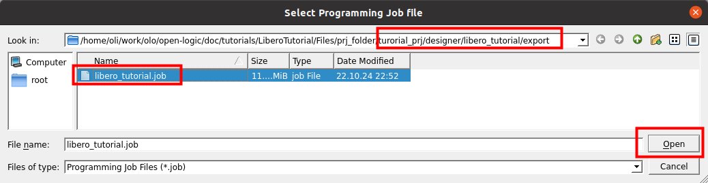

[Back to **Readme**](../../Readme.md)

# Libero Tutorial

## Introduction

The aim of this tutorial is give users a kick-start on creating Microchip Libero projects using _Open Logic_.

The tutorial covers project setup and implementation up to the production of a running bitstream for a small design.
The design is rather hardware independent but all examples and pinout constraints are given for a
[ICICLE](https://www.microchip.com/en-us/development-tool/mpfs-icicle-kit-es) evaluation board. If want to use it on
some other hardware, just change pinout and the target device accordingly.

The steps should be very much independent of the Libero version but all screenshots are taken with version v2024.2.

## Step 1: Project setup

First, create a new project.


On the first page of the dialog, choose any project name and folder you like.


As part, choose the FPGA on the ICICLE: **MPFS250T_ES-FCVG484E**

Note that this is an engineering sample part (_\_ES_). Future board revisions probably will contain the series part
**MPFS250T-FCVG484E**. Choose the exact part on your board - otherwise the programming tools may refuse to program the
bitstream generated.


You can now forward through the next three pages without changes or simply press the _Finish_ button.

## Step 2: Integrate Open Logic

We follow the steps described also in the [HowTo...](../HowTo.md) document. They are repeated here, so you do not have
to open the _HowTo_ document separately.

Open the dialog to run scripts:


Then select the script in _\<open-logic-root>/tools/libero/import_sources.tcl_ and run it **without any arguments for
the VHDL** tutorial.

Pass the **argument _lib=work_ for the Verilog** tutorial. This is required because Libero resp. SynplifyPro searches
for VHDL entities only in the library _work_ when they are instantiated from Verilog.


You should now see a number of source files being added to the project - all of them compiled into the library _olo_.
The exact number of source files may vary as _Open Logic_ still grows.


That's it,  _Open Logic_ is now ready to be used.

## Step 3: Build FPGA Design

### Overview

In this tutorial we will build the following design:


This design slightly differs from the normal reference design because the ICICLE board does only have four buttons and
one of them is required to be used as reset input, because Microchip PolarFire FPGAs do not support defining the FF
initialization state (see [olo_base_reset_gen](../base/olo_base_reset_gen.md) documentation).

All _Open Logic_ blocks are shown in grey. Custom logic is shown in blue.

_Switch[3]_ is used as reset - when it is pressed the design is reset (it must be pressed once before the design is
functional). _olo_base_reset_gen_ is used to synchronize the reset.

The design does de-bounce all four switches resp. buttons.

Every time the user presses _Switch[2]_, the counter is incremented. Every time the user presses _Switch[0]_, the state
of the counter is written into a FIFO (4 bits wide, 4096 entries deep). Every time the user presses _Switch[1]_, one
FIFO entry is read and applied to the LEDs. Note that clock and reset are not shown in the figure for simplicity
reasons.

The de-bouncing is required to ensure that a button press really only produces one edge (and hence one read/write
transaction to the FIFO resp. a single increment of the counter).

The design is super simple - it is not meant for demonstrating the coolest features of _Open Logic_ but for being the
simplest possible example of a design making use of _Open Logic_.

### Add Source Code

The code is provided in the file
[\<open-logic-root\>/doc/tutorials/LiberoTutorial/Files/libero_tutorial.vhd](./LiberoTutorial/Files/libero_tutorial.vhd).

If you are using Verilog, use the system verilog source file:
[\<open-logic-root\>/doc/tutorials/LiberoTutorial/Files/libero_tutorial.sv](./LiberoTutorial/Files/libero_tutorial.sv).

Add this file to the project as follows:


Navigate to the file
[\<open-logic-root\>/doc/tutorials/LiberoTutorial/Files/libero_tutorial.vhd](./LiberoTutorial/Files/libero_tutorial.vhd)
and link it. Linking instead of importing the file is chosen, so the file is referenced in its original location and not
copied into the project folder.

If you are using Verilog, use the system verilog source file:
[\<open-logic-root\>/doc/tutorials/LiberoTutorial/Files/libero_tutorial.sv](./LiberoTutorial/Files/libero_tutorial.sv).


You should now see the source-file being added.


To set the file as root (top-level), first the design hierarchy must be built.


The file can then be selected as root from the right-click menu.


After selecting the root, the yellow _Please select a root_ warning disappears and the file is marked as root by
displaying it in bold letters.

### Add Constraints

The required pinout for the ICICLE board is provided int the PDC file
[\<open-logic-root\>/doc/tutorials/LiberoTutorial/Files/pinout.pdc](./LiberoTutorial/Files/pinout.pdc). You can link
this file through the same dialog used for the source file already (_File > Link Files > Link Files_). Just make sure
you select file type *.pdc in the dialog so you can select the file.

**Note:** For unknown reasons sometimes Libero does not allow to _link_ *.pdc files. If you run into this situation just
use _File > Import Files > Import Files_ instead - be aware that this command creates a copy of the \*.pdf file inside
the project folder.


Next a minimal set of timing constraints is added. The constraint file only defines the clock frequency in this case -
not what is state of the art for a real design but sufficient for the tutorial.

The timing constraints are provided in the SDC file
[\<open-logic-root\>/doc/tutorials/LiberoTutorial/Files/constraints.sdc](./LiberoTutorial/Files/constraints.sdc). Again,
make sure you select the correct file type.


By default Libero does not use the freshly imported constraints. This can be changed through the _Manage Constraints_
dialog from the _Design Flow_ tab. Open it by double-clicking.


First enable the I/O constraints (the PDC file) to be used during Place and Route. Then save the setting by pressing the
_Save_ button.


Then do the same for the timing constraints (the SDC file), just that this file shall be used for all steps of the
tool-flow.


### Build Design

Build the design and generate a bitstream. You can just double-click the _Export Bitstream_ option - Libero will detect
automatically run all required steps of the flow, which takes some time.

Any dialogs showing up can be confirmed without changes.


After successful compilation, Libero automatically displays the resulting reports

### Analyze Resource Utilization

From the resource utilization it is obvious that the FIFO was correctly mapped to Block-RAM (LSRAM, Large SRAM, 20kb).

The overall LUT count of the design is 183 LUT.

The LUT usage also demonstrates the efficiency of _Open Logic_: If the de-bouncing would be implemented in the most
simple form (one counter per signal running on the system clock directly), the de-bouncing alone would use 84 LUTs (4
signals x 25ms @ 50 MHz --> 84 counter bits) but thanks to clever design the LUT count here is only 70.


### Analyze Timing

Timing analysis must be launched manually in Libero by double-clicking _Verify Timing_.

The timing report shows that unsurprisingly the slow clock-speed of the 50 MHz clock is met. It also shows missing
output and input delays - which is acceptable for a tutorial but should be fixed by adding constraints in a real-world
project.

**IMPORTANT NOTE**: For Libero scoped constraints do not work and all constraints must be entered manually (see
documentation of individual components that require constraints like interface components and clock crossings).


## Step 4: Try it on Hardware

Now connect your [ICICLE](https://www.microchip.com/en-us/development-tool/mpfs-icicle-kit-es) hardware to your PC using
the USB cable.

The ICICLE board is programmed through a separate application _FlashPro Express_, which is installed together with
Libero. To program the bitstream, it must be exported as a FlashPro Express Job by double-clicking the related option.
Any dialogs popping up can be confirmed without changes.


Now open _FlashPro Express_.

**Note for Linux users:** You first have to run the FlashPro Express environment installation as root
`sudo <libero-install-dir>/bin/fp6_env_install` and for unknown reasons FlashPro Express must be executed as root as
well to work correctly `sudo <libero-install-dir>/bin/FPExpress`.

In FlashPro Express, create a new Job Project.


Now select the exported *.job file (see next screenshot). You can choose any empty folder as destination for the
project.


The exported *.job file can be found in the folder _\<project-folder\>/designer/libero_tutorial/export_.



To program the device, simply press the prominent _Run_ button with the option _Program_ selected (default).


First you must reset the design (press _Switch[3]_), you then you can increment the counter (press _Switch[2]_) and
write (_Switch[0]_) a few counter values into the FIFO. The values can then be displayed on the the LEDs one by one by
pressing _Switch[1]_.

## Step 5: Discussion of the VHDL Source Code

The source code can be found in the file
[\<open-logic-root\>/doc/tutorials/LiberoTutorial/Files/libero_tutorial.vhd](./LiberoTutorial/Files/libero_tutorial.vhd).

Not every line of the source code is discussed. It is simple and implements the design described earlier. Only a few
details worth mentioning are discussed.

The source code samples given are VHDL - however, for the verilog example file the code looks very much the same and the
comments apply as well.

### Omitting Unused Generics

The FIFO instance only sets two generics:

```vhdl
    i_fifo : entity olo.olo_base_fifo_sync
        generic map ( 
            Width_g         => 4,               
            Depth_g         => 4096                 
        )
        ...
```

The _olo_base_fifo_sync_ entity would have much more generics but due to the concept of providing default values for
optional generics, it is not necessary to obfuscate source-code with many lines of actually unused generics.

```vhdl
entity olo_base_fifo_sync is
    generic ( 
        Width_g         : positive;                   
        Depth_g         : positive;                  
        AlmFullOn_g     : boolean   := false;        
        AlmFullLevel_g  : natural   := 0;                   
        AlmEmptyOn_g    : boolean   := false;        
        AlmEmptyLevel_g : natural   := 0;                   
        RamStyle_g      : string    := "auto";       
        RamBehavior_g   : string    := "RBW";        
        ReadyRstState_g : std_logic := '1'
    );
    ...
```

### Omitting Unused Ports

The same concept applies to unused ports. In this case we do neither require full handshaking nor status signals like
Full/Empty/Level - hence all these signals can be omitted:

```vhdl
    i_fifo : entity olo.olo_base_fifo_sync
        ...
        port map (    
              Clk           => Clk,
              Rst           => Rst,
              In_Data       => Data,
              In_Valid      => RisingEdges(0),
              Out_Data      => Led,
              Out_Ready     => RisingEdges(1)              
        );
```

Again compared to the full list of signals the _olo_base_fifo_sync_ provides many lines of obfuscating code can be
omitted because all optional input ports come with default values.

```vhdl
entity olo_base_fifo_sync is
    ...
    port (    
        -- Control Ports
          Clk           : in  std_logic;
          Rst           : in  std_logic;
          -- Input Data
          In_Data       : in  std_logic_vector(Width_g - 1 downto 0);
          In_Valid      : in  std_logic                                             := '1';
          In_Ready      : out std_logic;
          In_Level      : out std_logic_vector(log2ceil(Depth_g + 1) - 1 downto 0);
          -- Output Data
          Out_Data      : out std_logic_vector(Width_g - 1 downto 0);
          Out_Valid     : out std_logic;
          Out_Ready     : in  std_logic                                             := '1';
          Out_Level     : out std_logic_vector(log2ceil(Depth_g + 1) - 1 downto 0);
          -- Status
          Full          : out std_logic; 
          AlmFull       : out std_logic;
          Empty         : out std_logic; 
          AlmEmpty      : out std_logic
          
    );
```

## Notes

If you should want to build the tutorial project without many manual mouse clicks, you can do so by following the steps
below:

- Open a shell
- In the shell, navigate to the directory \<open-logic-root\>/doc/tutorials/LiberoTutorial/Files
  
  ```shell
  cd <open-logic-root>/doc/tutorials/LiberoTutorial/Files
  ```

- Run the script [scripted_build.tcl](./LiberoTutorial/Files/scripted_build.tcl), which creates and builds the tutorial
- project: <br>
  For VHDL:
  
  ```shell
  libero script:scripted_build.tcl
  ```
  
  For Verilog:
  
  ```shell
  libero script:scripted_build_sv.tcl
  ```

Note: replace \<open-logic-root\> with the root folder of your _Open Logic_ working copy.
