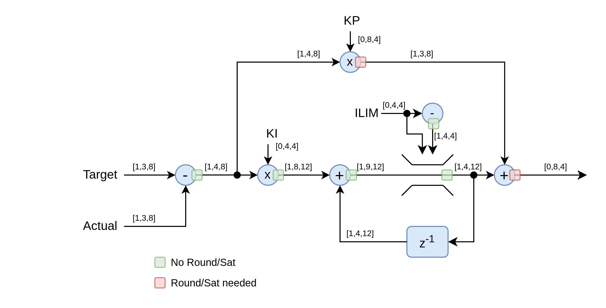
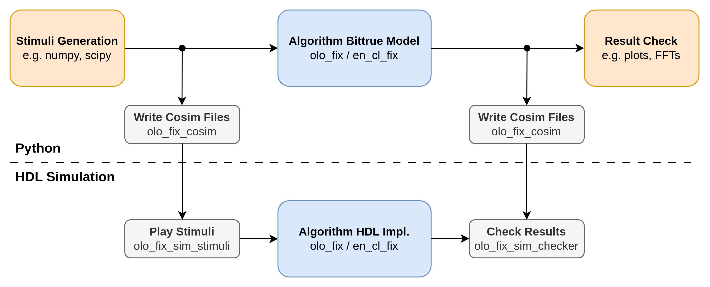

[Back to **Readme**](../../Readme.md)

# Open Logic Fixed Point Math Tutorial

## Introduction

The aim of this tutorial is give users a kick-start on using _Open Logic_ fixed point mathematics infrastructure.

The idea of the infrastructure and components provided by _Open Logic_ is that users model their algorithm in Python. This allows for efficient algorithm development because extensive mathematics libraries like _numpy_ or _scipy_ are available and results can easily be analyzed (plots, FFTs, etc.).

The models produced are bit-true - this means they include all quantization effects. The exact same mathematics can then be built in HDL using the _olo_fix_ components and equlivalence is checked in a co-simulation.

This tutorial walks the user through this process.

Before you start into the tutorial, it is strongly suggested that you read through [en_cl_fix documentation](https://github.com/open-logic/en_cl_fix/blob/open-logic/README.md) and [olo_fix_principles](../fix/olo_fix_principles.md) now, which are applicable to _Open Logic_ fixed point mathematics. 

**Note:** All files mentioned in the tutorial are stored in the folder _\<open-logic-root\>/doc/tutorials/OploFixTutorial/Files_.

## Example System

The tutorial implements a PI controller to control the voltage over a variable resistor (_R2_) in a RC-strucutre.

Below figure depicts the system implemented.


Note that the mindset is that *Target-Voltage* is a dynamic value (changing every sample). All parameters (_KP, I, ILIM_) are static parameters (e.g. configured through registers) - they shall not be treated as compile-time constants but they are not expected to change while the controller is running.

The controller is running at 1 MSPS (i.e. calculates one sample every microsecond).

## Step 1: Plant Model

First, the RC-structure to be controlled must be modelled. 

This model is used for simulation purposes only and will not be synthesized to the FPGA. Hence all tools and libraries avaialable in Pychon could be used. For example _scipy_ could be used to produce models based on differential equations. However, because this is a tutorial for FPGA development and not a Python course, a very simple fixed-step model will be used in this  case.

The model allows simulating the system with a fixed time-step and it allows changing the variable resistance of _R2_.

The plant model is trivial and hence not explained in more detail. It is suggested that you have a look at the source code [PlantModel.py](./OloFixTutorial/Files/PlantModel.py) before you proceed.

## Step 2: Floating Point Controller Model

Next, the algorithm to be realized in the FPGA (in this case a PI controller) is modelled. Below figure depcits the exact controller structure implemented.

At this point the algorithm is still modelled in floating-point because algorithm development would be slowed down by fixed-point format considerations. First the algorithm must be defined - later it can be converted to fixed point.

Have a look at the floating point controller model in the class `ControllerFloat` in [Controller.py](./OloFixTutorial/Files/Controller.py).

Note that the controller is split into a base class `ControllerBase` and the actual floating point implementation `ControllerFloat`. The reason for this is that in this tutorial we will create three versios of this model (one floating point and two fixed-point) and they shall be usable by the simulation interchangably.

## Step 3: Simulation

Now a simulation is set up. The simulation brings together the plant model from _Step 1_, the controller model from _Step 2_ and any converters between them.

The simulation file provided has a bit of additional complexity caused by the tutorial covering different variants of modelling and comparing them. Also the simulation write co-simulation files which are not to be considered at this point of the tutorial.

Have a llog at [Simulation.py](./OloFixTutorial/Files/Simulation.py) now. Below is some guidance so you do not miss any important points.

### Setup

Not every line of setup code is explained, especially not the ones that are more related to executing the different models with the same simulation script. However, a few notable snippets are discussed.

First of all, the Open Logic packages are added to the path. They are not provided as PIP packages because it is crucial that they are in-sync with the HDL code - a local installation would not ensure this. Therefore the path _\<olo-root\>/src/fix/python_ must be added to _sys.path_ - this setup ensures python and HDL are in sync.

```python
# Add olo_fix to the path
import sys
import os
sys.path.append(os.path.abspath(os.path.join(os.path.dirname(__file__), "../../../../src/fix/python")))
from olo_fix import olo_fix_cosim
from en_cl_fix_pkg import *

```

Note that _olo_fix_ muse be imported _BEFORE_ en_cl_fix because the import of _olo_fix_ automatically adds the path to _en_cl_fix_ to sys.path.

The control loop parameters are defined as constants and the different controller models are created. In our case we are currently only using the floating point model, which uses non-quantized coefficients.

```python
# Quantize Inputs
KP = 20	
KI = 0.4
ILIM = 3.5
...

# Setup different controller models
controllers = {"Float"    : ControllerFloat(kp=KP, ki=KI, ilim=ILIM),
               ...}
```

The setup with the different controllers stored in a dictionary is a bit unusual and only present to run the same simulation code with different versions of the model. If you are used to python it is easy to follow - if you are not familiar with python this also is not an issue, this code is not tightly related to _Open Logic_ and not required in your own application.

### Simulation Loop

The simulation loop loops through samples and executes the simulation step by step. 

```python
    # Run simulation
    for i, ix in enumerate(target):
        ...
```

The definition of the ADC is that it provides the voltage in volts. Hence for a floating point model, no scaling or quantization is required. The input value _ctrl_in_ is additionally stored into an array for plotting it later.

``` python
        #quantize input (ADC)
        if name == "Float":
            ctrl_in = v_actual # <<-- Used in this case
        else:
            ctrl_in = cl_fix_from_real(v_actual, FMT_IN)  
        actual_value[i] = ctrl_in
```

Then, the controller is simulated. The input value to reach is set, the controller is executed and the output is additionally stored in an array for plotting it later.

```python
        #Simulate Controller
        controller.set_target(ix)
        ctrl_out = controller.simulate(ctrl_in)
        control_value[i] = ctrl_out
```

Then the output is clipped to the range supported by the DAC (0V to 5V):

```python
        # Clip output (DAC)
        v_in = np.clip(ctrl_out, 0, 5)
```

Next, the plant model is executed and again the output is stored into an array for plotting.

```python
        #Simulate Plant
        output[i] = v_actual= plant.simulate(v_in)  
```

And - to simulate a disturbance - after 150 samples the _R2_ resistance is changed from its initial value of 1k to 500 ohms.

```python
        # Change R2 at runtime
        if i == 150:
            plant.set_r2(500)
```

### Output Handling

For each simulation (for each controller implementation) the target value input, the controller output and the plant output (actual value input) are plotted. Additionally the differences between different models are plotted. However, the plotting code is not discussed in detail - refer to [matplotlib](https://matplotlib.org/3.5.3/api/_as_gen/matplotlib.pyplot.html) for details.

Writing of co-simulation files is not of any meaning in context of the floating point model, so this part is skipped here as well.

### Execution

You can now in a console navigate to _\<olo-root\>/doc/tutorials/OloFixTutorialFiles_ and execute the simulation:

``` shell
python3 ./Simulation.py
```

The outputs related to the fixed point controller implementations can be ignored. Important at this point is the plot for the floating point controller. It can be observed that after a huge overshoot, the controller reaches the target value and that it is able to hold it also after _R2_ changed its value around sample 150.


## Step 4: Fixed Point Design

In this step, the controller is converted from floating point to fixed point. This is best explained based on a block diagram including the number formats.

From here on many fixed-point formats are used. If you are not familiar to them yet, it is strongly suggested that you go through [en_cl_fix documentation](https://github.com/open-logic/en_cl_fix/blob/open-logic/README.md) and [olo_fix_principles](../fix/olo_fix_principles.md) now.



Note that the formats choosen are not very realistic. The resolution is chosen very low on purpose to visualize quantization effects in the tutorial. Also is there not really a reason for rounding after the KP multiplier - again this definition is only chosen for tutorial purposes. 

Two questions that might arise are:

* Why is no rounding required for the adder in the I-part loop ([1,8,12]+[1,9,12]=[1,9,12])?
  * By only looking at the formats, one more integer bit on the result would be expected.
  * However, because there is a limitation in the loop to [1,4,4], the feedback input with the format [1,9,12] will never exceed a value of 16.0 and hence one more integer bit than the [1,8,12] input is sufficient.
* Why is the output of the limiter defined as [1,9,12] and not as [1,4,12]?
  * This really is not needed from a theoretic perspective
  * It is implemented that way to keep the code readable (less conversions) in order to not overload the tutorial

## Step 5: olo_fix Model

Open Logic provides different components for fixed-point mathematics (_olo_fix\_..._) and each component comes with a python model. We will now build the same PI controller again but as fixed-point model correctly simulating all quantization effects and number formats, exactly the way they are implemented in the FPGA.

Again the implementation of the controller is in [Controller.py](./OloFixTutorial/Files/Controller.py), but this time we are looking at the class `ControllerOloFix`. Open the file, the most important sections are explained below.

Of course the imports are required to build a fixed-point model.

```python
import sys
import os
sys.path.append(os.path.abspath(os.path.join(os.path.dirname(__file__), "../../../../src/fix/python")))
from olo_fix import *
from en_cl_fix_pkg import *
```

Then the interface number formats are defined. 

```python
FMT_IN = FixFormat(1, 3, 8)
FMT_OUT = FixFormat(1, 3, 8)
FMT_KP = FixFormat(0, 8, 4)
FMT_KI = FixFormat(0, 4, 4)
FMT_ILIM = FixFormat(0, 4, 4)
```

Formats may also depend on each other. It is good practice to model these dependencies correctly, so dependent number formats are adjusted automatically if one of the interface number formats is changed.

```python
FMT_ILIM_NEG = FixFormat(1, FMT_ILIM.I, FMT_ILIM.F)
FMT_ERR = cl_fix_sub_fmt(FMT_IN, FMT_IN)
FMT_PPART = FMT_OUT #No need to go beyond what saturates the output.
FMT_IMULT = cl_fix_mult_fmt(FMT_ERR, FMT_KI)
FMT_I = cl_fix_add_fmt(FMT_ILIM, FMT_IMULT)
```

Functions like `cl_fix_sub_fmt` automatically calculate what number format is required to represent the output of an operation without any rounding or saturation. For details, refer to the [en_cl_fix documentation](https://github.com/open-logic/en_cl_fix/blob/open-logic/README.md).

The actual model then consists of two parts. In the constructor of the controller, all _olo_fix_ operators are created. Configuration parameters that are generics in HDL are passed to their constructors.

```python
# Fixed Point Implementation based on olo_fix
class ControllerOloFix (ControllerBase):
    def __init__(self, kp, ki, ilim):
        super().__init__(kp, ki, ilim)
        # Static Calculation
        self._ilim_neg = olo_fix_neg(FMT_ILIM, FMT_ILIM_NEG).process(self._ilim)
        # Processing Instances
        self._error_sub = olo_fix_sub(FMT_IN, FMT_IN, FMT_ERR)
        self._p_mult = olo_fix_mult(FMT_ERR, FMT_KP, FMT_PPART, round=FixRound.NonSymPos_s, saturate=FixSaturate.Sat_s)
        self._i_mult = olo_fix_mult(FMT_ERR, FMT_KI, FMT_IMULT)
        self._i_add = olo_fix_add(FMT_I, FMT_IMULT, FMT_I)
        self._i_limit = olo_fix_limit(FMT_I, FMT_ILIM_NEG, FMT_ILIM, FMT_I)
        self._out_add = olo_fix_add(FMT_I, FMT_PPART, FMT_OUT, round=FixRound.NonSymPos_s, saturate=FixSaturate.Sat_s)
```

In the simulation method, the signal is routed through the processing instances exactly as it is to be expected from the block diagram.

```python
    def simulate(self, actual) -> float:
        # Error
        error = self._error_sub.process(self._target, actual)

        # Part
        p_part = self._p_mult.process(error, self._kp)

        # I Part
        i_1 = self._i_mult.process(error, self._ki)
        i_presat = self._i_add.process(self._integrator, i_1)
        self._integrator = self._i_limit.process(i_presat, self._ilim_neg, self._ilim)

        # Output
        return self._out_add.process(self._integrator, p_part)
```

### Simulation

To ensure the fixed point model really behaves exactly like the FPGA implementation, it is important to also quantize all inputs (because the FPGA implementation cannot receive floating-point inputs).

```python
# Quantize Inputs
KP_FIX = cl_fix_from_real(20, FMT_KP)
KI_FIX = cl_fix_from_real(0.4, FMT_KI)
ILIM_FIX = cl_fix_from_real(3.5, FMT_ILIM)


# Setup different controller models
controllers = {...
               "OloFix"   : ControllerOloFix(kp=KP_FIX, ki=KI_FIX, ilim=ILIM_FIX)}
```

This not only applies to the parameters but also to the input from the plant model:

```python
        #quantize input (ADC)
        if name == "Float":
            ctrl_in = v_actual
        else:
            ctrl_in = cl_fix_from_real(v_actual, FMT_IN) # <<-- Used in this case
        actual_value[i] = ctrl_in
```

### Execution

Again execute the simulation. The plot that we are interested in now is shown below:


Quantization effects are clearly visible on the _Control Value_ but the controller does its job. Note that the strong quantization effects do not say anything about the quality of the fixed-point library. The number formats are chosen in a way to expose clearly visible quantization effects on purpose for the tutorial.

It's of course interesting to compare the difference between the output of the floating point and the fixed-point model (red curve in below figure). It's clearly visible that the saturation at the output of the fixed-point model leads to significant differences around the transients.


However, between the transients the differences are relatively small (but still recognizable). Simulating those differences is crucial to avoid debugging on FPGA hardware - which is exactly why Open Logic provides a python model for all fixed-point mathematics components.


## Step 6: olo_fix RTL Implementation

### Algorithm Implementation

Note that number formats are described in a package [fix_formats_pkg.vhd](./OloFixTutorial/Files/fix_formats_pkg.vhd). because they are used in multiple places (two RTL implementations and testbench).

The content of this package is easy to map to the number format definitions in python discussed before. For two examples the python code is given as comment.

```vhdl
    constant FmtIn_c      : FixFormat_t := (1, 3, 8); -- FMT_IN = FixFormat(1, 3, 8)
    constant FmtOut_c     : FixFormat_t := (1, 3, 8);
    constant FmtKp_c      : FixFormat_t := (0, 8, 4);
    constant FmtKi_c      : FixFormat_t := (0, 4, 4);
    constant FmtIlim_c    : FixFormat_t := (0, 4, 4);
    constant FmtIlimNeg_c : FixFormat_t := (1, FmtIlim_c.I, FmtIlim_c.F);
    constant FmtErr_c     : FixFormat_t := cl_fix_sub_fmt(FmtIn_c, FmtIn_c);
    constant FmtPpart_c   : FixFormat_t := FmtOut_c;
    constant FmtImult_c   : FixFormat_t := cl_fix_mult_fmt(FmtErr_c, FmtKi_c); --FMT_IMULT = cl_fix_mult_fmt(FMT_ERR, FMT_KI)
    constant FmtI_c       : FixFormat_t := cl_fix_add_fmt(FmtIlim_c, FmtImult_c);
```

The code for the RTL implementation of the controller is given in [controller_olo_fix.vhd](./OloFixTutorial/Files/controller_olo_fix.vhd). It is suggested that you read through the file yourself but some interesting points are discussed below.

Of course the fixed point packages from Open Logic and the underlying en_cl_fix library must be importet.

```vhdl
library olo;
    use olo.en_cl_fix_pkg.all;
    use olo.olo_fix_pkg.all;
```

In en_cl_fix (and therefore in Open Logic) fixed point numbers are represented as _std_logic_vector_ and the interpretation of the content is given by a _FixFormat_t_ type. For more details refer to the [en_cl_fix documentation](https://github.com/open-logic/en_cl_fix/blob/open-logic/README.md).

Port widths of the entity can be based on the fixed point formats (using the _cl_fix_width()_ function). This way port widths are automatically adjusted if number formats change.

```vhdl
entity olo_fix_tutorial_controller is
    port (
        -- Control Ports
        Clk         : in    std_logic;
        Rst         : in    std_logic;
        -- Config
        Cfg_Ki      : in    std_logic_vector(cl_fix_width(FmtKi_c) - 1 downto 0);
        Cfg_Kp      : in    std_logic_vector(cl_fix_width(FmtKp_c) - 1 downto 0);
        Cfg_Ilim    : in    std_logic_vector(cl_fix_width(FmtIlim_c) - 1 downto 0);
        ...
    );
end entity;
```

The very same thing applies to signal declarations. 

```vhdl
architecture rtl of olo_fix_tutorial_controller is
    -- Static
    signal ILimNeg    : std_logic_vector(cl_fix_width(FmtIlimNeg_c) - 1 downto 0);

    -- Dynamic
    signal Error            : std_logic_vector(cl_fix_width(FmtErr_c) - 1 downto 0);
    signal Error_Valid      : std_logic;
    signal Ppart            : std_logic_vector(cl_fix_width(FmtPpart_c) - 1 downto 0);
    ...
```

For each operator an entity is instantiated. The generics and ports are easily mappable to the python code. 

```vhdl
...    
    -- Error Calculation
    -- Python: self._error_sub = olo_fix_sub(FMT_IN, FMT_IN, FMT_ERR)
    i_error_sub : entity olo.olo_fix_sub
        generic map (
            AFmt_g      => to_string(FmtIn_c),
            BFmt_g      => to_string(FmtIn_c),
            ResultFmt_g => to_string(FmtErr_c)
        )
        -- Python: error = self._error_sub.process(self._target, actual)
        port map (
            Clk         => Clk,
            Rst         => Rst,
            In_Valid    => In_Valid,
            In_A        => In_Target,
            In_B        => In_Actual,
            Out_Valid   => Error_Valid,
            Out_Result  => Error
        );
...
```

Note that formats are passed as strings (_to_string()_) to _olo_fix_ entities. This is required to make them verilog compatible as described in [olo_fix_principles](../fix/olo_fix_principles.md).

Like all other Open Logic entities, _olo_fix_ entities are documented. In this example refer to [olo_fix_sub](../fix/olo_fix_sub.md).

_olo_fix_ entities are fully pipelined. They can take one sample every clock cycle and as a result present the signal at the output also for only one clock sample (indicated by the corresponding _\_Valid_ signal. Usually this is fine but the Integrator should keep its value until the next sample arrives. This is implemented as a latch in a native VHDL process. This sample shows that _olo_fix_ mathematics can be easily mixed and matched with any other VHDL code.

```vhdl
...
    p_feedback : process(Clk)
    begin
        if rising_edge(Clk) then
            -- Normal Operation
            if ILimited_Valid = '1' then
                Integrator <= ILimited;
            end if;
            Integrator_Valid <= ILimited_Valid;
            -- Reset
            if Rst = '1' then
                Integrator <= (others => '0');
                Integrator_Valid <= '0';
            end if;
        end if;
    end process;
...
```

### Pipeline Equalization

You might have noticed that the P-part multiplier has 9 register stages for the multiplication, which is a significant difference from any other blocks that all come with the default of one operation register.

```vhdl
    -- P Part
    i_p_mult : entity olo.olo_fix_mult
        generic map (
            AFmt_g      => to_string(FmtErr_c),
            BFmt_g      => to_string(FmtKp_c),
            OpRegs_g    => 9,                     -- <<---- This line
            ResultFmt_g => to_string(FmtPpart_c),
            Round_g     => FixRound_NonSymPos_c,
            Saturate_g  => FixSaturate_Sat_c
        )
```


### Synthesis Results

The code was synthesized for a Zynq-7010 device (relatively slow Artix7 fabric) with the following results. 

| LUT  |  FF  | DSP48 |  Fmax   | Critical Path                         |
| :--: | :--: | :---: | :-----: | :------------------------------------ |
| 191  | 325  |   2   | 294 MHz | Saturation of output adder (3 levels) |

294 MHz are a relatively high frequency for such a device.

## Step 7: VHDL Testbench

Up to now we implemented a Python model of a controller and a VHDL implementation of it. This basically is the normal development flow. Where Open Logic _olo_fix_ really shines is co-simulations - where it is easy to check if the VHDL implementation really exactly (down to the very last bit) behaves the same as the python model. How to achieve this is discussed in this section.

The general idea is writing input and output data from the python simulation into files and using those files as stimulus and reference to compare the output of the RTL implementation against as depicted below.



### Write Co-Simulation Files from Python

You may already have noticed that running the python simulation produced some *.fix files in the _\<open-logic-root\>/doc/tutorials/OploFixTutorial/Files_ folder. These are the co-simulation files written by below python code in [Simulation.py](./OloFixTutorial/Files/Simulation.py):

```python
#Write cosimulation files
out_dir = os.path.abspath(os.path.dirname(__file__))
writer = olo_fix_cosim(out_dir)
writer.write_cosim_file(actual_values["EnClFix"], FMT_IN, "InputActual.fix")
writer.write_cosim_file(target, FMT_IN, "InputTarget.fix")
writer.write_cosim_file(control_values["EnClFix"], FMT_OUT, "Output.fix")
```

Each _write_cosim_file()_ call writes a numy _np.ndarray_ of data into a file. The format is used to ensure the data is properly quantized - and it is written into the file as well to check if it matches the expected number format on the VHDL side.

A short look into the _Output.fix_ file reveals that besides the format, data is stored as hex with one sample per line. Note that below a few "000" lines are omitted to keep the snippet short.

```text
(1,3,8)
000
000
7FF
7FF
```

### Read Co-Simulation Files from VHDL

For the VHDL testbench [controller_tb.vhd](./OloFixTutorial/Files/controller_tb.vhd) not every line is discussed. It is assumed that the reader is familiar with VHDL testbenching in general.

What is discussed, is the part of the testbench responsible for handling data-exchange with python. One [olo_fix_sim_stimuli](../fix/olo_fix_sim_stimuli.md) entity is instantiated to provide the target value stream to the DUT.

```vhdl
    constant InFileTarget_c  : string := "InputTarget.fix";
...    
    vc_stimuli_target : entity olo.olo_fix_sim_stimuli
        generic map (
            FilePath_g         => InFileTarget_c,
            Fmt_g              => to_string(FmtIn_c),
            StallProbability_g => 1.0, -- Always stall to create the desired sample rate
            StallMaxCycles_g   => CyclesPerSample_c-1,
            StallMinCycles_g   => CyclesPerSample_c-1
        )
        port map (
            Clk      => Clk,
            Rst      => Rst,
            Valid    => In_Valid,
            Data     => In_Target
        );
```

This entity reads the content of the *.fix file and applies it to the VHDL signal _In_Target_ . Additionally it controls the _In_Valid_ signal and produces the sample rate of 1 MSPS - this is achieved by always stalling (_StallProbability_g => 1.0_ ) and making the number of stall cycles constant by using the same value for upper and lower limit.

The controller requires a second input (the _In_Actual_ value). For this another [olo_fix_sim_stimuli](../fix/olo_fix_sim_stimuli.md) entity is instantiated but this time in timig-slave mode (_IsTimingMaser_g => false_). This means that the entity does not drive _In_Valid_ but only observe the _Valid_ and _Ready_ inputs and produce _In_Actual_ with respective timing. 

```vhdl
    vc_stimuli_actual : entity olo.olo_fix_sim_stimuli
        generic map (
            FilePath_g         => InFileActual_c,
            Fmt_g              => to_string(FmtIn_c),
            IsTimingMaster_g   => false
        )
        port map (
            Clk      => Clk,
            Rst      => Rst,
            Valid    => In_Valid,
            Ready    => In_Valid,
            Data     => In_Actual
        );
```

And last but not least a [olo_fix_sim_checker](../fix/olo_fix_sim_checker.md) entity is used to check if the produced output matches the expected value produced by the python simulation exactly. The entity would report errors if this is not the case.

```vhdl
    vc_checker : entity olo.olo_fix_sim_checker
        generic map (
            FilePath_g         => OutFile_c,
            Fmt_g              => to_string(FmtOut_c)
        )
        port map (
            Clk      => Clk,
            Rst      => Rst,
            Valid    => Out_Valid,
            Data     => Out_Result
        );
```

Note that VUnit variants of the two entities mentioned exist. See the documentation of the entities for details.

## Step 8: Simulation

Let's now run the simulation. The python simulation was already executed before, so the *.fix files exist already. Only the HDL simulation must be launched here. Note that the tutorial is written for _Questasim_ only - the same code works in other simulators but for simplicity reasons only one simulator is described here.

Open _Questasim_ and navigate to the directory navigate to _\<olo-root\>/doc/tutorials/OloFixTutorialFiles_. Then execute the tutorial script in the TCL shell of Questasim:

```tcl
source ./scripted_run.tcl
```

The script [scripted_run.tcl](./OloFixTutorial/Files/scripted_run.tcl) does compile the whole _Open Logic_ library plus the tutorial files. It also defines a function to compile a specific version of the controller and execute the simulation. We want to simulate the _olo_fix_ variant, so we execute:

```tcl
olo_fix_tutorial controller_olo_fix
```

You can now see the results displayed in the waveform window and no error messages in the log (which means the results are exactly as expected). Note that in below screenshot the representation settings of _Out_Result_ are changed to more closely ressemble the python plot (_Radix=Decimal_, _Format=Analog_).


If you do not trust errors being thrown in case of mismatches, just edit the _Output.fix_ file and see if an error is reported if you re-run the simulation. You should get an error in the form below:

```shell
 ** Error: olo_fix_sim_checker - Data mismatch: expected 011111110011, got 011111111111 - file Output.fix - line 12
#    Time: 11205 ns  Iteration: 0  Instance: /controller_tb/vc_checker
```

## Appendix A: cl_fix Model

As described in [olo_fix_principles](../fix/olo_fix_principles.md), for basic operations either _olo_fix_ entities or _cl_fix_ functions can be used. They behave mathematically equivalent.

As demonstration the very same functionality as described in the tutorial is also implemented with _cl_fix_ functions. 

The python model is described in [Controller.py](./OloFixTutorial/Files/Controller.py), class `ControllerEnClFix`.

The blue line in the plot from the Python simulation shows the difference between `ControllerEnClFix` and `ControllerOloFix` - which for obvious reasons is always zero. They really behave exactly the same.


### Conclusion

 _olo_fix_ and _cl_fix_ can be used interchangeably to model fixed-point VHDL implementations based on _cl_fix_ or _olo_fix_. You can also combine _olo_fix_ VHDL implementations with _cl_fix_ models and vice versa or you can mix and match _olo_fix_ and _cl_fix_ (e.g. use _cl_fix_ for basic operations and _olo_fix_ for higher level functions like filters which do not exist in _cl_fix_).

## Appendix B: cl_fix RTL Implementation

### Basic Version

The VHDL implementation is given in [controller_cl_fix.vhd](./OloFixTutorial/Files/controller_cl_fix.vhd). Note that instead of entity instantiations, function calls are used to implement the fixed-point mathematics.

```vhdl
            -- Stg 1
            Error_1 <= cl_fix_sub(In_Target, FmtIn_c, In_Actual, FmtIn_c, FmtErr_c);
            Vld_1 <= In_Valid;
```

Executing the co-simulation in _Questasim_ is working exactly as described before, just with a different argument passed to the _olo_fix_tutorial_ procedure:

```
olo_fix_tutorial controller_cl_fix
```

### Synthesis Results Basic Version

The code was synthesized for a Zynq-7010 device (relatively slow Artix7 fabric) with the following results. 

| LUT  |  FF  | DSP48 |  Fmax   | Critical Path                                        |
| :--: | :--: | :---: | :-----: | :--------------------------------------------------- |
| 127  | 106  |   2   | 116 MHz | P-part multiplier incl. saturation/round (14 levels) |

It is easy to spot that significantly less FFs are used than for the _olo_fix_ version and that the clock frequency is less than half the one for _olo_fix_. The reason for this is that with _cl_fix_ functions it is most natural to execute a operation including rounding and saturation on one line. This of course leads to long logic paths. 

In contrast for _olo_fix_ it is most natural to have all optional pipeline stages enabled (see [olo_fix_principles](../fix/olo_fix_principles.md)). Defaults are chosen accordingly to encourage proper pipelining. 

However, it is possible to achieve the very same logic with both approaches. It is just that in _cl_fix_ adding pipeline needs added code and in _olo_fix_ removing it needs added code.

### Pipelined Version

A properly pipelined _cl_fix_ implementation is given in [controller_cl_fix_pipelined.vhd](./OloFixTutorial/Files/controller_cl_fix_pipelined.vhd). The important difference to the basic version is that any operations that require saturation and rounding are split into three steps (operation, rounding, saturation) and the number formats between them are chosen accordingly. This is explained based on the example of the P-part multiplication.

```vhdl
architecture rtl of olo_fix_tutorial_controller is
    ....
    constant PMultFmt_c    : FixFormat_t := cl_fix_mult_fmt(FmtErr_c, FmtKp_c);
    constant PRoundFmt_c   : FixFormat_t := cl_fix_round_fmt(PMultFmt_c, FmtPpart_c.F, NonSymPos_s);
    ...
    signal Vld_2        : std_logic;
    signal PMult_2      :  std_logic_vector(cl_fix_width(PMultFmt_c) - 1 downto 0);
    ...
    signal Vld_3        : std_logic;
    signal PRound_3     : std_logic_vector(cl_fix_width(PRoundFmt_c) - 1 downto 0);
    ...
    signal Vld_4        : std_logic;
    signal Ppart_4      : std_logic_vector(cl_fix_width(FmtPpart_c) - 1 downto 0);
    ....
begin
    
    p_calc : process(Clk)
    begin
        if rising_edge(Clk) then
            ....
            -- Stg 2
            PMult_2 <= cl_fix_mult(Error_1, FmtErr_c, Cfg_Kp, FmtKp_c, PMultFmt_c);
            Vld_2 <= Vld_1;
        
            -- Stg 3
            PRound_3 <= cl_fix_round(PMult_2, PMultFmt_c, PRoundFmt_c, NonSymPos_s);
            Vld_3 <= Vld_2;

			-- Stg 4
            ...
            Ppart_4 <= cl_fix_saturate(PRound_3, PRoundFmt_c, FmtPpart_c, Sat_s);
            Vld_4 <= Vld_3;
            ...            
```

This does improve timing but it also means all number formats must be defined explicitly. 

Note that the splitting the operation into the three sub-steps does not change numerical behavior. The very same python model stil holds true - but alternatively the three steps could be modelled separately. The result is the same in both cases.

Executing the co-simulation in _Questasim_ is working exactly as described before, just with a different argument passed to the _olo_fix_tutorial_ procedure:

```
olo_fix_tutorial controller_cl_fix_pipelined
```

### Synthesis Results Basic Version

The code was synthesized for a Zynq-7010 device (relatively slow Artix7 fabric) with the following results. 

| LUT  |  FF  | DSP48 |  Fmax   | Critical Path               |
| :--: | :--: | :---: | :-----: | :-------------------------- |
| 136  | 147  |   2   | 229 MHz | WP-part rounding (6 levels) |

Note that the timing performance increased (at the cost of more FFs) but still is a bit below _olo_fix_ because _olo_fix_ adds more pipelining on all operations, not only on the ones that require rounding and saturation. The same could be achieved with _cl_fix_ with additional effort to find out where additional pipeline stages are required to increase performance.

### Conclusion

_olo_fix_ and _cl_fix_ can be used interchangeably for fixed-point VHDL implementations. You can also combine _olo_fix_ VHDL implementations with _cl_fix_ models and vice versa or you can mix and match _olo_fix_ and _cl_fix_ (e.g. use _cl_fix_ for basic operations and _olo_fix_ for higher level functions like filters which do not exist in _cl_fix_).

## Appendix C: Verilog RTL Implementation

Open Logic is comitted to being usable from verilog as well. Hence _olo_fix_ can also be used from Verilog - in contrast to _cl_fix_ which is not accessible for verilog users.

An _olo_fix_ based verilog implementation of the same controller is given in [controller_verilog.sv](./OloFixTutorial/Files/controller_verilog.sv). 

Unfortunately no option was found to define port and signal widths based on fixed-point formats. Therefore ports and signals must be declared with the correct width manually.

**Note: If you are an experienced verilog user, any contributions to improve this would be highly appreciated!**

```verilog
odule olo_fix_tutorial_controller (
    input wire Clk,
    input wire Rst,
    input wire [7:0] Cfg_Ki,    // (0, 4, 4)
    input wire [11:0] Cfg_Kp,   // (0, 8, 4)
    input wire [7:0] Cfg_ILim,  // (0, 4, 4)
    ...
);

    // Static Signals
    wire [8:0] ILimNeg; // (1, 4, 4)

    // Dynamic Signals
    wire [12:0] Error; // (1, 4, 8)
    wire Error_Valid;
    ....
```

Fixed point formats are defined as strings:

```verilog
    // Formats
    localparam string FmtIn_c      = "(1, 3, 8)";
    localparam string FmtOut_c     = "(1, 3, 8)";
    ...
    localparam string FmtImult_c   = "(1, 8, 12)"; // Define manually, functions like cl_fix_mult_fmt are not available
```

As mentioned, the format definition and signal/port declaration is a bit more manual (and hence more error prone than in VHDL). However, instantiation looks rather similar then.

```verilog
    \olo.olo_fix_neg #(                  
        .AFmt_g(FmtIlim_c),
        .ResultFmt_g(FmtIlimNeg_c)
    ) i_ilim_neg (
        .Clk(Clk),
        .Rst(Rst),
        .In_A(Cfg_ILim),
        .Out_Result(ILimNeg)
    );
```

Executing the co-simulation in _Questasim_ is working exactly as described before, just with a different argument passed to the _olo_fix_tutorial_ procedure:

```
olo_fix_tutorial controller_verilog
```

Synthesis results are exactly equal to the _olo_fix_ based VHDL implementation.

For users that are used to both languages, VHDL is suggested as language for fixed point mathematics because declarations and format definitions are less error prone thanks to _cl_fix_ functions.

## Appendix D: olo_fix vs. cl_fix

As mentioned before, for basic operations _olo_fix_ and _cl_fix_ are behaving identical. Blow lists give advantages of both options and hence serve as a help for deciding which one to use.

Advantages of _olo_fix_:

* Is NOT limited to basic operations (i.e. contains higher level functionality such as filters)
* By default adds more pipelining, which results in better timing performance
* Can be used from Verilog (cross language instantiation is possible)

Advantages of _cl_fix_:

* Leads to more concise code (especially in VHDL but also in Python)
* By default adds no pipelining, which results in less latency and FF usage

As discussed before, the two options can also be freely combined.

