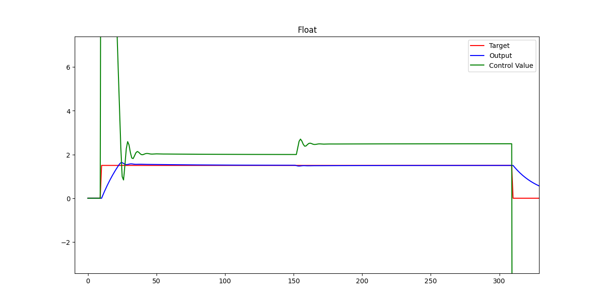

[Back to **Readme**](../../Readme.md)

# Open Logic Fixed Point Math Tutorial

## Introduction

The aim of this tutorial is give users a kick-start on using _Open Logic_ fixed point mathematics infrastructure.

The idea of the infrastructure and components provided by _Open Logic_ is that users model their algorithm in Python. This allows for efficient algorithm development because extensive mathematics libraries like _numpy_ or _scipy_ are available and results can easily be analyzed (plots, FFTs, etc.).

The models produces are bittrue - this means they include all quantization effects. The exact same mathematics can then be built in HDL using the _olo_fix_ components and equlivalence is checked in a co-simulation.

This tutorial walks the user through this process.

**Note:** All files mentioned in the tutorial are stored in the folder _\<open-logic-root\>/doc/tutorials/OploFixTutorial/Files_.

## Example System

The tutorial implements a PI controller to control the voltage over a variable resistor (_R2_) in a RC-strucutre.

Below figure depicts the system implemented.

**!!!Figure!!!**

## Step 1: Plant Model

First, the RC-structure to be controlled must be modelled. 

This model is used for simulation purposes only and will not be synthesized to the FPGA. Hence all tools and libraries avaialable in Pychon could be used. For example _scipy_ could be used to produce models based on differential equations. However, because this is a tutorial for FPGA development and not a Python course, a very simple fixed-step model will be used in this  case.

The model allows simulating the system with a fixed time-step and it allows changing the variable resistance of _R2_.

The plant model is trivial and hence not explained in more detail. It is suggested that you have a look at the source code [PlantModel.py](./OloFixTutorial/Files/PlantModel.py) before you proceed.

## Step 2: Floating Point Controller Model

Next, the algorithm to be realized in the FPGA (in this case a PI controller) is modelled. Below figure depcits the exact controller structure implemented.

At this point the algorithm is still modelled in floating-point because algorithm development would be slowed down by fixed-point format considerations. First the algorithm must be defined - later it can be converted to fixed point.

Have a look at the floating point controller model in the class `ControllerFloat` in [Controller.py](./OloFixTutorial/Files/Controller.py).

Note that the controller is split into a base class `ControllerBase` and the actual floating point implementation `ControllerFloat`. The reason for this is that in this tutorial we will create three versios of this model (one floating point and two fixed-point) and they shall be usable by the simulation interchangably.

## Step 3: Simulation

Now a simulation is set up. The simulation brings together the plant model from _Step 1_, the controller model from _Step 2_ and any converters between them.

The simulation file provided has a bit of additional complexity caused by the tutorial covering different variants of modelling and comparing them. Also the simulation write co-simulation files which are not to be considered at this point of the tutorial.

Have a llog at [Simulation.py](./OloFixTutorial/Files/Simulation.py) now. Below is some guidance so you do not miss any important points.

### Setup

Not every line of setup code is explained, especially not the ones that are more related to executing the different models with the same simulation script. However, a few notable snippets are discussed.

First of all, the Open Logic packages are added to the path. They are not provided as PIP packages because it is crucial that they are in-sync with the HDL code - a local installation would not ensure this. Therefore the path _\<olo-root\>/src/fix/python_ must be added to _sys.path_ - this setup ensures python and HDL are in sync.

```python
# Add olo_fix to the path
import sys
import os
sys.path.append(os.path.abspath(os.path.join(os.path.dirname(__file__), "../../../../src/fix/python")))
from olo_fix import olo_fix_cosim
from en_cl_fix_pkg import *

```

Note that _olo_fix_ muse be imported _BEFORE_ en_cl_fix because the import of _olo_fix_ automatically adds the path to _en_cl_fix_ to sys.path.

The control loop parameters are defined as constants and the different controller models are created. In our case we are currently only using the floating point model, which uses non-quantized coefficients.

```python
# Quantize Inputs
KP = 20	
KI = 0.4
ILIM = 3.5
...

# Setup different controller models
controllers = {"Float"    : ControllerFloat(kp=KP, ki=KI, ilim=ILIM),
               ...}
```

The setup with the different controllers stored in a dictionary is a bit unusual and only present to run the same simulation code with different versions of the model. If you are used to python it is easy to follow - if you are not familiar with python this also is not an issue, this code is not tightly related to _Open Logic_ and not required in your own application.

### Simulation Loop

The simulation loop loops through samples and executes the simulation step by step. 

```python
    # Run simulation
    for i, ix in enumerate(target):
        ...
```

The definition of the ADC is that it provides the voltage in volts. Hence for a floating point model, no scaling or quantization is required. The input value _ctrl_in_ is additionally stored into an array for plotting it later.

``` python
        #quantize input (ADC)
        if name == "Float":
            ctrl_in = v_actual # <<-- Used in this case
        else:
            ctrl_in = cl_fix_from_real(v_actual, FMT_IN)  
        actual_value[i] = ctrl_in
```

Then, the controller is simulated. The input value to reach is set, the controller is executed and the output is additionally stored in an array for plotting it later.

```python
        #Simulate Controller
        controller.set_target(ix)
        ctrl_out = controller.simulate(ctrl_in)
        control_value[i] = ctrl_out
```

Then the output is clipped to the range supported by the DAC (0V to 5V):

```python
        # Clip output (DAC)
        v_in = np.clip(ctrl_out, 0, 5)
```

Next, the plant model is executed and again the output is stored into an array for plotting.

```python
        #Simulate Plant
        output[i] = v_actual= plant.simulate(v_in)  
```

And - to simulate a disturbance - after 150 samples the _R2_ resistance is changed from its initial value of 1k to 500 ohms.

```python
        # Change R2 at runtime
        if i == 150:
            plant.set_r2(500)
```

### Output Handling

For each simulation (for each controller implementation) the target value input, the controller output and the plant output (actual value input) are plotted. Additionally the differences between different models are plotted. However, the plotting code is not discussed in detail - refer to [matplotlib](https://matplotlib.org/3.5.3/api/_as_gen/matplotlib.pyplot.html) for details.

Writing of co-simulation files is not of any meaning in context of the floating point model, so this part is skipped here as well.

### Execution

You can now in a console navigate to _\<olo-root\>/doc/tutorials/OloFixTutorialFiles_ and execute the simulation:

``` shell
python3 ./Simulation.py
```

The outputs related to the fixed point controller implementations can be ignored. Important at this point is the plot for the floating point controller. It can be observed that after a huge overshoot, the controller reaches the target value and that it is able to hold it also after _R2_ changed its value around sample 150.



## Step 4: Fixed Point Design

In this step, the controller is converted from floating point to fixed point. This is best explained based on a block diagram including the number formats.

**!!!! IMAGE !!!!**

## Step 5: olo_fix Model

Open Logic provides different components for fixed-point mathematics (_olo_fix\_..._) and each component comes with a python model. We will now build the same PI controller again but as fixed-point model correctly simulating all quantization effects and number formats, exactly the way they are implemented in the FPGA.

Again the implementation of the controller is in [Controller.py](./OloFixTutorial/Files/Controller.py), but this time we are looking at the class `ControllerOloFix`. Open the file, the most important sections are explained below.

Of course the imports are required to build a fixed-point model.

```python
import sys
import os
sys.path.append(os.path.abspath(os.path.join(os.path.dirname(__file__), "../../../../src/fix/python")))
from olo_fix import *
from en_cl_fix_pkg import *
```

Then the interface number formats are defined. 

```python
FMT_IN = FixFormat(1, 3, 8)
FMT_OUT = FixFormat(1, 3, 8)
FMT_KP = FixFormat(0, 8, 4)
FMT_KI = FixFormat(0, 4, 4)
FMT_ILIM = FixFormat(0, 4, 4)
```

Formats may also depend on each other. It is good practice to model these dependencies correctly, so dependent number formats are adjusted automatically if one of the interface number formats is changed.

```python
FMT_ILIM_NEG = FixFormat(1, FMT_ILIM.I, FMT_ILIM.F)
FMT_ERR = cl_fix_sub_fmt(FMT_IN, FMT_IN)
FMT_PPART = FMT_OUT #No need to go beyond what saturates the output.
FMT_IMULT = cl_fix_mult_fmt(FMT_ERR, FMT_KI)
FMT_I = cl_fix_add_fmt(FMT_ILIM, FMT_IMULT)
```

Functions like `cl_fix_sub_fmt` automatically calculate what number format is required to represent the output of an operation without any rounding or saturation. For details, refer to the [en_cl_fix documentation](https://github.com/open-logic/en_cl_fix/blob/open-logic/README.md).

The actual model then consists of two parts. In the constructor of the controller, all _olo_fix_ operators are created. Configuration parameters that are generics in HDL are passed to their constructors.

```python
# Fixed Point Implementation based on olo_fix
class ControllerOloFix (ControllerBase):
    def __init__(self, kp, ki, ilim):
        super().__init__(kp, ki, ilim)
        # Static Calculation
        self._ilim_neg = olo_fix_neg(FMT_ILIM, FMT_ILIM_NEG).process(self._ilim)
        # Processing Instances
        self._error_sub = olo_fix_sub(FMT_IN, FMT_IN, FMT_ERR)
        self._p_mult = olo_fix_mult(FMT_ERR, FMT_KP, FMT_PPART, round=FixRound.NonSymPos_s, saturate=FixSaturate.Sat_s)
        self._i_mult = olo_fix_mult(FMT_ERR, FMT_KI, FMT_IMULT)
        self._i_add = olo_fix_add(FMT_I, FMT_IMULT, FMT_I)
        self._i_limit = olo_fix_limit(FMT_I, FMT_ILIM_NEG, FMT_ILIM, FMT_I)
        self._out_add = olo_fix_add(FMT_I, FMT_PPART, FMT_OUT, round=FixRound.NonSymPos_s, saturate=FixSaturate.Sat_s)
```

In the simulation method, the signal is routed through the processing instances exactly as it is to be expected from the block diagram.

```python
    def simulate(self, actual) -> float:
        # Error
        error = self._error_sub.process(self._target, actual)

        # Part
        p_part = self._p_mult.process(error, self._kp)

        # I Part
        i_1 = self._i_mult.process(error, self._ki)
        i_presat = self._i_add.process(self._integrator, i_1)
        self._integrator = self._i_limit.process(i_presat, self._ilim_neg, self._ilim)

        # Output
        return self._out_add.process(self._integrator, p_part)
```

### Simulation

To ensure the fixed point model really behaves exactly like the FPGA implementation, it is important to also quantize all inputs (because the FPGA implementation cannot receive floating-point inputs).

```python
# Quantize Inputs
KP_FIX = cl_fix_from_real(20, FMT_KP)
KI_FIX = cl_fix_from_real(0.4, FMT_KI)
ILIM_FIX = cl_fix_from_real(3.5, FMT_ILIM)


# Setup different controller models
controllers = {...
               "OloFix"   : ControllerOloFix(kp=KP_FIX, ki=KI_FIX, ilim=ILIM_FIX)}
```

This not only applies to the parameters but also to the input from the plant model:

```python
        #quantize input (ADC)
        if name == "Float":
            ctrl_in = v_actual
        else:
            ctrl_in = cl_fix_from_real(v_actual, FMT_IN) # <<-- Used in this case
        actual_value[i] = ctrl_in
```

### Execution

Again execute the simulation. The plot that we are interested in now is shown below:


Quantization effects are clearly visible on the _Control Value_ but the controller does its job. Note that the strong quantization effects do not say anything about the quality of the fixed-point library. The number formats are chosen in a way to expose clearly visible quantization effects on purpose for the tutorial.

It's of course interesting to compare the difference between the output of the floating point and the fixed-point model (red curve in below figure). It's clearly visible that the saturation at the output of the fixed-point model leads to significant differences around the transients.


However, between the transients the differences are relatively small (but still recognizable). Simulating those differences is crucial to avoid debugging on FPGA hardware - which is exactly why Open Logic provides a python model for all fixed-point mathematics components.


## Step 6: olo_fix RTL Implementation

Note that number formats are described in a package [fix_formats_pkg.vhd](./OloFixTutorial/Files/fix_formats_pkg.vhd). because they are used in multiple places (two RTL implementations and testbench).

The content of this package is easy to map to the number format definitions in python discussed before. For two examples the python code is given as comment.

```vhdl
    constant FmtIn_c      : FixFormat_t := (1, 3, 8); -- FMT_IN = FixFormat(1, 3, 8)
    constant FmtOut_c     : FixFormat_t := (1, 3, 8);
    constant FmtKp_c      : FixFormat_t := (0, 8, 4);
    constant FmtKi_c      : FixFormat_t := (0, 4, 4);
    constant FmtIlim_c    : FixFormat_t := (0, 4, 4);
    constant FmtIlimNeg_c : FixFormat_t := (1, FmtIlim_c.I, FmtIlim_c.F);
    constant FmtErr_c     : FixFormat_t := cl_fix_sub_fmt(FmtIn_c, FmtIn_c);
    constant FmtPpart_c   : FixFormat_t := FmtOut_c;
    constant FmtImult_c   : FixFormat_t := cl_fix_mult_fmt(FmtErr_c, FmtKi_c); --FMT_IMULT = cl_fix_mult_fmt(FMT_ERR, FMT_KI)
    constant FmtI_c       : FixFormat_t := cl_fix_add_fmt(FmtIlim_c, FmtImult_c);
```

The code for the RTL implementation of the controller is given in [controller_olo_fix.vhd](./OloFixTutorial/Files/controller_olo_fix.vhd). It is suggested that you read through the file yourself but some interesting points are discussed below.

Of course the fixed point packages from Open Logic and the underlying en_cl_fix library must be importet.

```vhdl
library olo;
    use olo.en_cl_fix_pkg.all;
    use olo.olo_fix_pkg.all;
```

In en_cl_fix (and therefore in Open Logic) fixed point numbers are represented as _std_logic_vector_ and the interpretation of the content is given by a _FixFormat_t_ type. For more details refer to the [en_cl_fix documentation](https://github.com/open-logic/en_cl_fix/blob/open-logic/README.md).

Port widths of the entity can be based on the fixed point formats (using the _cl_fix_width()_ function). This way port widths are automatically adjusted if number formats change.

```vhdl
entity olo_fix_tutorial_controller is
    port (
        -- Control Ports
        Clk         : in    std_logic;
        Rst         : in    std_logic;
        -- Config
        Cfg_Ki      : in    std_logic_vector(cl_fix_width(FmtKi_c) - 1 downto 0);
        Cfg_Kp      : in    std_logic_vector(cl_fix_width(FmtKp_c) - 1 downto 0);
        Cfg_Ilim    : in    std_logic_vector(cl_fix_width(FmtIlim_c) - 1 downto 0);
        ...
    );
end entity;
```

The very same thing applies to signal declarations. 

```vhdl
architecture rtl of olo_fix_tutorial_controller is
    -- Static
    signal ILimNeg    : std_logic_vector(cl_fix_width(FmtIlimNeg_c) - 1 downto 0);

    -- Dynamic
    signal Error            : std_logic_vector(cl_fix_width(FmtErr_c) - 1 downto 0);
    signal Error_Valid      : std_logic;
    signal Ppart            : std_logic_vector(cl_fix_width(FmtPpart_c) - 1 downto 0);
    ...
```

For each operator an entity is instantiated. The generics and ports are easily mappable to the python code. 

```vhdl
...    
    -- Error Calculation
    -- Python: self._error_sub = olo_fix_sub(FMT_IN, FMT_IN, FMT_ERR)
    i_error_sub : entity olo.olo_fix_sub
        generic map (
            AFmt_g      => to_string(FmtIn_c),
            BFmt_g      => to_string(FmtIn_c),
            ResultFmt_g => to_string(FmtErr_c)
        )
        -- Python: error = self._error_sub.process(self._target, actual)
        port map (
            Clk         => Clk,
            Rst         => Rst,
            In_Valid    => In_Valid,
            In_A        => In_Target,
            In_B        => In_Actual,
            Out_Valid   => Error_Valid,
            Out_Result  => Error
        );
...
```

Note that formats are passed as strings (_to_string()_) to _olo_fix_ entities. This is required to make them verilog compatible as described in [olo_fix_principles](../fix/olo_fix_principles.md).

Like all other Open Logic entities, _olo_fix_ entities are documented. In this example refer to [olo_fix_sub](../fix/olo_fix_sub.md).

_olo_fix_ entities are fully pipelined. They can take one sample every clock cycle and as a result present the signal at the output also for only one clock sample (indicated by the corresponding _\_Valid_ signal. Usually this is fine but the Integrator should keep its value until the next sample arrives. This is implemented as a latch in a native VHDL process. This sample shows that _olo_fix_ mathematics can be easily mixed and matched with any other VHDL code.

```vhdl
...
    p_feedback : process(Clk)
    begin
        if rising_edge(Clk) then
            -- Normal Operation
            if ILimited_Valid = '1' then
                Integrator <= ILimited;
            end if;
            Integrator_Valid <= ILimited_Valid;
            -- Reset
            if Rst = '1' then
                Integrator <= (others => '0');
                Integrator_Valid <= '0';
            end if;
        end if;
    end process;
...
```

**!!! Discuss pipeline equalization !!!**

### Synthesis Results

The code was synthesized for a Zynq-7010 device (relatively slow Artix7 fabric) with the following results. 

| LUT  |  FF  | DSP48 |  Fmax   | Critical Path                         |
| :--: | :--: | :---: | :-----: | :------------------------------------ |
| 191  | 325  |   2   | 294 MHz | Saturation of output adder (3 levels) |

294 MHz are a relatively high frequency for such a device.

## Step 7: VHDL Testbench

## Step 8: Simulation

## Appendix A: cl_fix Model

## Appendix B: cl_fix RTL Implementation

## Appendix C: Verilog RTL Implementation

## Appendix D: olo_fix vs. cl_fix


