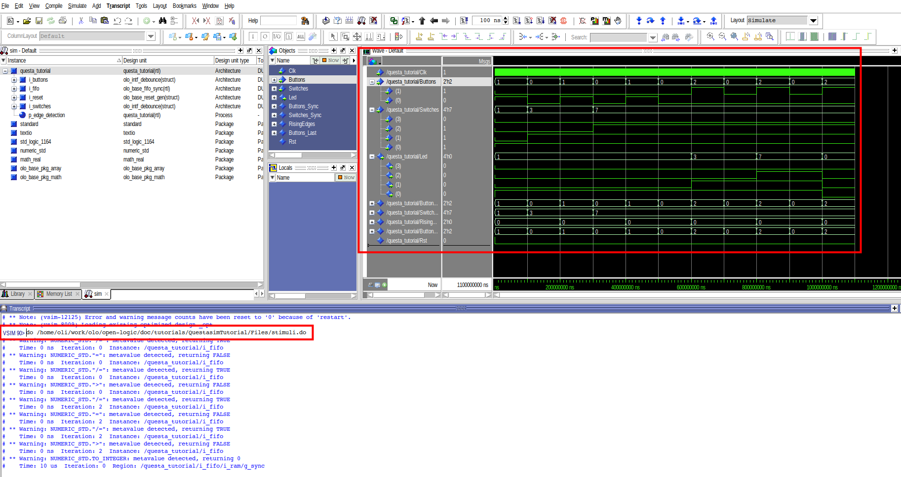

[Back to **Readme**](../../Readme.md)

# Questasim Tutorial

## Introduction

The aim of this tutorial is give users a kick-start on using *Open Logic* In Questasim projects.

The tutorial does not cover the *project* mode of questasim because the TCL commands in this regard are very limited. Instead it demonstrates the *non project* mode of Questasim (where files are compiled into the working directory directly).

The steps should be very much independent of the Questasim version but all screenshots are taken with version 2023.3.

## Step 1: Project setup

First, choose a working directory.


Select any directory you like. Ideally you create a new, empty directory and select this one.


## Step 2: Integrate Open Logic

We follow the steps described also in the [HowTo...](../HowTo.md) document. They are repeated here, so you do not have to open the *HowTo* document separately.

In the Questasim TCL console, execute the command below:

```
source <open-logic-root>/tools/questa/vcom_sources.tcl
```

In the screenshot below the path on my local PC is shown - the path on your system of course is different.


You should now see a new library *olo* containing plenty of source files. The exact number of source files may vary as *Open Logic* still grows.


That's it,  *Open Logic* is now ready to be used.

## Step 3: Build FPGA Design

### Overview

In this tutorial we will build the following design:


All *Open Logic* blocks are shown in grey. Custom logic is shown in blue.

The design does de-bounce two buttons and four switches. Every time the user presses button 0, the state of the switches is written into a FIFO (4 bits wide, 4096 entries deep). Every time the user presses button 1, one FIFO entry is read and applied to the LEDs. Note that clock and reset are not shown in the figure for simplicity reasons.

The de-bouncing is required to ensure that a button press really only produces one edge (and hence one read/write transaction to the FIFO). For the switches, de-bouncing is not strictly required but good style.

The design is super simple - it is not meant for demonstrating the coolest features of *Open Logic* but for being the simplest possible example of a design making use of *Open Logic*.

### Add Source Code

The VHDL code is provided in the file [\<open-logic-root\>/doc/tutorials/QuestasimTutorial/Files/questa_tutorial.vhd](./QuestasimTutorial/Files/questa_tutorial.vhd). 

If you are using Verilog, use the system verilog source file: [\<open-logic-root\>/doc/tutorials/QuestasimTutorial/Files/questa_tutorial.sv](./QuestasimTutorial/Files/questa_tutorial.sv). 

Compile the files as follows:


Select the source file (see above) and compile it (use the *.sv file for the system verilog variant of the tutorial):


You should now see the file showing up inside the default ibrary *work*:


## Step 4: Run the Simulation

To open the simulation, double-click the *questa_tutorial* file:


The simulation window will open:


Select all signals from the *Objects* window and add them to the *Wave* window through the right-click menu:


Now execute the predefined stimuli by typing the following command into the TCL console:

```
do <open-logic-root>/doc/tutorials/QuestasimTutorial/Files/stimuli.do
```

In the screenshot below the path on my local PC is shown - the path on your system of course is different. In the screenshot the resulting waveform is also visible.




## Step 5: Discussion of the VHDL Source Code

The source code can be found in the file [\<open-logic-root\>/doc/tutorials/QuestasimTutorial/Files/questa_tutorial.vhd](./QuestasimTutorial/Files/questa_tutorial.vhd). 

Not every line of the source code is discussed. It is simple and implements the design described earlier. Only a few details worth mentioning are discussed.

The source code samples given are VHDL - however, for the verilog example file the code looks very much the same and the comments apply as well.

### Omitting Unused Generics

The FIFO instance only sets two generics:

```
    i_fifo : entity olo.olo_base_fifo_sync
        generic map ( 
            Width_g         => 4,               
            Depth_g         => 4096                 
        )
        ...
```

The *olo_base_fifo_sync* entity would have much more generics but due to the concept of providing default values for optional generics, it is not necessary to obfuscate source-code with many lines of actually unused generics.

```
entity olo_base_fifo_sync is
    generic ( 
        Width_g         : positive;                   
        Depth_g         : positive;                  
        AlmFullOn_g     : boolean   := false;        
        AlmFullLevel_g  : natural   := 0;                   
        AlmEmptyOn_g    : boolean   := false;        
        AlmEmptyLevel_g : natural   := 0;                   
        RamStyle_g      : string    := "auto";       
        RamBehavior_g   : string    := "RBW";        
        ReadyRstState_g : std_logic := '1'
    );
    ...
```

### Omitting Unused Ports

The same concept applies to unused ports. In this case we do neither require full handshaking nor status signals like Full/Empty/Level - hence all these signals can be omitted:

```
    i_fifo : entity olo.olo_base_fifo_sync
        ...
        port map (    
              Clk           => Clk,
              Rst           => Rst,
              In_Data       => Switches_Sync,
              In_Valid      => RisingEdges(0),
              Out_Data      => Led,
              Out_Ready     => RisingEdges(1)              
        );
```

Again compared to the full list of signals the *olo_base_fifo_sync* provides many lines of obfuscating code can be omitted because all optional input ports come with default values.

```
entity olo_base_fifo_sync is
    ...
    port (    
        -- Control Ports
          Clk           : in  std_logic;
          Rst           : in  std_logic;
          -- Input Data
          In_Data       : in  std_logic_vector(Width_g - 1 downto 0);
          In_Valid      : in  std_logic                                             := '1';
          In_Ready      : out std_logic;
          In_Level      : out std_logic_vector(log2ceil(Depth_g + 1) - 1 downto 0);
          -- Output Data
          Out_Data      : out std_logic_vector(Width_g - 1 downto 0);
          Out_Valid     : out std_logic;
          Out_Ready     : in  std_logic                                             := '1';
          Out_Level     : out std_logic_vector(log2ceil(Depth_g + 1) - 1 downto 0);
          -- Status
          Full          : out std_logic; 
          AlmFull       : out std_logic;
          Empty         : out std_logic; 
          AlmEmpty      : out std_logic
          
    );
```

### Clock Frequency

A unusually slow clock frequency is used (100 kHz) in order to keep simulation times low:

```
    i_buttons : entity olo.olo_intf_debounce
        generic map (
            ClkFrequency_g  => 100.0e3,
            ...
```


## Notes

If you should want to build the tutorial project without many manual mouse clicks, you can do so by following the steps below:

* Open Questasim

* In the TCL console, navigate to the directory \<open-logic-root\>/doc/tutorials/QuestasimTutorial/Files
  ```
  cd <open-logic-root>/doc/tutorials/QuestasimTutorial/Files
  ```

* Run the script [scripted_run.tcl](./QuestasimTutorial/Files/scripted_run.tcl), which creates and builds and simulates the tutorial project: 
  For VHDL:
  
  ```
  source scripted_run.tcl
  ```
  
  For Verilog:
  
  ```
  source scripted_run_sv.tcl
  ```

Note: replace \<open-logic-root\> with the root folder of your *Open Logic* working copy.
