[Back to **Readme**](../../Readme.md)

# Vivado Tutorial

## Introduction

The aim of this tutorial is give users a kick-start on creating AMD Vivado projects using *Open Logic*.

The tutorial covers project setup and implementation up to the production of a running bitstream for a small design. The design is rather hardware independent but all examples and pinout constraints are given for a [Zybo Z7-10](https://digilent.com/shop/zybo-z7-zynq-7000-arm-fpga-soc-development-board/). If want to use it on some other hardware, just change pinout and the target device accordingly.

The steps should be very much independent of the Vivado version but all screenshots are taken with version 2023.1.

## Step 1: Project setup

First, create a new project.

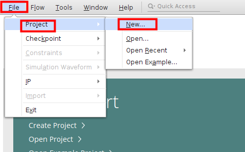

Confirm the first page of the dialog and choose any path you like to store the project on the second page.

On the third page, it is important to create an **RTL Project**

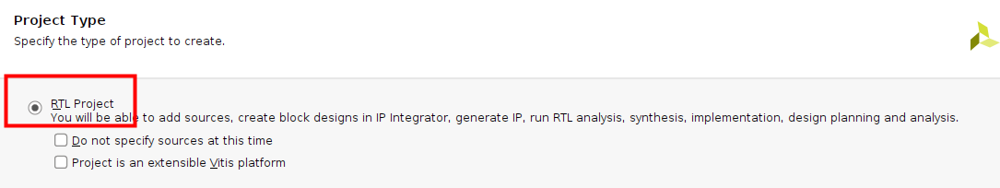

You do not have to add any sources at this point but it is important that you set the language you target (VHDL or Verilog). The tutorial works for both languages.

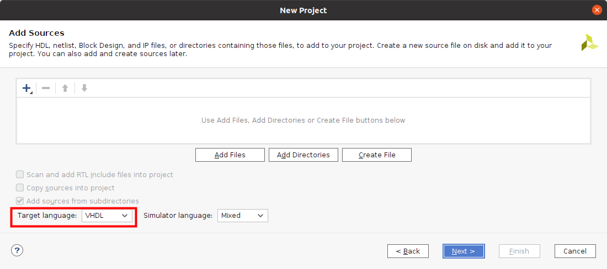

Forward through the next page without adding any constraints files.

As part, choose the FPGA on the Z7-10: **xc7z010clg400-1**

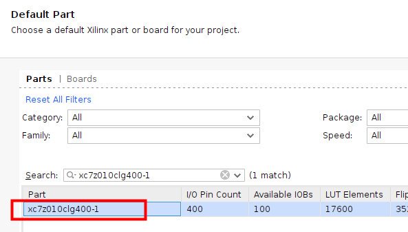

## Step 2: Integrate Open Logic

We follow the steps described also in the [HowTo...](../HowTo.md) document. They are repeated here, so you do not have to open the *HowTo* document separately.

Open the Vivado TCL console and execute the command below:

```
source <open-logic-root>/tools/vivado/import_sources.tcl
```

In the screenshot below the path on my local PC is shown - the path on your system of course is different.

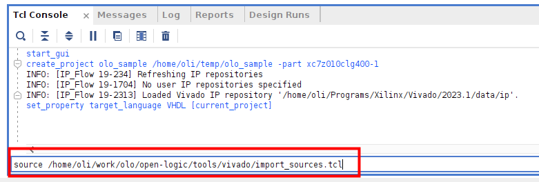

You should now see one constraints file and many source files in the library *olo*. The exact number of source files may vary as *Open Logic* still grows.

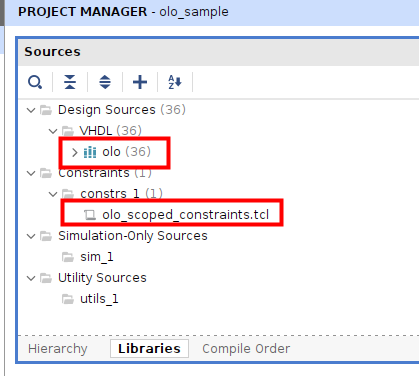

That's it,  *Open Logic* is now ready to be used.

## Step 3: Build FPGA Design

### Overview

In this tutorial we will build the following design:

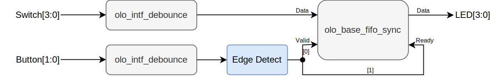

All *Open Logic* blocks are shown in grey. Custom logic is shown in blue.

The design does de-bounce two buttons and four switches. Every time the user presses button 0, the state of the switches is written into a FIFO (4 bits wide, 4096 entries deep). Every time the user presses button 1, one FIFO entry is read and applied to the LEDs. Note that clock and reset are not shown in the figure for simplicity reasons.

The de-bouncing is required to ensure that a button press really only produces one edge (and hence one read/write transaction to the FIFO). For the switches, de-bouncing is not strictly required but good style.

The design is super simple - it is not meant for demonstrating the coolest features of *Open Logic* but for being the simplest possible example of a design making use of *Open Logic*.

### Add Source Code

The VHDL code is provided in the file [<open-logic-root>/doc/tutorials/VivadoTutorial/Files/vivado_tutorial.vhd](./VivadoTutorial/Files/vivado_tutorial.vhd). 

If you are using Verilog, use the system verilog source file: [<open-logic-root>/doc/tutorials/VivadoTutorial/Files/vivado_tutorial.sv](./VivadoTutorial/Files/vivado_tutorial.sv). 

Add this file to the project as follows:

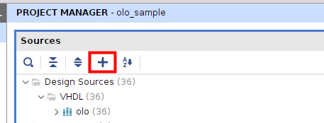


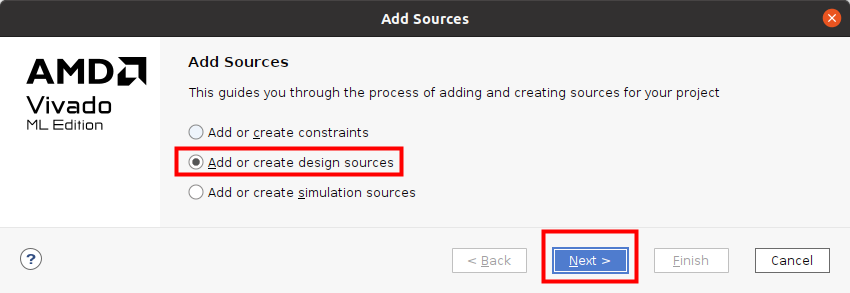


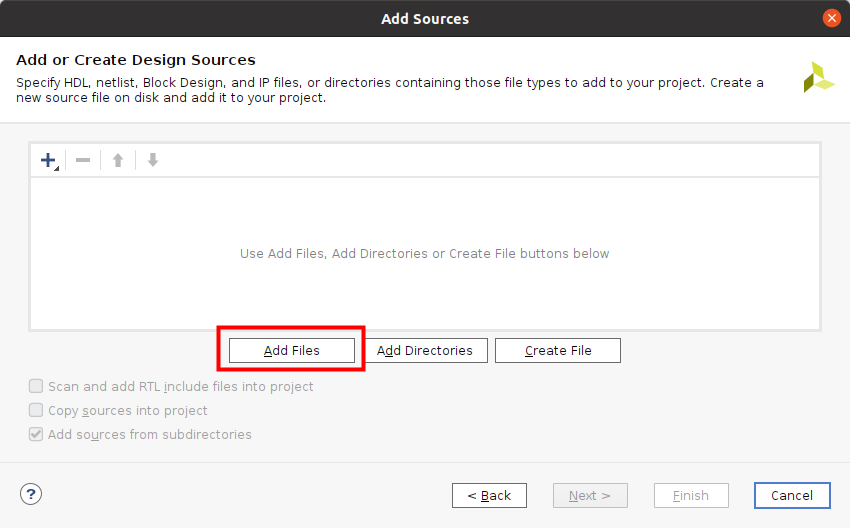

Navigate to the file [<open-logic-root>/doc/tutorials/VivadoTutorial/Files/vivado_tutorial.vhd](./VivadoTutorial/Files/vivado_tutorial.vhd) and add it.

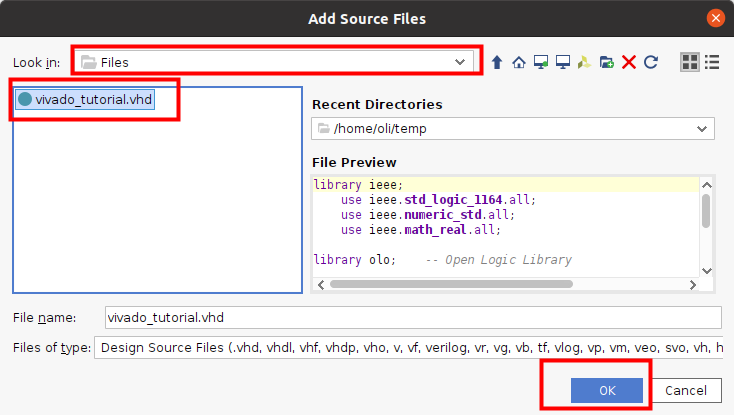

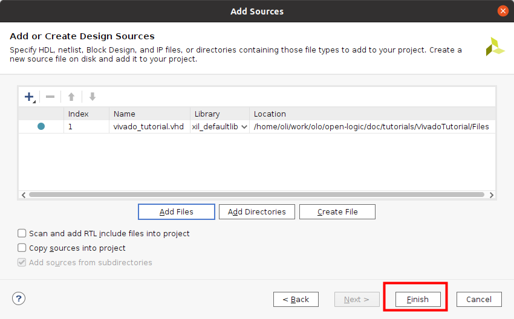

And finally select this file as top-module for the project through the right-click menu in the sources window.

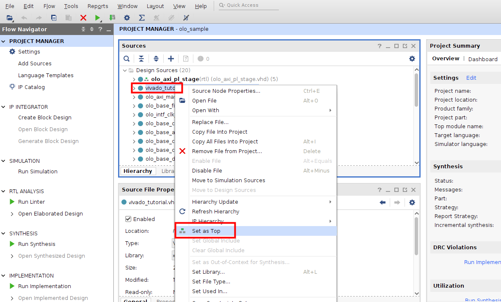

### Add Constraints

A basic constraints set (pinout + clock) is provided in the file [<open-logic-root>/doc/tutorials/VivadoTutorial/Files/pinout.xdc](./VivadoTutorial/Files/pinout.xdc). Add this file through the same steps as described in [Add Source Code](#Add-Source-Code) but as constraints file:

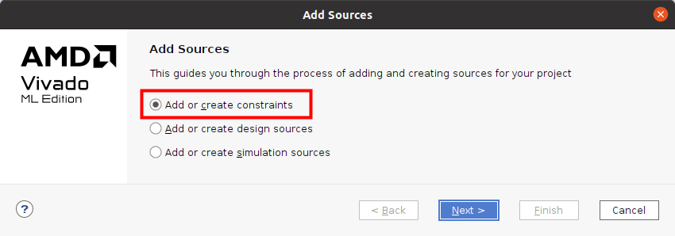

### Build Design

Build the design and generate a bitstream. You can just press the *Generate Bitstream* button - Vivado will detect automatically that the design must be built before the bitstream can be generated.

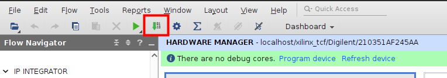

Open the implemented design when the build is done and Vivado asks you if you want to open it.

### Analyze Resource Utilization

From the resource utilization it is obvious that the FIFO was correctly mapped to Block-RAM.

The LUT usage also demonstrates the efficiency of *Open Logic*: If the de-bouncing would be implemented in the most simple form (one counter per signal running on the system clock directly), the de-bouncing alone would use 132 LUTs (6 signals x 25ms x 125 MHz --> 132 counter bits). The overall LUT count of the design is only 120 - and this includes the FIFO.

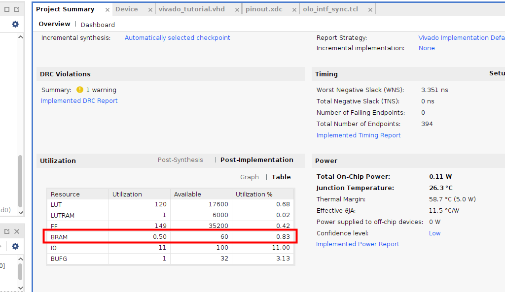

### Analyze Timing

The timing report shows two things:

* Output delays are missing. This makes sense because we let a FIFO drive outputs directly and no output delay was constrained. For LEDs this is tolerable but in a productive design of course you would want to add those constraints manually.
* **No** missing input delays are reported. The *olo_intf_sync* input synchronizer comes with scoped constraints and adds these constraints automatically. This demonstrates the usefulness of scoped constraints *Open Logic* provides wherever possible.
  * For Verilog **there are** missing input delays, because scoped constraints only work for VHDL at the moment.


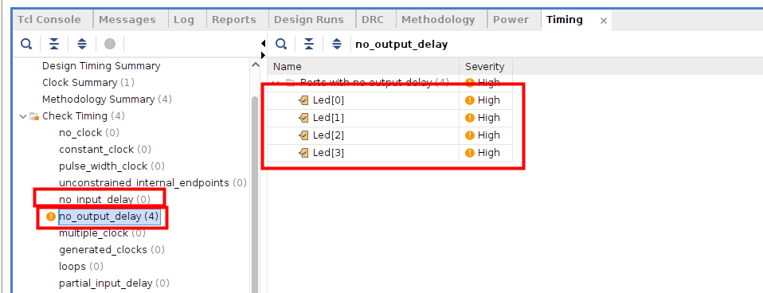


## Step 4: Try it on Hardware

Now connect your [Zybo Z7-10](https://digilent.com/shop/zybo-z7-zynq-7000-arm-fpga-soc-development-board/) hardware to your PC using the USB cable.

Open the Hardware Manager:

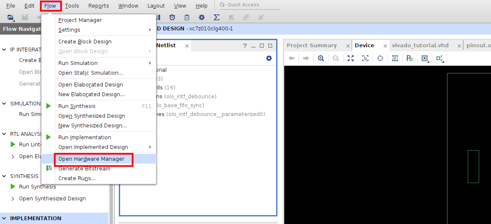

Open the target device:

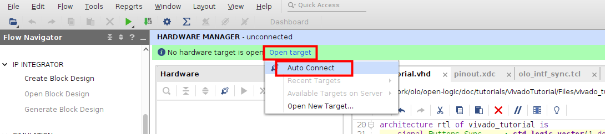

Program the device:

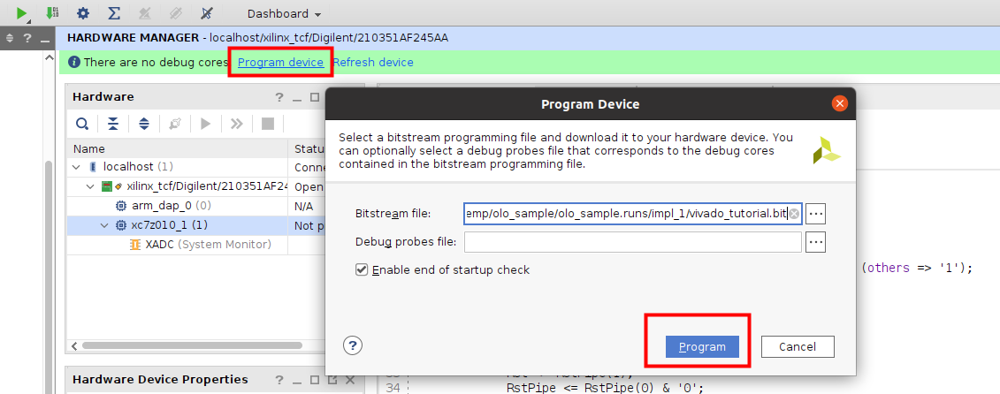

You can now dial in values using the *Switches* and write them into the FIFO by pressing *Button 0* (on the very right). After that they can be read from the FIFO and displayed one by one by pressing *Button 1* (second from the right).

## Step 5: Discussion of the VHDL Source Code

The source code can be found in the file [<open-logic-root>/doc/tutorials/VivadoTutorial/Files/vivado_tutorial.vhd](./VivadoTutorial/Files/vivado_tutorial.vhd). 

Not every line of the source code is discussed. It is simple and implements the design described earlier. Only a few details worth mentioning are discussed.

The source code samples given are VHDL - however, for the verilog example file the code looks very much the same and the comments apply as well.

### Omitting Unused Generics

The FIFO instance only sets two generics:

```
    i_fifo : entity olo.olo_base_fifo_sync
        generic map ( 
            Width_g         => 4,               
            Depth_g         => 4096                 
        )
        ...
```

The *olo_base_fifo_sync* entity would have much more generics but due to the concept of providing default values for optional generics, it is not necessary to obfuscate source-code with many lines of actually unused generics.

```
entity olo_base_fifo_sync is
    generic ( 
        Width_g         : positive;                   
        Depth_g         : positive;                  
        AlmFullOn_g     : boolean   := false;        
        AlmFullLevel_g  : natural   := 0;                   
        AlmEmptyOn_g    : boolean   := false;        
        AlmEmptyLevel_g : natural   := 0;                   
        RamStyle_g      : string    := "auto";       
        RamBehavior_g   : string    := "RBW";        
        ReadyRstState_g : std_logic := '1'
    );
    ...
```

### Omitting Unused Ports

The same concept applies to unused ports. In this case we do neither require full handshaking nor status signals like Full/Empty/Level - hence all these signals can be omitted:

```
    i_fifo : entity olo.olo_base_fifo_sync
        ...
        port map (    
              Clk           => Clk,
              Rst           => Rst,
              In_Data       => Switches_Sync,
              In_Valid      => RisingEdges(0),
              Out_Data      => Led,
              Out_Ready     => RisingEdges(1)              
        );
```

Again compared to the full list of signals the *olo_base_fifo_sync* provides many lines of obfuscating code can be omitted because all optional input ports come with default values.

```
entity olo_base_fifo_sync is
    ...
    port (    
        -- Control Ports
          Clk           : in  std_logic;
          Rst           : in  std_logic;
          -- Input Data
          In_Data       : in  std_logic_vector(Width_g - 1 downto 0);
          In_Valid      : in  std_logic                                             := '1';
          In_Ready      : out std_logic;
          In_Level      : out std_logic_vector(log2ceil(Depth_g + 1) - 1 downto 0);
          -- Output Data
          Out_Data      : out std_logic_vector(Width_g - 1 downto 0);
          Out_Valid     : out std_logic;
          Out_Ready     : in  std_logic                                             := '1';
          Out_Level     : out std_logic_vector(log2ceil(Depth_g + 1) - 1 downto 0);
          -- Status
          Full          : out std_logic; 
          AlmFull       : out std_logic;
          Empty         : out std_logic; 
          AlmEmpty      : out std_logic
          
    );
```


## Notes

If you should want to build the tutorial project without many manual mouse clicks, you can do so by following the steps below:

* Open Vivado

* In the TCL console, navigate to the directory <open-logic-root>/doc/tutorials/VivadoTutorial/Files
  ```
  cd <open-logic-root>/doc/tutorials/VivadoTutorial/Files
  ```

* Run the script [scripted_build.tcl](./VivadoTutorial/Files/scripted_build.tcl), which creates and builds the tutorial project: 
  For VHDL:
  
  ```
  source scripted_build.tcl
  ```
  
  For Verilog:
  
  ```
  source scripted_build_sv.tcl
  ```

Note: replace <open-logic-root> with the root folder of your *Open Logic* working copy.
